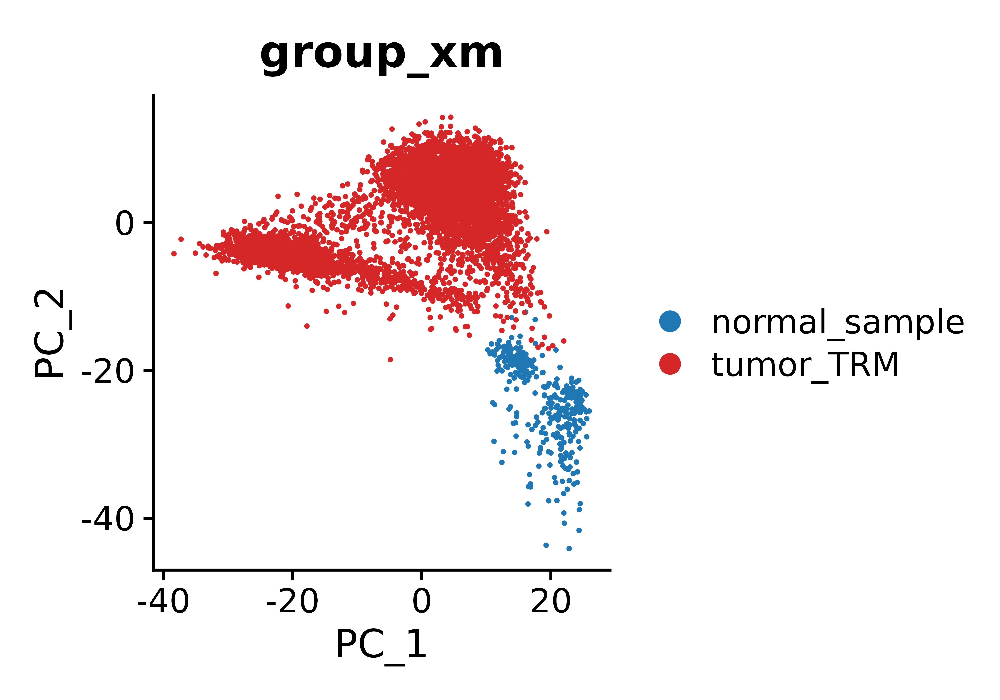

- figure.1 pipeline
```r
library(Rsamtools)
library(GenomicFeatures)
library(GenomicAlignments)
library(BiocParallel)
library(pheatmap)
library(RColorBrewer)
library(PoiClaClu)
library(org.Mm.eg.db)
library(AnnotationDbi)
library(DOSE)
library(clusterProfiler)
library(topGO)
library(pathview)
library(org.Hs.eg.db)
library(AnnotationDbi)
library(DOSE)
library(clusterProfiler)
library(topGO)
library(ggplot2)
library(data.table)
```
Fig.1A
```r
JHB_data_all1 <- read.csv(row.names=1,"./JHB_cell_data_result1.csv")
library(BisqueRNA)
ALL_GSEA_GMT <- read.gmt("./all_merge/msigdb.v7.1.symbols.gmt")
ALL_GSEA_GMT$term <- as.character(ALL_GSEA_GMT$term)
colnames(ALL_GSEA_GMT) <- c("term","gene")

JHB_data_all1 <- JHB_data_all1[order(JHB_data_all1$log2FoldChange,decreasing=TRUE),]
JHB_data_all1$X <- rownames(JHB_data_all1)
JHB_SCLC_vs_Normal_res <- JHB_data_all1[,c("log2FoldChange","X")]
JHB_SCLC_vs_Normal_res <- na.omit(JHB_SCLC_vs_Normal_res)
JHB_SCLC_vs_Normal_res_genelist <- JHB_SCLC_vs_Normal_res$log2FoldChange
names(JHB_SCLC_vs_Normal_res_genelist) <- JHB_SCLC_vs_Normal_res$X
JHB_SCLC_vs_Normal_res_genelist <- JHB_SCLC_vs_Normal_res_genelist[JHB_SCLC_vs_Normal_res_genelist!=0]

JHB_SCLC_vs_Normal_res_GSEA <- GSEA(JHB_SCLC_vs_Normal_res_genelist, TERM2GENE=ALL_GSEA_GMT, verbose=TRUE,minGSSize=0,pvalueCutoff = 1)
mcsaveRDS(JHB_SCLC_vs_Normal_res_GSEA,"./JHB_SCLC_hsa.GeneList_GSEA.rds",mc.cores=20)
JHB_SCLC_vs_Normal_res_GSEA <- mcreadRDS("./JHB_SCLC_hsa.GeneList_GSEA.rds",mc.cores=20)

JHB_SCLC_vs_Normal_res_GSEA$target = as.factor(ifelse(JHB_SCLC_vs_Normal_res_GSEA$pvalue < 0.05 & abs(JHB_SCLC_vs_Normal_res_GSEA$NES) > 0.3, ifelse(JHB_SCLC_vs_Normal_res_GSEA$NES < -0.3 ,'Neg','Pos'),'NoSignifi'))
JHB_SCLC_vs_Normal_res_GSEA$target  <- factor(JHB_SCLC_vs_Normal_res_GSEA$target ,levels=c("Pos","NoSignifi","Neg"))
JHB_SCLC_vs_Normal_res_GSEA <- JHB_SCLC_vs_Normal_res_GSEA[order(JHB_SCLC_vs_Normal_res_GSEA$NES,decreasing=TRUE),]

Splicing_pathway <- JHB_SCLC_vs_Normal_res_GSEA$ID[grep("SPLICING",JHB_SCLC_vs_Normal_res_GSEA$ID)]
JHB_SCLC_vs_Normal_res_GSEA_splicing <- subset(JHB_SCLC_vs_Normal_res_GSEA, ID %in% Splicing_pathway)
# JHB_SCLC_vs_Normal_res_GSEA_splicing1 <- subset(JHB_SCLC_vs_Normal_res_GSEA_splicing,ID != c("LEE_METASTASIS_AND_ALTERNATIVE_SPLICING_DN"))
# JHB_SCLC_vs_Normal_res_GSEA_splicing1 <- subset(JHB_SCLC_vs_Normal_res_GSEA_splicing,ID != c("LEE_METASTASIS_AND_ALTERNATIVE_SPLICING_UP"))
JHB_SCLC_vs_Normal_res_GSEA_splicing1 <- JHB_SCLC_vs_Normal_res_GSEA_splicing[order(JHB_SCLC_vs_Normal_res_GSEA_splicing$NES,decreasing=TRUE),][1:6,]
JHB_SCLC_vs_Normal_res_GSEA_splicing1 <- JHB_SCLC_vs_Normal_res_GSEA_splicing1[order(JHB_SCLC_vs_Normal_res_GSEA_splicing1$NES,decreasing=FALSE),]

library(ggpubr)
bb <- jdb_palette("brewer_celsius")
color1 <- adjustcolor(bb[8], alpha.f = 0.8)  # 透明度 60%

p1 <- ggbarplot(JHB_SCLC_vs_Normal_res_GSEA_splicing1, 
          x = "ID", 
          y = "NES", 
          fill = "target", 
          color = "black",
          title = "SCLC VS normal Splicing pathway", 
          outlier.shape = NA, 
          rotate = TRUE,
          lab.size = 1) +
  rotate_x_text(angle = 90) + 
  scale_fill_manual(values = color1)

pdf(file="./Fig1/JHB_RNA_GSVA_splicing_SCLC_VS_normal.pdf",height=3.5,width=7)
p1
dev.off()


GSE60052_data_all1 <- read.csv(row.names=1,file="./resSCLC.csv")

ALL_GSEA_GMT <- read.gmt("./all_merge/msigdb.v7.1.symbols.gmt")
ALL_GSEA_GMT$term <- as.character(ALL_GSEA_GMT$term)
colnames(ALL_GSEA_GMT) <- c("term","gene")

GSE60052_data_all1 <- GSE60052_data_all1[order(GSE60052_data_all1$log2FoldChange,decreasing=TRUE),]
GSE60052_data_all1$X <- rownames(GSE60052_data_all1)
GSE60052_SCLC_vs_Normal_res <- GSE60052_data_all1[,c("log2FoldChange","X")]
GSE60052_SCLC_vs_Normal_res <- na.omit(GSE60052_SCLC_vs_Normal_res)
GSE60052_SCLC_vs_Normal_res_genelist <- GSE60052_SCLC_vs_Normal_res$log2FoldChange
names(GSE60052_SCLC_vs_Normal_res_genelist) <- GSE60052_SCLC_vs_Normal_res$X
GSE60052_SCLC_vs_Normal_res_genelist <- GSE60052_SCLC_vs_Normal_res_genelist[GSE60052_SCLC_vs_Normal_res_genelist!=0]

GSE60052_SCLC_vs_Normal_res_GSEA <- GSEA(GSE60052_SCLC_vs_Normal_res_genelist, TERM2GENE=ALL_GSEA_GMT, verbose=TRUE,minGSSize=0,pvalueCutoff = 1)
mcsaveRDS(GSE60052_SCLC_vs_Normal_res_GSEA,"./GSE60052_SCLC_hsa.GeneList_GSEA.rds",mc.cores=20)
GSE60052_SCLC_vs_Normal_res_GSEA <- mcreadRDS("./GSE60052_SCLC_hsa.GeneList_GSEA.rds",mc.cores=20)

GSE60052_SCLC_vs_Normal_res_GSEA <- mcreadRDS("./GSE60052_SCLC_hsa.GeneList_GSEA.rds",mc.cores=20)
GSE60052_SCLC_vs_Normal_res_GSEA$target = as.factor(ifelse(GSE60052_SCLC_vs_Normal_res_GSEA$pvalue < 0.05 & abs(GSE60052_SCLC_vs_Normal_res_GSEA$NES) > 0.3, ifelse(GSE60052_SCLC_vs_Normal_res_GSEA$NES < -0.3 ,'Neg','Pos'),'NoSignifi'))
GSE60052_SCLC_vs_Normal_res_GSEA$target  <- factor(GSE60052_SCLC_vs_Normal_res_GSEA$target ,levels=c("Pos","NoSignifi","Neg"))
GSE60052_SCLC_vs_Normal_res_GSEA <- GSE60052_SCLC_vs_Normal_res_GSEA[order(GSE60052_SCLC_vs_Normal_res_GSEA$NES,decreasing=TRUE),]

Splicing_pathway <- GSE60052_SCLC_vs_Normal_res_GSEA$ID[grep("SPLICING",GSE60052_SCLC_vs_Normal_res_GSEA$ID)]
GSE60052_SCLC_vs_Normal_res_GSEA_splicing <- subset(GSE60052_SCLC_vs_Normal_res_GSEA, ID %in% Splicing_pathway)
GSE60052_SCLC_vs_Normal_res_GSEA_splicing1 <- GSE60052_SCLC_vs_Normal_res_GSEA_splicing[order(GSE60052_SCLC_vs_Normal_res_GSEA_splicing$NES,decreasing=TRUE),][1:6,]
GSE60052_SCLC_vs_Normal_res_GSEA_splicing1 <- GSE60052_SCLC_vs_Normal_res_GSEA_splicing1[order(GSE60052_SCLC_vs_Normal_res_GSEA_splicing1$NES,decreasing=FALSE),]

library(ggpubr)
bb <- jdb_palette("brewer_celsius")
color1 <- adjustcolor(bb[8], alpha.f = 0.8)  # 透明度 60%

p1 <- ggbarplot(GSE60052_SCLC_vs_Normal_res_GSEA_splicing1, 
          x = "ID", 
          y = "NES", 
          fill = "target", 
          color = "black",
          title = "GSE60052", 
          outlier.shape = NA, 
          rotate = TRUE,
          lab.size = 1) +
  rotate_x_text(angle = 90) + 
  scale_fill_manual(values = color1)

pdf(file="./Fig1/PLOS_GENE_GSVA_splicing_SCLC_VS_normal.pdf",height=3.5,width=8)
p1
dev.off()

zgb_data_dds_res <- read.csv("./ZGB_SCLC_DATA_result.csv",row.names=1)

ALL_GSEA_GMT <- read.gmt("./all_merge/msigdb.v7.1.symbols.gmt")
colnames(ALL_GSEA_GMT) <- c("term","gene")
ALL_GSEA_GMT$term <- as.character(ALL_GSEA_GMT$term)

zgb_data_dds_res1 <- zgb_data_dds_res[order(zgb_data_dds_res$log2FoldChange,decreasing=TRUE),]
zgb_data_dds_res1$X <- rownames(zgb_data_dds_res1)
zgb_SCLC_vs_Normal_res <- zgb_data_dds_res1[,c("log2FoldChange","X")]
zgb_SCLC_vs_Normal_res <- na.omit(zgb_SCLC_vs_Normal_res)
zgb_SCLC_vs_Normal_res_genelist <- zgb_SCLC_vs_Normal_res$log2FoldChange
names(zgb_SCLC_vs_Normal_res_genelist) <- zgb_SCLC_vs_Normal_res$X
zgb_SCLC_vs_Normal_res_genelist <- zgb_SCLC_vs_Normal_res_genelist[zgb_SCLC_vs_Normal_res_genelist!=0]

zgb_SCLC_vs_Normal_res_GSEA <- GSEA(zgb_SCLC_vs_Normal_res_genelist, TERM2GENE=ALL_GSEA_GMT, verbose=TRUE,minGSSize=0,pvalueCutoff = 1)
mcsaveRDS(zgb_SCLC_vs_Normal_res_GSEA,"./zgb_SCLC_hsa.GeneList_GSEA.rds",mc.cores=20)
zgb_SCLC_vs_Normal_res_GSEA <- mcreadRDS("./zgb_SCLC_hsa.GeneList_GSEA.rds",mc.cores=20)

zgb_SCLC_vs_Normal_res_GSEA <- mcreadRDS("./zgb_SCLC_hsa.GeneList_GSEA.rds",mc.cores=20)
zgb_SCLC_vs_Normal_res_GSEA$target = as.factor(ifelse(zgb_SCLC_vs_Normal_res_GSEA$pvalue < 0.05 & abs(zgb_SCLC_vs_Normal_res_GSEA$NES) > 0.3, ifelse(zgb_SCLC_vs_Normal_res_GSEA$NES < -0.3 ,'Neg','Pos'),'NoSignifi'))
zgb_SCLC_vs_Normal_res_GSEA$target  <- factor(zgb_SCLC_vs_Normal_res_GSEA$target ,levels=c("Pos","NoSignifi","Neg"))
zgb_SCLC_vs_Normal_res_GSEA <- zgb_SCLC_vs_Normal_res_GSEA[order(zgb_SCLC_vs_Normal_res_GSEA$NES,decreasing=TRUE),]

Splicing_pathway <- zgb_SCLC_vs_Normal_res_GSEA$ID[grep("SPLICING",zgb_SCLC_vs_Normal_res_GSEA$ID)]
zgb_SCLC_vs_Normal_res_GSEA_splicing <- subset(zgb_SCLC_vs_Normal_res_GSEA, ID %in% Splicing_pathway)
zgb_SCLC_vs_Normal_res_GSEA_splicing1 <- zgb_SCLC_vs_Normal_res_GSEA_splicing[order(zgb_SCLC_vs_Normal_res_GSEA_splicing$NES,decreasing=TRUE),][1:6,]
zgb_SCLC_vs_Normal_res_GSEA_splicing1 <- zgb_SCLC_vs_Normal_res_GSEA_splicing1[order(zgb_SCLC_vs_Normal_res_GSEA_splicing1$NES,decreasing=FALSE),]
zgb_SCLC_vs_Normal_res_GSEA_splicing1$color <- "Splicing"
library(ggpubr)
bb <- jdb_palette("brewer_celsius")
color1 <- adjustcolor(bb[8], alpha.f = 0.8)  # 透明度 60%

p1 <- ggbarplot(zgb_SCLC_vs_Normal_res_GSEA_splicing1, 
          x = "ID", 
          y = "NES", 
          fill = "color", 
          color = "black",
          title = "zgb", 
          outlier.shape = NA, 
          rotate = TRUE,
          lab.size = 1) +
  rotate_x_text(angle = 90) + 
  scale_fill_manual(values = color1)

pdf(file="./Fig1/zgb_GSVA_splicing_SCLC_VS_normal.pdf",height=3.5,width=8)
p1
dev.off()


Cell2024_Zhangpeng2 <- read.csv(row.names=1,"./Cell_ZhangPeng_Protein_Matrix.csv")
Cell_Zhangpeng_clinical <- read.csv(row.names=1,"./Zhangpeng_SCLC_and_Normal_Clinical.csv")

JHB_protein_tumor <- Cell2024_Zhangpeng2[,grep("T",colnames(Cell2024_Zhangpeng2))]
JHB_protein_normal <- Cell2024_Zhangpeng2[,grep("N",colnames(Cell2024_Zhangpeng2))]

library(limma) 
merge_data_expr=Cell2024_Zhangpeng2

head(merge_data_expr)
group_list <- c(rep("Tumor",112),rep("Normal",112))
design <- model.matrix(~0+factor(group_list))
colnames(design) <- c("Normal","Tumor")
fomula <- 'Tumor-Normal'
constrast.matrix <- makeContrasts(contrasts = fomula,levels = design)
constrast.matrix 
fit <- lmFit(merge_data_expr,design)
fit2 <- contrasts.fit(fit,constrast.matrix)
fit2 <- eBayes(fit2)
res_1 <- topTable(fit2, adjust="BH", sort.by="logFC", n=Inf)
mcsaveRDS(res_1,"./JHB_Protein_SCLC_TvsN_res.rds",mc.cores=20)
JHB_protein_res <- mcreadRDS("./JHB_Protein_SCLC_TvsN_res.rds",mc.cores=20)

ALL_GSEA_GMT <- read.gmt("./all_merge/msigdb.v7.1.symbols.gmt")
colnames(ALL_GSEA_GMT) <- c("term","gene")
ALL_GSEA_GMT$term <- as.character(ALL_GSEA_GMT$term)

JHB_protein_res <- JHB_protein_res[order(JHB_protein_res$logFC,decreasing=TRUE),]
JHB_protein_res$X <- rownames(JHB_protein_res)
JHB_protein_SCLC_vs_Normal_res <- JHB_protein_res[,c("logFC","X")]
JHB_protein_SCLC_vs_Normal_res <- na.omit(JHB_protein_SCLC_vs_Normal_res)
JHB_protein_SCLC_vs_Normal_res_genelist <- JHB_protein_SCLC_vs_Normal_res$logFC
names(JHB_protein_SCLC_vs_Normal_res_genelist) <- JHB_protein_SCLC_vs_Normal_res$X
JHB_protein_SCLC_vs_Normal_res_genelist <- JHB_protein_SCLC_vs_Normal_res_genelist[JHB_protein_SCLC_vs_Normal_res_genelist!=0]
JHB_protein_SCLC_vs_Normal_res_GSEA <- GSEA(JHB_protein_SCLC_vs_Normal_res_genelist, TERM2GENE=ALL_GSEA_GMT, verbose=TRUE,minGSSize=0,pvalueCutoff = 1)
mcsaveRDS(JHB_protein_SCLC_vs_Normal_res_GSEA,"./JHB_Protein_SCLC_GSVA.rds",mc.cores=20)

JHB_protein_SCLC_vs_Normal_res_GSEA <- mcreadRDS("./JHB_Protein_SCLC_GSVA.rds",mc.cores=20)
JHB_protein_SCLC_vs_Normal_res_GSEA <- as.data.frame(JHB_protein_SCLC_vs_Normal_res_GSEA)
JHB_protein_SCLC_vs_Normal_res_GSEA$target = as.factor(ifelse(JHB_protein_SCLC_vs_Normal_res_GSEA$pvalue < 0.05 & abs(JHB_protein_SCLC_vs_Normal_res_GSEA$NES) > 0.3, ifelse(JHB_protein_SCLC_vs_Normal_res_GSEA$NES < -0.3 ,'Neg','Pos'),'NoSignifi'))
JHB_protein_SCLC_vs_Normal_res_GSEA$target  <- factor(JHB_protein_SCLC_vs_Normal_res_GSEA$target ,levels=c("Pos","NoSignifi","Neg"))
JHB_protein_SCLC_vs_Normal_res_GSEA <- JHB_protein_SCLC_vs_Normal_res_GSEA[order(JHB_protein_SCLC_vs_Normal_res_GSEA$NES,decreasing=TRUE),]

Splicing_pathway <- JHB_protein_SCLC_vs_Normal_res_GSEA$ID[grep("SPLICING",JHB_protein_SCLC_vs_Normal_res_GSEA$ID)]
JHB_protein_SCLC_vs_Normal_res_GSEA_splicing <- subset(JHB_protein_SCLC_vs_Normal_res_GSEA, ID %in% Splicing_pathway)
JHB_protein_SCLC_vs_Normal_res_GSEA_splicing1 <- JHB_protein_SCLC_vs_Normal_res_GSEA_splicing[order(JHB_protein_SCLC_vs_Normal_res_GSEA_splicing$NES,decreasing=TRUE),][1:6,]
JHB_protein_SCLC_vs_Normal_res_GSEA_splicing1 <- JHB_protein_SCLC_vs_Normal_res_GSEA_splicing1[order(JHB_protein_SCLC_vs_Normal_res_GSEA_splicing1$NES,decreasing=FALSE),]
JHB_protein_SCLC_vs_Normal_res_GSEA_splicing1$color <- "Splicing"
library(ggpubr)
bb <- jdb_palette("brewer_celsius")
color1 <- adjustcolor(bb[8], alpha.f = 0.8)  # 透明度 60%

p1 <- ggbarplot(JHB_protein_SCLC_vs_Normal_res_GSEA_splicing1, 
          x = "ID", 
          y = "NES", 
          fill = "color", 
          color = "black",
          outlier.shape = NA, 
          rotate = TRUE,
          lab.size = 1) +
  rotate_x_text(angle = 90) + 
  scale_fill_manual(values = color1)

pdf(file="./Fig1/JHB_protien_GSVA_splicing_SCLC_VS_normal.pdf",height=3.5,width=8)
p1
dev.off()
```
-  - 


# ========== Fig.1a ========== 
# （注：这里重复写了几次 Fig.1a，保留原文）

# 读入差异分析结果
TRMA_VS_TRM <- read.csv("./PRMA_VS_PRM_TrudyOliver.csv")

# 读入GSEA基因集
ALL_GSEA_GMT <- read.gmt("./msigdb.v7.1.symbols.gmt")
colnames(ALL_GSEA_GMT) <- c("term","gene")
ALL_GSEA_GMT$term <- as.character(ALL_GSEA_GMT$term)

# 将人类基因名转换为小鼠基因名
ALL_GSEA_GMT_mus <- ALL_GSEA_GMT
ALL_GSEA_GMT_mus$term <- as.character(ALL_GSEA_GMT_mus$term)
ALL_GSEA_GMT_mus1 <- ALL_GSEA_GMT_mus %>% mutate(mouse_gene = convert_human_to_mouse_symbols(gene))
ALL_GSEA_GMT_mus2 <- ALL_GSEA_GMT_mus1[, c("term", "mouse_gene")]
colnames(ALL_GSEA_GMT_mus2) <- c("term", "gene")
ALL_GSEA_GMT_mus2 <- na.omit(ALL_GSEA_GMT_mus2)

# 准备基因列表
TRMA_VS_TRM1 <- TRMA_VS_TRM[order(TRMA_VS_TRM$log2FoldChange, decreasing=TRUE), ]
TRMA_VS_TRM1$X <- TRMA_VS_TRM1$gene_name
TRMA_VS_TRM_SCLC_vs_Normal_res <- TRMA_VS_TRM1[, c("log2FoldChange", "X")]
TRMA_VS_TRM_SCLC_vs_Normal_res <- na.omit(TRMA_VS_TRM_SCLC_vs_Normal_res)
TRMA_VS_TRM_SCLC_vs_Normal_res_genelist <- TRMA_VS_TRM_SCLC_vs_Normal_res$log2FoldChange
names(TRMA_VS_TRM_SCLC_vs_Normal_res_genelist) <- TRMA_VS_TRM_SCLC_vs_Normal_res$X
TRMA_VS_TRM_SCLC_vs_Normal_res_genelist <- TRMA_VS_TRM_SCLC_vs_Normal_res_genelist[TRMA_VS_TRM_SCLC_vs_Normal_res_genelist != 0]

# GSEA分析
TRMA_VS_TRM_SCLC_vs_Normal_res_GSEA <- GSEA(
  TRMA_VS_TRM_SCLC_vs_Normal_res_genelist, 
  TERM2GENE = ALL_GSEA_GMT_mus2, 
  verbose = TRUE,
  minGSSize = 0,
  pvalueCutoff = 1
)

TRMA_VS_TRM_SCLC_vs_Normal_res_GSEA <- TRMA_VS_TRM_SCLC_vs_Normal_res_GSEA[order(TRMA_VS_TRM_SCLC_vs_Normal_res_GSEA$NES, decreasing = TRUE), ]

# 提取Splicing相关通路
Splicing_pathway <- TRMA_VS_TRM_SCLC_vs_Normal_res_GSEA$ID[grep("SPLICING", TRMA_VS_TRM_SCLC_vs_Normal_res_GSEA$ID)]
TRMA_VS_TRM_SCLC_vs_Normal_res_GSEA_splicing <- subset(TRMA_VS_TRM_SCLC_vs_Normal_res_GSEA, ID %in% Splicing_pathway)
TRMA_VS_TRM_SCLC_vs_Normal_res_GSEA_splicing1 <- TRMA_VS_TRM_SCLC_vs_Normal_res_GSEA_splicing[order(TRMA_VS_TRM_SCLC_vs_Normal_res_GSEA_splicing$NES, decreasing = FALSE), ][1:6, ]
TRMA_VS_TRM_SCLC_vs_Normal_res_GSEA_splicing1 <- TRMA_VS_TRM_SCLC_vs_Normal_res_GSEA_splicing1[order(TRMA_VS_TRM_SCLC_vs_Normal_res_GSEA_splicing1$NES, decreasing = TRUE), ]
TRMA_VS_TRM_SCLC_vs_Normal_res_GSEA_splicing1$color <- "Splicing"

# 绘制柱状图
library(ggpubr)
bb <- jdb_palette("brewer_celsius")
color1 <- adjustcolor(bb[8], alpha.f = 0.8)  # 设置颜色透明度60%

p1 <- ggbarplot(
  TRMA_VS_TRM_SCLC_vs_Normal_res_GSEA_splicing1, 
  x = "ID", 
  y = -log10(p.adjust), 
  fill = "color", 
  color = "black",
  title = "TRMA_VS_TRM", 
  outlier.shape = NA, 
  rotate = TRUE,
  lab.size = 1
) +
rotate_x_text(angle = 90) + 
scale_fill_manual(values = color1)
```

- 
- 

