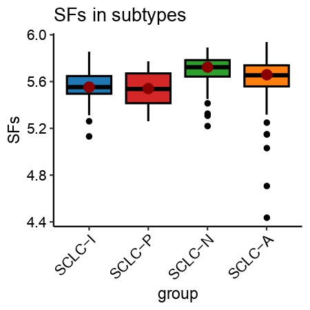

```r
library(Rsamtools)
library(GenomicFeatures)
library(GenomicAlignments)
library(BiocParallel)
library(pheatmap)
library(RColorBrewer)
library(PoiClaClu)
library(org.Mm.eg.db)
library(AnnotationDbi)
library(DOSE)
library(clusterProfiler)
library(topGO)
library(pathview)
library(org.Hs.eg.db)
library(AnnotationDbi)
library(DOSE)
library(clusterProfiler)
library(topGO)
library(ggplot2)
library(data.table)
```
Fig.1A
```r
JHB_data_all1 <- read.csv(row.names=1,"./JHB_cell_data_result1.csv")
library(BisqueRNA)
ALL_GSEA_GMT <- read.gmt("./all_merge/msigdb.v7.1.symbols.gmt")
ALL_GSEA_GMT$term <- as.character(ALL_GSEA_GMT$term)
colnames(ALL_GSEA_GMT) <- c("term","gene")

JHB_data_all1 <- JHB_data_all1[order(JHB_data_all1$log2FoldChange,decreasing=TRUE),]
JHB_data_all1$X <- rownames(JHB_data_all1)
JHB_SCLC_vs_Normal_res <- JHB_data_all1[,c("log2FoldChange","X")]
JHB_SCLC_vs_Normal_res <- na.omit(JHB_SCLC_vs_Normal_res)
JHB_SCLC_vs_Normal_res_genelist <- JHB_SCLC_vs_Normal_res$log2FoldChange
names(JHB_SCLC_vs_Normal_res_genelist) <- JHB_SCLC_vs_Normal_res$X
JHB_SCLC_vs_Normal_res_genelist <- JHB_SCLC_vs_Normal_res_genelist[JHB_SCLC_vs_Normal_res_genelist!=0]

JHB_SCLC_vs_Normal_res_GSEA <- GSEA(JHB_SCLC_vs_Normal_res_genelist, TERM2GENE=ALL_GSEA_GMT, verbose=TRUE,minGSSize=0,pvalueCutoff = 1)
mcsaveRDS(JHB_SCLC_vs_Normal_res_GSEA,"./JHB_SCLC_hsa.GeneList_GSEA.rds",mc.cores=20)
JHB_SCLC_vs_Normal_res_GSEA <- mcreadRDS("./JHB_SCLC_hsa.GeneList_GSEA.rds",mc.cores=20)

JHB_SCLC_vs_Normal_res_GSEA$target = as.factor(ifelse(JHB_SCLC_vs_Normal_res_GSEA$pvalue < 0.05 & abs(JHB_SCLC_vs_Normal_res_GSEA$NES) > 0.3, ifelse(JHB_SCLC_vs_Normal_res_GSEA$NES < -0.3 ,'Neg','Pos'),'NoSignifi'))
JHB_SCLC_vs_Normal_res_GSEA$target  <- factor(JHB_SCLC_vs_Normal_res_GSEA$target ,levels=c("Pos","NoSignifi","Neg"))
JHB_SCLC_vs_Normal_res_GSEA <- JHB_SCLC_vs_Normal_res_GSEA[order(JHB_SCLC_vs_Normal_res_GSEA$NES,decreasing=TRUE),]

Splicing_pathway <- JHB_SCLC_vs_Normal_res_GSEA$ID[grep("SPLICING",JHB_SCLC_vs_Normal_res_GSEA$ID)]
JHB_SCLC_vs_Normal_res_GSEA_splicing <- subset(JHB_SCLC_vs_Normal_res_GSEA, ID %in% Splicing_pathway)
# JHB_SCLC_vs_Normal_res_GSEA_splicing1 <- subset(JHB_SCLC_vs_Normal_res_GSEA_splicing,ID != c("LEE_METASTASIS_AND_ALTERNATIVE_SPLICING_DN"))
# JHB_SCLC_vs_Normal_res_GSEA_splicing1 <- subset(JHB_SCLC_vs_Normal_res_GSEA_splicing,ID != c("LEE_METASTASIS_AND_ALTERNATIVE_SPLICING_UP"))
JHB_SCLC_vs_Normal_res_GSEA_splicing1 <- JHB_SCLC_vs_Normal_res_GSEA_splicing[order(JHB_SCLC_vs_Normal_res_GSEA_splicing$NES,decreasing=TRUE),][1:6,]
JHB_SCLC_vs_Normal_res_GSEA_splicing1 <- JHB_SCLC_vs_Normal_res_GSEA_splicing1[order(JHB_SCLC_vs_Normal_res_GSEA_splicing1$NES,decreasing=FALSE),]

library(ggpubr)
bb <- jdb_palette("brewer_celsius")
color1 <- adjustcolor(bb[8], alpha.f = 0.8)  # 透明度 60%

p1 <- ggbarplot(JHB_SCLC_vs_Normal_res_GSEA_splicing1, 
          x = "ID", 
          y = "NES", 
          fill = "target", 
          color = "black",
          title = "SCLC VS normal Splicing pathway", 
          outlier.shape = NA, 
          rotate = TRUE,
          lab.size = 1) +
  rotate_x_text(angle = 90) + 
  scale_fill_manual(values = color1)

pdf(file="./Fig1/JHB_RNA_GSVA_splicing_SCLC_VS_normal.pdf",height=3.5,width=7)
p1
dev.off()


GSE60052_data_all1 <- read.csv(row.names=1,file="./resSCLC.csv")

ALL_GSEA_GMT <- read.gmt("./all_merge/msigdb.v7.1.symbols.gmt")
ALL_GSEA_GMT$term <- as.character(ALL_GSEA_GMT$term)
colnames(ALL_GSEA_GMT) <- c("term","gene")

GSE60052_data_all1 <- GSE60052_data_all1[order(GSE60052_data_all1$log2FoldChange,decreasing=TRUE),]
GSE60052_data_all1$X <- rownames(GSE60052_data_all1)
GSE60052_SCLC_vs_Normal_res <- GSE60052_data_all1[,c("log2FoldChange","X")]
GSE60052_SCLC_vs_Normal_res <- na.omit(GSE60052_SCLC_vs_Normal_res)
GSE60052_SCLC_vs_Normal_res_genelist <- GSE60052_SCLC_vs_Normal_res$log2FoldChange
names(GSE60052_SCLC_vs_Normal_res_genelist) <- GSE60052_SCLC_vs_Normal_res$X
GSE60052_SCLC_vs_Normal_res_genelist <- GSE60052_SCLC_vs_Normal_res_genelist[GSE60052_SCLC_vs_Normal_res_genelist!=0]

GSE60052_SCLC_vs_Normal_res_GSEA <- GSEA(GSE60052_SCLC_vs_Normal_res_genelist, TERM2GENE=ALL_GSEA_GMT, verbose=TRUE,minGSSize=0,pvalueCutoff = 1)
mcsaveRDS(GSE60052_SCLC_vs_Normal_res_GSEA,"./GSE60052_SCLC_hsa.GeneList_GSEA.rds",mc.cores=20)
GSE60052_SCLC_vs_Normal_res_GSEA <- mcreadRDS("./GSE60052_SCLC_hsa.GeneList_GSEA.rds",mc.cores=20)

GSE60052_SCLC_vs_Normal_res_GSEA <- mcreadRDS("./GSE60052_SCLC_hsa.GeneList_GSEA.rds",mc.cores=20)
GSE60052_SCLC_vs_Normal_res_GSEA$target = as.factor(ifelse(GSE60052_SCLC_vs_Normal_res_GSEA$pvalue < 0.05 & abs(GSE60052_SCLC_vs_Normal_res_GSEA$NES) > 0.3, ifelse(GSE60052_SCLC_vs_Normal_res_GSEA$NES < -0.3 ,'Neg','Pos'),'NoSignifi'))
GSE60052_SCLC_vs_Normal_res_GSEA$target  <- factor(GSE60052_SCLC_vs_Normal_res_GSEA$target ,levels=c("Pos","NoSignifi","Neg"))
GSE60052_SCLC_vs_Normal_res_GSEA <- GSE60052_SCLC_vs_Normal_res_GSEA[order(GSE60052_SCLC_vs_Normal_res_GSEA$NES,decreasing=TRUE),]

Splicing_pathway <- GSE60052_SCLC_vs_Normal_res_GSEA$ID[grep("SPLICING",GSE60052_SCLC_vs_Normal_res_GSEA$ID)]
GSE60052_SCLC_vs_Normal_res_GSEA_splicing <- subset(GSE60052_SCLC_vs_Normal_res_GSEA, ID %in% Splicing_pathway)
GSE60052_SCLC_vs_Normal_res_GSEA_splicing1 <- GSE60052_SCLC_vs_Normal_res_GSEA_splicing[order(GSE60052_SCLC_vs_Normal_res_GSEA_splicing$NES,decreasing=TRUE),][1:6,]
GSE60052_SCLC_vs_Normal_res_GSEA_splicing1 <- GSE60052_SCLC_vs_Normal_res_GSEA_splicing1[order(GSE60052_SCLC_vs_Normal_res_GSEA_splicing1$NES,decreasing=FALSE),]

library(ggpubr)
bb <- jdb_palette("brewer_celsius")
color1 <- adjustcolor(bb[8], alpha.f = 0.8)  # 透明度 60%

p1 <- ggbarplot(GSE60052_SCLC_vs_Normal_res_GSEA_splicing1, 
          x = "ID", 
          y = "NES", 
          fill = "target", 
          color = "black",
          title = "GSE60052", 
          outlier.shape = NA, 
          rotate = TRUE,
          lab.size = 1) +
  rotate_x_text(angle = 90) + 
  scale_fill_manual(values = color1)

pdf(file="./Fig1/PLOS_GENE_GSVA_splicing_SCLC_VS_normal.pdf",height=3.5,width=8)
p1
dev.off()

zgb_data_dds_res <- read.csv("./ZGB_SCLC_DATA_result.csv",row.names=1)

ALL_GSEA_GMT <- read.gmt("./all_merge/msigdb.v7.1.symbols.gmt")
colnames(ALL_GSEA_GMT) <- c("term","gene")
ALL_GSEA_GMT$term <- as.character(ALL_GSEA_GMT$term)

zgb_data_dds_res1 <- zgb_data_dds_res[order(zgb_data_dds_res$log2FoldChange,decreasing=TRUE),]
zgb_data_dds_res1$X <- rownames(zgb_data_dds_res1)
zgb_SCLC_vs_Normal_res <- zgb_data_dds_res1[,c("log2FoldChange","X")]
zgb_SCLC_vs_Normal_res <- na.omit(zgb_SCLC_vs_Normal_res)
zgb_SCLC_vs_Normal_res_genelist <- zgb_SCLC_vs_Normal_res$log2FoldChange
names(zgb_SCLC_vs_Normal_res_genelist) <- zgb_SCLC_vs_Normal_res$X
zgb_SCLC_vs_Normal_res_genelist <- zgb_SCLC_vs_Normal_res_genelist[zgb_SCLC_vs_Normal_res_genelist!=0]

zgb_SCLC_vs_Normal_res_GSEA <- GSEA(zgb_SCLC_vs_Normal_res_genelist, TERM2GENE=ALL_GSEA_GMT, verbose=TRUE,minGSSize=0,pvalueCutoff = 1)
mcsaveRDS(zgb_SCLC_vs_Normal_res_GSEA,"./zgb_SCLC_hsa.GeneList_GSEA.rds",mc.cores=20)
zgb_SCLC_vs_Normal_res_GSEA <- mcreadRDS("./zgb_SCLC_hsa.GeneList_GSEA.rds",mc.cores=20)

zgb_SCLC_vs_Normal_res_GSEA <- mcreadRDS("./zgb_SCLC_hsa.GeneList_GSEA.rds",mc.cores=20)
zgb_SCLC_vs_Normal_res_GSEA$target = as.factor(ifelse(zgb_SCLC_vs_Normal_res_GSEA$pvalue < 0.05 & abs(zgb_SCLC_vs_Normal_res_GSEA$NES) > 0.3, ifelse(zgb_SCLC_vs_Normal_res_GSEA$NES < -0.3 ,'Neg','Pos'),'NoSignifi'))
zgb_SCLC_vs_Normal_res_GSEA$target  <- factor(zgb_SCLC_vs_Normal_res_GSEA$target ,levels=c("Pos","NoSignifi","Neg"))
zgb_SCLC_vs_Normal_res_GSEA <- zgb_SCLC_vs_Normal_res_GSEA[order(zgb_SCLC_vs_Normal_res_GSEA$NES,decreasing=TRUE),]

Splicing_pathway <- zgb_SCLC_vs_Normal_res_GSEA$ID[grep("SPLICING",zgb_SCLC_vs_Normal_res_GSEA$ID)]
zgb_SCLC_vs_Normal_res_GSEA_splicing <- subset(zgb_SCLC_vs_Normal_res_GSEA, ID %in% Splicing_pathway)
zgb_SCLC_vs_Normal_res_GSEA_splicing1 <- zgb_SCLC_vs_Normal_res_GSEA_splicing[order(zgb_SCLC_vs_Normal_res_GSEA_splicing$NES,decreasing=TRUE),][1:6,]
zgb_SCLC_vs_Normal_res_GSEA_splicing1 <- zgb_SCLC_vs_Normal_res_GSEA_splicing1[order(zgb_SCLC_vs_Normal_res_GSEA_splicing1$NES,decreasing=FALSE),]
zgb_SCLC_vs_Normal_res_GSEA_splicing1$color <- "Splicing"
library(ggpubr)
bb <- jdb_palette("brewer_celsius")
color1 <- adjustcolor(bb[8], alpha.f = 0.8)  # 透明度 60%

p1 <- ggbarplot(zgb_SCLC_vs_Normal_res_GSEA_splicing1, 
          x = "ID", 
          y = "NES", 
          fill = "color", 
          color = "black",
          title = "zgb", 
          outlier.shape = NA, 
          rotate = TRUE,
          lab.size = 1) +
  rotate_x_text(angle = 90) + 
  scale_fill_manual(values = color1)

pdf(file="./Fig1/zgb_GSVA_splicing_SCLC_VS_normal.pdf",height=3.5,width=8)
p1
dev.off()


Cell2024_Zhangpeng2 <- read.csv(row.names=1,"./Cell_ZhangPeng_Protein_Matrix.csv")
Cell_Zhangpeng_clinical <- read.csv(row.names=1,"./Zhangpeng_SCLC_and_Normal_Clinical.csv")

JHB_protein_tumor <- Cell2024_Zhangpeng2[,grep("T",colnames(Cell2024_Zhangpeng2))]
JHB_protein_normal <- Cell2024_Zhangpeng2[,grep("N",colnames(Cell2024_Zhangpeng2))]

library(limma) 
merge_data_expr=Cell2024_Zhangpeng2

head(merge_data_expr)
group_list <- c(rep("Tumor",112),rep("Normal",112))
design <- model.matrix(~0+factor(group_list))
colnames(design) <- c("Normal","Tumor")
fomula <- 'Tumor-Normal'
constrast.matrix <- makeContrasts(contrasts = fomula,levels = design)
constrast.matrix 
fit <- lmFit(merge_data_expr,design)
fit2 <- contrasts.fit(fit,constrast.matrix)
fit2 <- eBayes(fit2)
res_1 <- topTable(fit2, adjust="BH", sort.by="logFC", n=Inf)
mcsaveRDS(res_1,"./JHB_Protein_SCLC_TvsN_res.rds",mc.cores=20)
JHB_protein_res <- mcreadRDS("./JHB_Protein_SCLC_TvsN_res.rds",mc.cores=20)

ALL_GSEA_GMT <- read.gmt("./all_merge/msigdb.v7.1.symbols.gmt")
colnames(ALL_GSEA_GMT) <- c("term","gene")
ALL_GSEA_GMT$term <- as.character(ALL_GSEA_GMT$term)

JHB_protein_res <- JHB_protein_res[order(JHB_protein_res$logFC,decreasing=TRUE),]
JHB_protein_res$X <- rownames(JHB_protein_res)
JHB_protein_SCLC_vs_Normal_res <- JHB_protein_res[,c("logFC","X")]
JHB_protein_SCLC_vs_Normal_res <- na.omit(JHB_protein_SCLC_vs_Normal_res)
JHB_protein_SCLC_vs_Normal_res_genelist <- JHB_protein_SCLC_vs_Normal_res$logFC
names(JHB_protein_SCLC_vs_Normal_res_genelist) <- JHB_protein_SCLC_vs_Normal_res$X
JHB_protein_SCLC_vs_Normal_res_genelist <- JHB_protein_SCLC_vs_Normal_res_genelist[JHB_protein_SCLC_vs_Normal_res_genelist!=0]
JHB_protein_SCLC_vs_Normal_res_GSEA <- GSEA(JHB_protein_SCLC_vs_Normal_res_genelist, TERM2GENE=ALL_GSEA_GMT, verbose=TRUE,minGSSize=0,pvalueCutoff = 1)
mcsaveRDS(JHB_protein_SCLC_vs_Normal_res_GSEA,"./JHB_Protein_SCLC_GSVA.rds",mc.cores=20)

JHB_protein_SCLC_vs_Normal_res_GSEA <- mcreadRDS("./JHB_Protein_SCLC_GSVA.rds",mc.cores=20)
JHB_protein_SCLC_vs_Normal_res_GSEA <- as.data.frame(JHB_protein_SCLC_vs_Normal_res_GSEA)
JHB_protein_SCLC_vs_Normal_res_GSEA$target = as.factor(ifelse(JHB_protein_SCLC_vs_Normal_res_GSEA$pvalue < 0.05 & abs(JHB_protein_SCLC_vs_Normal_res_GSEA$NES) > 0.3, ifelse(JHB_protein_SCLC_vs_Normal_res_GSEA$NES < -0.3 ,'Neg','Pos'),'NoSignifi'))
JHB_protein_SCLC_vs_Normal_res_GSEA$target  <- factor(JHB_protein_SCLC_vs_Normal_res_GSEA$target ,levels=c("Pos","NoSignifi","Neg"))
JHB_protein_SCLC_vs_Normal_res_GSEA <- JHB_protein_SCLC_vs_Normal_res_GSEA[order(JHB_protein_SCLC_vs_Normal_res_GSEA$NES,decreasing=TRUE),]

Splicing_pathway <- JHB_protein_SCLC_vs_Normal_res_GSEA$ID[grep("SPLICING",JHB_protein_SCLC_vs_Normal_res_GSEA$ID)]
JHB_protein_SCLC_vs_Normal_res_GSEA_splicing <- subset(JHB_protein_SCLC_vs_Normal_res_GSEA, ID %in% Splicing_pathway)
JHB_protein_SCLC_vs_Normal_res_GSEA_splicing1 <- JHB_protein_SCLC_vs_Normal_res_GSEA_splicing[order(JHB_protein_SCLC_vs_Normal_res_GSEA_splicing$NES,decreasing=TRUE),][1:6,]
JHB_protein_SCLC_vs_Normal_res_GSEA_splicing1 <- JHB_protein_SCLC_vs_Normal_res_GSEA_splicing1[order(JHB_protein_SCLC_vs_Normal_res_GSEA_splicing1$NES,decreasing=FALSE),]
JHB_protein_SCLC_vs_Normal_res_GSEA_splicing1$color <- "Splicing"
library(ggpubr)
bb <- jdb_palette("brewer_celsius")
color1 <- adjustcolor(bb[8], alpha.f = 0.8)  # 透明度 60%

p1 <- ggbarplot(JHB_protein_SCLC_vs_Normal_res_GSEA_splicing1, 
          x = "ID", 
          y = "NES", 
          fill = "color", 
          color = "black",
          outlier.shape = NA, 
          rotate = TRUE,
          lab.size = 1) +
  rotate_x_text(angle = 90) + 
  scale_fill_manual(values = color1)

pdf(file="./Fig1/JHB_protien_GSVA_splicing_SCLC_VS_normal.pdf",height=3.5,width=8)
p1
dev.off()
```
<div style="display: flex; justify-content: space-between;">
  
  
</div>

<div style="display: flex; justify-content: space-between;">
  
  
</div>

Fig.1B
```r
SCLC_sce_Lung_obj <- mcreadRDS("./SCLC_sce_Lung_obj.rds",mc.cores=20)
SCLC_sce_Lung_obj <- readRDS("./SCLC_sce_Lung_obj.rds")
my_pal1 <- jdb_palette("corona")
names(my_pal1) <- c("T cell","SCLC-A","SCLC-P","SCLC-N","AE1","AEP","B cell","Basal","Ciliated","Club","DC","Endothelial","Fibroblast","Hepatocyte","Ionocyte","Macrophage","Mast","Mucinous","Neuroendocrine","Neutrophil","Plasma cell")
SCLC_sce_Lung_obj$cell_type_fine <- factor(SCLC_sce_Lung_obj$cell_type_fine,levels=names(my_pal1))

p2 <- DimPlot(object = SCLC_sce_Lung_obj, reduction = "umap",repel=TRUE,label=FALSE,group.by="cell_type_fine") +scale_color_manual(values = my_pal1, guide = "none")

pdf(file="./Fig1/MSK_patients_scRNAseq_umap.pdf",height=4,width=6.6)
p2
dev.off()
```


Fig.1C
```r
SP_genes <- read.csv("./GO_term_summary_20250205_003645.csv")
SP_genes_1 <- SP_genes %>% mutate(human_gene = convert_mouse_to_human_symbols(as.character(SP_genes$Symbol))) %>% drop_na()
Splicing_factor_genes <- intersect(SP_genes_1$human_gene,rownames(SCLC_sce_Lung_obj))
speci_raw <- FetchData(object = SCLC_sce_Lung_obj, vars = Splicing_factor_genes,slot="data")
SCLC_sce_Lung_obj[["Splicing_factor_genes"]] <- (rowSums(speci_raw))/length(Splicing_factor_genes)

XY_FeaturePlot(object = SCLC_sce_Lung_obj, features = "Splicing_factor_genes",pt.size=0.2,
  ncol=5,reduction="umap",label=T,cols = CustomPalette(low ="#B0B0B0", mid = "#32CD32",high = "#FF0000"))
XY_FeaturePlot(object = SCLC_sce_Lung_obj, features = "Splicing_factor_genes", 
  pt.size=0.2, ncol=5, reduction="umap", label=T, 
  cols = CustomPalette(low ="#B0B0B0", mid = "#90EE90", high = "#FF0000"))
p1 <- XY_FeaturePlot(object = SCLC_sce_Lung_obj, features = "Splicing_factor_genes", 
  pt.size=0.2, ncol=5, reduction="umap", label=T, 
  cols = CustomPalette(low ="#007BBF", mid = "#89CFF0", high = "#FF0000"))
p1 <- XY_FeaturePlot(object = SCLC_sce_Lung_obj, features = "Splicing_factor_genes", 
  pt.size = 0.2, ncol = 5, reduction = "umap", label = TRUE, 
  cols = CustomPalette(low = "#6A5ACD", mid = "#C3B1E1", high = "#FFD700"))
pdf(file=".//Fig1/MSK_patients_scRNAseq_SFs_featureplot_umap_v3.pdf",height=3.5,width=4)
p1
dev.off()
ggsave("./Fig1/MSK_patients_scRNAseq_SFs_featureplot_umap_v31.png", plot=p1,width = 4, height = 3.5,dpi=1080)
```


Fig.1D
```r
speci_raw <- FetchData(object = SCLC_sce_Lung_obj, vars = c("Splicing_factor_genes","cell_type_fine","PRMT5"),slot="data")
speci_raw$cell_type_fine <- factor(speci_raw$cell_type_fine,levels= c("SCLC-A","SCLC-N","SCLC-P","T cell","AE1","AEP","B cell","Basal","Ciliated","Club","DC","Endothelial","Fibroblast","Hepatocyte","Ionocyte","Macrophage","Mast","Mucinous","Neuroendocrine","Neutrophil","Plasma cell"))
speci_raw$new_Group <- ifelse(speci_raw$cell_type_fine %in% c("SCLC-A","SCLC-N","SCLC-P"),speci_raw$cell_type_fine,"Non-tumor cell")
speci_raw$new_Group <- ifelse(speci_raw$cell_type_fine %in% c("SCLC-A","SCLC-N","SCLC-P"),speci_raw$cell_type_fine,"Non-tumor cell")
my_pal <- jdb_palette("corona")
p1 <- ggplot(speci_raw, aes(x = cell_type_fine, y = Splicing_factor_genes, color = cell_type_fine, fill = cell_type_fine)) +
  geom_boxplot(color = "black", size = 0.7,outlier.shape = NA) +  # 设置边框为黑色
  labs(title="SFs in subtypes") +
  scale_color_manual(values = my_pal1, guide = "none") +
  scale_fill_manual(values = my_pal1, guide = "none") +  # 为箱线图内部填充设置颜色
  theme_classic() +
  stat_summary(fun.y = median, geom = "point", colour = "darkred", size = 3) +
  NoLegend() +
  theme(axis.text.x = element_text(angle = 45, hjust = 1, size = 10, color = "black"),
        axis.text.y = element_text(size = 10, color = "black")) 
pdf(file="./Fig1/scRNAseq_MSK_subtype_SFs_expression_all_sub.pdf",height=3,width=5)
p1
dev.off()
```


Fig.1E
```r
TRMA_VS_TRM <- read.csv("./PRMA_VS_PRM_TrudyOliver.csv")

# 读入GSEA基因集
ALL_GSEA_GMT <- read.gmt("./msigdb.v7.1.symbols.gmt")
colnames(ALL_GSEA_GMT) <- c("term","gene")
ALL_GSEA_GMT$term <- as.character(ALL_GSEA_GMT$term)

# 将人类基因名转换为小鼠基因名
ALL_GSEA_GMT_mus <- ALL_GSEA_GMT
ALL_GSEA_GMT_mus$term <- as.character(ALL_GSEA_GMT_mus$term)
ALL_GSEA_GMT_mus1 <- ALL_GSEA_GMT_mus %>% mutate(mouse_gene = convert_human_to_mouse_symbols(gene))
ALL_GSEA_GMT_mus2 <- ALL_GSEA_GMT_mus1[, c("term", "mouse_gene")]
colnames(ALL_GSEA_GMT_mus2) <- c("term", "gene")
ALL_GSEA_GMT_mus2 <- na.omit(ALL_GSEA_GMT_mus2)

# 准备基因列表
TRMA_VS_TRM1 <- TRMA_VS_TRM[order(TRMA_VS_TRM$log2FoldChange, decreasing=TRUE), ]
TRMA_VS_TRM1$X <- TRMA_VS_TRM1$gene_name
TRMA_VS_TRM_SCLC_vs_Normal_res <- TRMA_VS_TRM1[, c("log2FoldChange", "X")]
TRMA_VS_TRM_SCLC_vs_Normal_res <- na.omit(TRMA_VS_TRM_SCLC_vs_Normal_res)
TRMA_VS_TRM_SCLC_vs_Normal_res_genelist <- TRMA_VS_TRM_SCLC_vs_Normal_res$log2FoldChange
names(TRMA_VS_TRM_SCLC_vs_Normal_res_genelist) <- TRMA_VS_TRM_SCLC_vs_Normal_res$X
TRMA_VS_TRM_SCLC_vs_Normal_res_genelist <- TRMA_VS_TRM_SCLC_vs_Normal_res_genelist[TRMA_VS_TRM_SCLC_vs_Normal_res_genelist != 0]

# GSEA分析
TRMA_VS_TRM_SCLC_vs_Normal_res_GSEA <- GSEA(
  TRMA_VS_TRM_SCLC_vs_Normal_res_genelist, 
  TERM2GENE = ALL_GSEA_GMT_mus2, 
  verbose = TRUE,
  minGSSize = 0,
  pvalueCutoff = 1
)

TRMA_VS_TRM_SCLC_vs_Normal_res_GSEA <- TRMA_VS_TRM_SCLC_vs_Normal_res_GSEA[order(TRMA_VS_TRM_SCLC_vs_Normal_res_GSEA$NES, decreasing = TRUE), ]

# 提取Splicing相关通路
Splicing_pathway <- TRMA_VS_TRM_SCLC_vs_Normal_res_GSEA$ID[grep("SPLICING", TRMA_VS_TRM_SCLC_vs_Normal_res_GSEA$ID)]
TRMA_VS_TRM_SCLC_vs_Normal_res_GSEA_splicing <- subset(TRMA_VS_TRM_SCLC_vs_Normal_res_GSEA, ID %in% Splicing_pathway)
TRMA_VS_TRM_SCLC_vs_Normal_res_GSEA_splicing1 <- TRMA_VS_TRM_SCLC_vs_Normal_res_GSEA_splicing[order(TRMA_VS_TRM_SCLC_vs_Normal_res_GSEA_splicing$NES, decreasing = FALSE), ][1:6, ]
TRMA_VS_TRM_SCLC_vs_Normal_res_GSEA_splicing1 <- TRMA_VS_TRM_SCLC_vs_Normal_res_GSEA_splicing1[order(TRMA_VS_TRM_SCLC_vs_Normal_res_GSEA_splicing1$NES, decreasing = TRUE), ]
TRMA_VS_TRM_SCLC_vs_Normal_res_GSEA_splicing1$color <- "Splicing"

# 绘制柱状图
library(ggpubr)
bb <- jdb_palette("brewer_celsius")
color1 <- adjustcolor(bb[8], alpha.f = 0.8)  # 设置颜色透明度60%

p1 <- ggbarplot(
  TRMA_VS_TRM_SCLC_vs_Normal_res_GSEA_splicing1, 
  x = "ID", 
  y = -log10(p.adjust), 
  fill = "color", 
  color = "black",
  title = "TRMA_VS_TRM", 
  outlier.shape = NA, 
  rotate = TRUE,
  lab.size = 1
) +
rotate_x_text(angle = 90) + 
scale_fill_manual(values = color1)
```


Fig.1F
```r
TRMA_VS_TRM <- read.csv("./PRMA_VS_PRM_TrudyOliver.csv")
SP_genes <- read.csv("./GO_term_summary_20250205_003645.csv")
SP_genes_1 <- SP_genes %>% mutate(human_gene = convert_mouse_to_human_symbols(as.character(SP_genes$Symbol))) %>% drop_na()

TRMA_VS_TRM_SFs <- subset(TRMA_VS_TRM,gene_name %in% SP_genes_1$Symbol)
p1 <- ggplot(data = TRMA_VS_TRM_SFs, aes(x = log2FoldChange, y = -log10(pvalue))) +
  geom_point(aes(color = ifelse(pvalue < 0.05 & log2FoldChange>0, "red", 
  ifelse(pvalue < 0.05 & log2FoldChange< 0 , "blue","black"))), size = 2) +  # 根据基因是否在 SP_genes_1$Symbol 中选择颜色
  geom_hline(yintercept = -log10(0.05), linetype = "dashed", color = "gray50") +
  labs(x = "log2FoldChange", y = "-log10(p-value)") +
  scale_color_identity() +  # 使用自定义的颜色
  geom_text_repel(
    data = subset(TRMA_VS_TRM_SFs, (abs(log2FoldChange)>3  &-log10(pvalue) >20) |-log10(pvalue) >30),
    aes(label = gene_name),
    hjust = 0, vjust = 1.5, color = "black")+
   theme_minimal() +
  theme(plot.margin = unit(rep(2, 4), 'cm')) +
  theme(panel.border = element_rect(color = "black", fill = NA, size = 1)) +
  theme(axis.text = element_text(size = 10), axis.title = element_text(size = 18))

pdf(file="./Fig1/TRMA_VS_TRM_Splicing_gene_volplot.pdf",height=4.5,width=4.5)
p1
dev.off()
```


Fig.1G
```r
ASCL1_binding <- read.csv("./macs2_ASCL1_binding_promoter.csv")
ASCL1_binding <- ASCL1_binding %>% mutate(human_gene = convert_mouse_to_human_symbols(as.character(ASCL1_binding$SYMBOL))) %>% drop_na()

SP_genes <- read.csv("./GO_term_summary_20250205_003645.csv")
SP_genes_1 <- SP_genes %>% mutate(human_gene = convert_mouse_to_human_symbols(as.character(SP_genes$Symbol))) %>% drop_na()

SP_gene_list <- data.frame(unique(na.omit(SP_genes_1$human_gene)))
names(SP_gene_list) <- "Symbol"
SP_gene_list$ASCL1_biding <- ifelse(SP_gene_list$Symbol %in% ASCL1_binding$human_gene, "ASCL1 biding","no biding")

my_pal1 <- jdb_palette("corona")[1:2]
names(my_pal1) <- c("no biding","ASCL1 biding")
SP_gene_list$ASCL1_biding  <- factor(SP_gene_list$ASCL1_biding ,levels=c("no biding","ASCL1 biding"))
aa <- as.data.frame(table(SP_gene_list$ASCL1_biding))
library(ggpubr)
aa$percent <- sprintf("%.1f%%", aa$Freq / sum(aa$Freq) * 100)
aa$label_text <- paste0(aa$Var1, "\n", aa$percent)
library(ggpubr)

p1 <- ggpie(aa, "Freq", label = "Var1",
      fill = "Var1", palette = my_pal1,
      title = "ASCL1 binding")
pdf(file="./Fig1/ASCL1_binding_SFs_count_ggpie.pdf",height=3,width=3)
p1
dev.off()

p1 <- ggpie(aa, "Freq",
            label = "label_text",   # 使用你准备好的标签列
            fill = "Var1",
            palette = my_pal1,
            title = "ASCL1 binding",
            lab.pos = "in")         # 标签位置：图内

pdf(file="./v1_Fig1//ASCL1_binding_SFs_count_ggpie_add_percentage.pdf",height=3,width=3)
p1
dev.off()
```


Fig.1H:./GSE155692_Trudy_Oliver_ASCL1_CUTtag/GSM4710579_PB490_ASCL1_stringent.bw
Fig.1I
```r
IMPOWER133_Clinical <- read.csv("./SCLC_Patient_data/2021_ICI_trail_IMpower133//IMPOWER133_Clinical_file.csv")
# IMPOWER133_Clinical <- subset(IMPOWER133_Clinical,ACTARM.2=="atezo")
IMPOWER133_Clinical$X <- gsub("\\-","\\.",IMPOWER133_Clinical$trunc_anonymized_sample_ids)
rownames(IMPOWER133_Clinical) <- gsub("-","_",IMPOWER133_Clinical$trunc_anonymized_sample_ids)

IMPOWER133_SCLC_bulkRNA2 <- read.csv(row.names="UNNAMED..0","./SCLC_Patient_data/2021_ICI_trail_IMpower133/IMPOWER133_SCLC_TPM_file.csv")
IMPOWER133_SCLC_bulkRNA2 <- IMPOWER133_SCLC_bulkRNA2[,-1]
IMPOWER133_SCLC_bulkRNA3 <- as.data.frame(t(IMPOWER133_SCLC_bulkRNA2))
rownames(IMPOWER133_SCLC_bulkRNA3) <- gsub("\\.","_",rownames(IMPOWER133_SCLC_bulkRNA3))
Both_id <- intersect(rownames(IMPOWER133_SCLC_bulkRNA3),rownames(IMPOWER133_Clinical))

IMPOWER133_SCLC_bulkRNA3$group <- as.character(IMPOWER133_Clinical[Both_id,]$Gay_MDACC_subtypes)
SP_genes <- read.csv("./GO_term_summary_20250205_003645.csv")
SP_genes_1 <- SP_genes %>% mutate(human_gene = convert_mouse_to_human_symbols(as.character(SP_genes$Symbol))) %>% drop_na()
IMPOWER133_SCLC_bulkRNA3$SFs <- rowMeans((IMPOWER133_SCLC_bulkRNA3[,intersect(SP_genes_1$human_gene,colnames(IMPOWER133_SCLC_bulkRNA3))]))

library(BuenColors)
library("ggpubr")

IMPOWER133_SCLC_bulkRNA3$group1 <- ifelse(IMPOWER133_SCLC_bulkRNA3$group %in% c("SCLC-A","SCLC-N"),"NE","Non-NE")


p1 <- ggplot(IMPOWER133_SCLC_bulkRNA3, aes(x = group, y = SFs, color = group, fill = group)) +
  geom_boxplot(color = "black", size = 0.7) +  # 设置边框为黑色
  labs(title="SFs in subtypes") +
  scale_color_manual(values = my_pal, guide = "none",outlier.shape = NA) +
  scale_fill_manual(values = my_pal, guide = "none") +  # 为箱线图内部填充设置颜色
  theme_classic() +
  stat_summary(fun.y = median, geom = "point", colour = "darkred", size = 3) +
  NoLegend() +
  theme(axis.text.x = element_text(angle = 45, hjust = 1, size = 10, color = "black"),
        axis.text.y = element_text(size = 10, color = "black")) +
  stat_compare_means(comparisons = list(c("BaseLine", "Resis_Ctrl")), label = "p.signif", method = "t.test")
pdf(file="/Fig1/IMPOWER133_subtype_SFs_expression_v3.pdf",height=3,width=3)
p1
dev.off()

JHB_data_all1 <- read.csv(row.names=1,"./JHB_cell_data_result1.csv")
JHB_data_tumor <- JHB_data_all1[,grep("T",colnames(JHB_data_all1))]
JHB_data_tumor1 <- as.data.frame(t(JHB_data_tumor))

JHB_marker_genes <- JHB_data_tumor1[,c("YAP1","NEUROD1" ,"ASCL1" ,"POU2F3")]
JHB_marker_genes$subtype <- apply(JHB_marker_genes, 1, function(row) {colnames(JHB_marker_genes)[which.max(row)]})
JHB_data_tumor1$subtype <- JHB_marker_genes[rownames(JHB_data_tumor1),]$subtype

SP_genes <- read.csv("./GO_term_summary_20250205_003645.csv")
SP_genes_1 <- SP_genes %>% mutate(human_gene = convert_mouse_to_human_symbols(as.character(SP_genes$Symbol))) %>% drop_na()
JHB_data_tumor1$SFs <- rowMeans((JHB_data_tumor1[,intersect(SP_genes_1$human_gene,colnames(JHB_data_tumor1))]))

# JHB_data_tumor1$subtype <- factor(JHB_data_tumor1$subtype,levels=c("ASCL1","NEUROD1","POU2F3","YAP1"))

JHB_data_tumor1$subtype1 <- ifelse(JHB_data_tumor1$subtype %in% c("ASCL1","NEUROD1"),"NE","Non-NE")
JHB_data_tumor1$subtype1 <- factor(JHB_data_tumor1$subtype1,levels=c("NE","Non-NE"))


my_pal <- jdb_palette("corona")
p1 <- ggplot(JHB_data_tumor1, aes(x = subtype, y = log2(SFs), color = subtype, fill = subtype)) +
  geom_boxplot(color = "black", size = 0.7,outlier.shape = NA) +  # 设置边框为黑色
  labs(title="SFs in subtypes") +
  scale_color_manual(values = my_pal, guide = "none") +
  scale_fill_manual(values = my_pal, guide = "none") +  # 为箱线图内部填充设置颜色
  theme_classic() +
  stat_summary(fun.y = median, geom = "point", colour = "darkred", size = 3) +
  NoLegend() +
  theme(axis.text.x = element_text(angle = 45, hjust = 1, size = 10, color = "black"),
        axis.text.y = element_text(size = 10, color = "black")) +
    stat_compare_means(comparisons = list(c("NE", "Non-NE")), label = "p.signif", method = "t.test")

pdf(file=".//Fig1/JHB_RBA_subtype_SFs_expression_v2.pdf",height=3,width=3)
p1
dev.off()

PLOS_GENE_count <- read.csv(row.names=1,file="./GSE60052_79tumor.7normal.normalized.log2.data.Rda.tsv",sep = "\t")
PLOS_GENE_count1 <- PLOS_GENE_count[,!(grepl("normal",colnames(PLOS_GENE_count)))]
PLOS_GENE_count2 <- as.data.frame(t(PLOS_GENE_count1))

PLOS_GENE_marker_genes <- PLOS_GENE_count2[,c("YAP1","NEUROD1" ,"ASCL1" ,"POU2F3")]
PLOS_GENE_marker_genes$subtype <- apply(PLOS_GENE_marker_genes, 1, function(row) {colnames(PLOS_GENE_marker_genes)[which.max(row)]})
PLOS_GENE_count2$subtype <- PLOS_GENE_marker_genes[rownames(PLOS_GENE_count2),]$subtype

SP_genes <- read.csv("./GO_term_summary_20250205_003645.csv")
SP_genes_1 <- SP_genes %>% mutate(human_gene = convert_mouse_to_human_symbols(as.character(SP_genes$Symbol))) %>% drop_na()
PLOS_GENE_count2$SFs <- rowMeans((PLOS_GENE_count2[,intersect(SP_genes_1$human_gene,colnames(PLOS_GENE_count2))]))
# PLOS_GENE_count2$subtype <- factor(PLOS_GENE_count2$subtype,levels=c("ASCL1","NEUROD1","POU2F3","YAP1"))
PLOS_GENE_count2$subtype1 <- ifelse(PLOS_GENE_count2$subtype %in% c("ASCL1","NEUROD1"),"NE","Non-NE")
PLOS_GENE_count2$subtype1 <- factor(PLOS_GENE_count2$subtype1,levels=c("NE","Non-NE"))


my_pal <- jdb_palette("corona")
p1 <- ggplot(PLOS_GENE_count2, aes(x = subtype, y = log2(SFs), color = subtype, fill = subtype)) +
  geom_boxplot(color = "black", size = 0.7,outlier.shape = NA) +  # 设置边框为黑色
  labs(title="SFs in subtypes") +
  scale_color_manual(values = my_pal, guide = "none") +
  scale_fill_manual(values = my_pal, guide = "none") +  # 为箱线图内部填充设置颜色
  theme_classic() +
  stat_summary(fun.y = median, geom = "point", colour = "darkred", size = 3) +
  NoLegend() +
  theme(axis.text.x = element_text(angle = 45, hjust = 1, size = 10, color = "black"),
        axis.text.y = element_text(size = 10, color = "black")) +
  stat_compare_means(comparisons = list(c("BaseLine", "Resis_Ctrl")), label = "p.signif", method = "t.test")
pdf(file="./Fig1/PLOS_GENE_subtype_SFs_expression_v2.pdf",height=3,width=3)
p1
dev.off()


zgb_data_dds_res <- read.csv("./2_output/ZGB_SCLC_DATA_result.csv",row.names=1)
zgb_data_dds_count <- as.data.frame(t(zgb_data_dds_res[,1:54]))

zgb_marker_genes <- zgb_data_dds_count[,c("YAP1","NEUROD1" ,"ASCL1" ,"POU2F3")]
zgb_marker_genes$subtype <- apply(zgb_marker_genes, 1, function(row) {colnames(zgb_marker_genes)[which.max(row)]})
zgb_data_dds_count$subtype <- zgb_marker_genes[rownames(zgb_data_dds_count),]$subtype

SP_genes <- read.csv("./GO_term_summary_20250205_003645.csv")
SP_genes_1 <- SP_genes %>% mutate(human_gene = convert_mouse_to_human_symbols(as.character(SP_genes$Symbol))) %>% drop_na()
# zgb_data_dds_count$SFs <- rowMeans((zgb_data_dds_count[,intersect(SP_genes_1$human_gene,colnames(zgb_data_dds_count))]))
zgb_data_dds_count$SFs <- rowMeans((zgb_data_dds_count[,intersect(SP_genes_1$human_gene,colnames(zgb_data_dds_count))]))
# zgb_data_dds_count$subtype <- factor(zgb_data_dds_count$subtype,levels=c("ASCL1","NEUROD1","POU2F3","YAP1"))
zgb_data_dds_count$subtype1 <- ifelse(zgb_data_dds_count$subtype %in% c("ASCL1","NEUROD1"),"NE","Non-NE")
zgb_data_dds_count$subtype1 <- factor(zgb_data_dds_count$subtype1,levels=c("NE","Non-NE"))

zgb_data_dds_count$SFs_log <- log2(zgb_data_dds_count$SFs+1)
zgb_data_dds_count$ASCL1_log <- log2(zgb_data_dds_count$ASCL1+1)
zgb_data_dds_count1 <- zgb_data_dds_count[grep("_T",rownames(zgb_data_dds_count)),]

my_pal <- jdb_palette("corona")
p1 <- ggplot(zgb_data_dds_count1, aes(x = subtype1, y = log2(SFs), color = subtype1, fill = subtype1)) +
  geom_boxplot(color = "black", size = 0.7,outlier.shape = NA) +  # 设置边框为黑色
  labs(title="SFs in subtypes") +
  scale_color_manual(values = my_pal, guide = "none") +
  scale_fill_manual(values = my_pal, guide = "none") +  # 为箱线图内部填充设置颜色
  theme_classic() +
  stat_summary(fun.y = median, geom = "point", colour = "darkred", size = 3) +
  NoLegend() +
  theme(axis.text.x = element_text(angle = 45, hjust = 1, size = 10, color = "black"),
        axis.text.y = element_text(size = 10, color = "black")) +
  stat_compare_means(comparisons = list(c("NE", "Non-NE")), label = "p.signif", method = "t.test")
pdf(file="./Fig1/ZGB_subtype_SFs_expression_v3.pdf",height=3,width=3)
p1
dev.off()
pdf(file="./Fig1/ZGB_subtype_SFs_expression_log_NE_and_Non-NE.pdf",height=3,width=3)
p1
dev.off()

Cell2024_Zhangpeng2 <- read.csv(row.names=1,"./SCLC_Patient_data/2024_Zhangpeng_SCLC_proteomics/protein_expression_matrix.csv")
Cell2024_Zhangpeng2 <- Cell2024_Zhangpeng2[,grep("T",colnames(Cell2024_Zhangpeng2))]
Cell2024_Zhangpeng3 <- as.data.frame(t(Cell2024_Zhangpeng2))

Cell2024_marker_genes <- Cell2024_Zhangpeng3[,c("YAP1","NEUROD1" ,"ASCL1" ,"POU2F3")]
Cell2024_marker_genes$subtype <- apply(Cell2024_marker_genes, 1, function(row) {colnames(Cell2024_marker_genes)[which.max(row)]})
Cell2024_Zhangpeng3$subtype <- Cell2024_marker_genes[rownames(Cell2024_Zhangpeng3),]$subtype

SP_genes <- read.csv("./GO_term_summary_20250205_003645.csv")
SP_genes_1 <- SP_genes %>% mutate(human_gene = convert_mouse_to_human_symbols(as.character(SP_genes$Symbol))) %>% drop_na()
# Cell2024_Zhangpeng3$SFs <- rowMeans((Cell2024_Zhangpeng3[,intersect(SP_genes_1$human_gene,colnames(Cell2024_Zhangpeng3))]))
Cell2024_Zhangpeng3$SFs <- rowMeans(2^(Cell2024_Zhangpeng3[,intersect(SP_genes_1$human_gene,colnames(Cell2024_Zhangpeng3))]))
# Cell2024_Zhangpeng3$subtype <- factor(Cell2024_Zhangpeng3$subtype,levels=c("ASCL1","NEUROD1","POU2F3","YAP1"))
Cell2024_Zhangpeng3$subtype1 <- ifelse(Cell2024_Zhangpeng3$subtype %in% c("ASCL1","NEUROD1"),"NE","Non-NE")
Cell2024_Zhangpeng3$subtype1 <- factor(Cell2024_Zhangpeng3$subtype1,levels=c("NE","Non-NE"))

my_pal <- jdb_palette("corona")
p1 <- ggplot(Cell2024_Zhangpeng3, aes(x = subtype, y = log2(SFs), color = subtype, fill = subtype)) +
  geom_boxplot(color = "black", size = 0.7,outlier.shape = NA) +  # 设置边框为黑色
  labs(title="SFs in subtypes") +
  scale_color_manual(values = my_pal, guide = "none") +
  scale_fill_manual(values = my_pal, guide = "none") +  # 为箱线图内部填充设置颜色
  theme_classic() +
  stat_summary(fun.y = median, geom = "point", colour = "darkred", size = 3) +
  NoLegend() +
  theme(axis.text.x = element_text(angle = 45, hjust = 1, size = 10, color = "black"),
        axis.text.y = element_text(size = 10, color = "black")) +
  stat_compare_means(comparisons = list(c("BaseLine", "Resis_Ctrl")), label = "p.signif", method = "t.test")
pdf(file="./Fig1/JHB_protein_subtype_SFs_expression_v2.pdf",height=3,width=3)
p1
dev.off()
```

<div style="display: flex; justify-content: space-between;">
  
  
  
  
</div>

<!-- <div style="display: flex; justify-content: space-between;">
  
  
</div> -->

Fig.1J
```r
SCLC_patients_RNA <- read.csv("./SCLC_Patient_data/SCLC_Nature_RNA.csv")
SCLC_patients_clinical <- fread("./SCLC_Patient_data/SCLC_Nature_Clinical.csv")
colnames(SCLC_patients_clinical) <- gsub("-","_",colnames(SCLC_patients_clinical))
SCLC_Counts <- SCLC_patients_RNA[!duplicated(SCLC_patients_RNA$gene),]
rownames(SCLC_Counts) <- SCLC_Counts$gene
SCLC_Counts <- SCLC_Counts[,-1]
SCLC_Counts <- SCLC_Counts[,-1]

SCLC_Counts1 <- as.data.frame(t(SCLC_Counts))
SCLC_patients_clinical <- as.data.frame(SCLC_patients_clinical)
rownames(SCLC_patients_clinical) <- SCLC_patients_clinical$Sample
patient_clinical <- SCLC_patients_clinical[rownames(SCLC_Counts1),]

Tmp_gene_clinical <- cbind(patient_clinical,SCLC_Counts1)
meta <- Tmp_gene_clinical
meta[is.na(meta)] <- "HHH"
all_merge <- meta[!meta$overall_survival == "HHH",]
all_merge$Status <- as.character(all_merge$Status)
all_merge$final_status <- ifelse(all_merge$Status=="alive",0,1)
all_merge$overall_survival <- as.numeric(all_merge$overall_survival)

SP_genes <- read.csv("./GO_term_summary_20250205_003645.csv")
SP_genes_1 <- SP_genes %>% mutate(human_gene = convert_mouse_to_human_symbols(as.character(SP_genes$Symbol))) %>% drop_na()
all_merge$SFs = rowMeans(all_merge[,intersect(SP_genes_1$human_gene,colnames(all_merge))])

library("survival")
library("survminer")
all_merge.cut <- surv_cutpoint(
   all_merge,
   time = "overall_survival",
   event = "final_status",
   variables = c("SFs"),
   progressbar=TRUE,
   minprop=0.1
)

all_merge.cut.cat <- surv_categorize(all_merge.cut) 
library(survival)
fit <- survfit(Surv(overall_survival, final_status) ~ SFs, data = all_merge.cut.cat)
p1 <- ggsurvplot(fit, data = all_merge.cut.cat,
surv.median.line = "hv",
pval = TRUE,
ggtheme = theme_bw(),
risk.table=TRUE)

pdf(file="./Fig1/Nature2013_SFs_OS_survival.pdf",height=5,width=4)
p1
dev.off()

CTC_data <- mcreadRDS("./SCLC_Patient_data/SCLC_CTC/bulk_RNA/counts_table/SCLC_CTC.bulk.all.data.rds",mc.cores=20)
CTC_meta_data <- mcreadRDS("./SCLC_Patient_data/SCLC_CTC/bulk_RNA/counts_table/SCLC_CTC.bulk.meta.rds",mc.cores=20)

setwd("./")
CDX_META_INFO <- read.csv("./SCLC_Patient_data/SCLC_CTC/bulk_RNA/counts_table/CDX_META_INFO.csv")
CDX_META_INFO$CDX.No. <- paste0("CDX",CDX_META_INFO$CDX.No.)
CDX_META_INFO$CDX.No. <- gsub("CDX33P","CDX33/33P",CDX_META_INFO$CDX.No.)
all_tmp_data <- future_lapply(CDX_META_INFO$CDX.No.,function(x){
  sel_meta <- subset(CDX_META_INFO,CDX.No.==x)
  id_t <- unlist(strsplit(sel_meta$CDX.No.,split="/"))
  if (length(id_t)==1) {
    sel_meta <- do.call(rbind,list(sel_meta,sel_meta,sel_meta,sel_meta,sel_meta,sel_meta))
    sel_meta$id <- c(rep(id_t[1],6))
    sel_meta$new_id <- paste0(sel_meta$CDX.No.,c("",".1",".2",".3",".4",".5"))
  } else {
    sel_meta <- do.call(rbind,list(sel_meta,sel_meta,sel_meta,sel_meta,sel_meta,sel_meta,
      sel_meta,sel_meta,sel_meta,sel_meta,sel_meta,sel_meta))
    sel_meta$id <- c(rep(id_t[1],6),rep(paste0("CDX",id_t[2]),6))
    sel_meta$new_id <- c(paste0(id_t[1],c("",".1",".2",".3",".4",".5")),paste0("CDX",id_t[2],c("",".1",".2",".3",".4",".5")))
  }
  return(sel_meta)
  })
all_tmp <- do.call(rbind,all_tmp_data)
all_tmp$new_id <- gsub("CDX0","CDX",all_tmp$new_id)
all_tmp$id <- gsub("CDX0","CDX",all_tmp$id)
rownames(all_tmp) <- all_tmp$new_id

CDXData <- read.csv("./SCLC_Patient_data/SCLC_CTC/bulk_RNA/counts_table/FinalCDXDataTable.csv")
colnames(CDXData) <- gsub("CDX0","CDX",colnames(CDXData))
CDXData <- CDXData[!duplicated(CDXData$gene_name),]
rownames(CDXData) <- CDXData$gene_name
CDXData <- CDXData[,-c(1,2,3)]
both_id <- intersect(colnames(CDXData),rownames(all_tmp))
all_tmp1 <- all_tmp[both_id,]
CDXData1 <- CDXData[,both_id]
rownames(CDXData1) <- CDXData$gene_name
all_tmp1$anno <- "OTS"
all_tmp1$anno[which(all_tmp1$Site.s..of.Metastases == "Bone, Brain")] <- "Brain_Metastasis"
write.csv(all_tmp1,"./CTC_CDX/all_tmp1_clinical.csv")
all_tmp1 <- read.csv(row.names=1,"./CTC_CDX/all_tmp1_clinical.csv")

CDX_res1 <- read.csv("./CTC_CDX_cohots_CDX14P_Brian_vs_OTS_v2.csv",row.names=1,header=TRUE)
CDX_res1 <- CDX_res1[order(CDX_res1$log2FoldChange,decreasing=TRUE),]
CDX_res1$gene <- rownames(CDX_res1)

CDX_dds_cou_count <- CDX_res1[,c(1:3,11:(ncol(CDX_res1)-1))]
CDX_dds_cou_count1 <- as.data.frame(t(CDX_dds_cou_count))

CDX_dds_cou_count2 <- CDX_dds_cou_count1[!grepl("\\.", rownames(CDX_dds_cou_count1)),]
CDX_dds_cou_count3 <- CDX_dds_cou_count2[!grepl("\\P", rownames(CDX_dds_cou_count2)),]

meta <- all_tmp1
Both_id_1 <- intersect(rownames(meta),rownames(CDX_dds_cou_count3))
meta <- cbind(meta[Both_id_1,],CDX_dds_cou_count3[Both_id_1,])
meta[is.na(meta)] <- "HHH"
all_merge <- meta[!meta$Survival..months. == "HHH",]
all_merge$Status <- "1"
all_merge$final_status <- ifelse(all_merge$Status=="alive",0,1)
all_merge$Survival..months. <- as.numeric(all_merge$Survival..months.)

SP_genes <- read.csv("./GO_term_summary_20250205_003645.csv")
SP_genes_1 <- SP_genes %>% mutate(human_gene = convert_mouse_to_human_symbols(as.character(SP_genes$Symbol))) %>% drop_na()
all_merge$SFs <- rowMeans((all_merge[,intersect(SP_genes_1$human_gene,colnames(all_merge))]))

library("survival")
library("survminer")
all_merge.cut <- surv_cutpoint(
   all_merge,
   time = "Survival..months.",
   event = "final_status",
   variables = c("SFs"),
   progressbar=TRUE,
   minprop=0.2
)

summary(all_merge.cut)
all_merge.cut.cat <- surv_categorize(all_merge.cut) 
library(survival)

fit <- survfit(Surv(Survival..months., final_status) ~ SFs, data = all_merge.cut.cat)
p1 <- ggsurvplot(fit, data = all_merge.cut.cat,
surv.median.line = "hv",title = "SFs",
pval = TRUE,
ggtheme = theme_bw(),
risk.table=TRUE)

pdf(file="./Fig1/CTC_CDX_SFs_survival.pdf",height=5,width=4)
p1
dev.off()

JHB_data_all1 <- read.csv(row.names=1,"./JHB_cell_data_result1.csv")
Cell_Zhangpeng_clinical <- read.csv(row.names=1,"./Zhangpeng_SCLC_and_Normal_Clinical.csv")
rownames(Cell_Zhangpeng_clinical) <- paste0("T",rownames(Cell_Zhangpeng_clinical))
JHB_data_all1_tumor <- JHB_data_all1[,grep("T",colnames(JHB_data_all1))]
JHB_data_all1_tumor1 <- as.data.frame(t(JHB_data_all1_tumor))

JHB_both_cli <- intersect(rownames(JHB_data_all1_tumor1),rownames(Cell_Zhangpeng_clinical))

JHB_both_cli_clinical <- cbind(Cell_Zhangpeng_clinical[JHB_both_cli,],JHB_data_all1_tumor1[JHB_both_cli,])
meta <- as.data.frame(JHB_both_cli_clinical)
all_merge <- meta[!is.na(as.character(meta$Survial..months.)),]
all_merge$Status. <- as.character(all_merge$Status.)
all_merge$final_Status. <- ifelse(all_merge$Status.=="alive",0,1)
all_merge$Survial..months. <- as.numeric(gsub(" (died for operation-associated complication)","",all_merge$Survial..months.))
all_merge1 <- all_merge[!is.na(all_merge$Survial..months.),]

SP_genes <- read.csv("./GO_term_summary_20250205_003645.csv")
SP_genes_1 <- SP_genes %>% mutate(human_gene = convert_mouse_to_human_symbols(as.character(SP_genes$Symbol))) %>% drop_na()

all_merge1$SFs_v2 = rowMeans(all_merge1[,intersect(SP_genes_1$human_gene,colnames(all_merge1))])

library("survival")
library("survminer")
all_merge1.cut <- surv_cutpoint(
   all_merge1,
   time = "Survial..months.",
   event = "final_Status.",
   variables = c("SFs_v2"),
   progressbar=TRUE,
   minprop=0.15
)

all_merge1.cut.cat <- surv_categorize(all_merge1.cut) 
library(survival)
fit <- survfit(Surv(Survial..months., final_Status.) ~ SFs_v2, data = all_merge1.cut.cat)
p1 <- ggsurvplot(fit, data = all_merge1.cut.cat,
surv.median.line = "hv",
pval = TRUE,
ggtheme = theme_bw(),
risk.table=TRUE)

pdf(file="./Fig1/JHB_RNA_SFs_OS_survival.pdf",height=5,width=4)
p1
dev.off()

Cell2024_Zhangpeng2 <- read.csv(row.names=1,"./SCLC_Patient_data/2024_Zhangpeng_SCLC_proteomics/protein_expression_matrix.csv")
Cell2024_Zhangpeng2 <- Cell2024_Zhangpeng2[,grep("T",colnames(Cell2024_Zhangpeng2))]
Cell2024_Zhangpeng3 <- as.data.frame(t(Cell2024_Zhangpeng2))
Cell_Zhangpeng_clinical <- read.csv(row.names=1,"./SCLC_Patient_data/2024_Zhangpeng_SCLC_proteomics/Zhangpeng_SCLC_and_Normal_Clinical.csv")
rownames(Cell_Zhangpeng_clinical) <- paste0("T",rownames(Cell_Zhangpeng_clinical))
ZhangPeng_both_cli <- intersect(rownames(Cell2024_Zhangpeng3),rownames(Cell_Zhangpeng_clinical))
ZhangPeng_both_cli_clinical <- cbind(Cell_Zhangpeng_clinical[ZhangPeng_both_cli,],Cell2024_Zhangpeng3[ZhangPeng_both_cli,])

meta <- as.data.frame(ZhangPeng_both_cli_clinical)
all_merge <- meta[!is.na(as.character(meta$Survial..months.)),]
all_merge$Status. <- as.character(all_merge$Status.)
all_merge$final_Status. <- ifelse(all_merge$Status.=="alive",0,1)
all_merge$Survial..months. <- as.numeric(gsub(" (died for operation-associated complication)","",all_merge$Survial..months.))
all_merge1 <- all_merge[!is.na(all_merge$Survial..months.),]

SP_genes <- read.csv("./GO_term_summary_20250205_003645.csv")
SP_genes_1 <- SP_genes %>% mutate(human_gene = convert_mouse_to_human_symbols(as.character(SP_genes$Symbol))) %>% drop_na()
all_merge1$SFs <- rowMeans(2^(all_merge1[,intersect(SP_genes_1$human_gene,colnames(all_merge1))]))


library("survival")
library("survminer")
all_merge1.cut <- surv_cutpoint(
   all_merge1,
   time = "Survial..months.",
   event = "final_Status.",
   variables = c("SFs"),
   progressbar=TRUE,
   minprop=0.1
)

all_merge1.cut.cat <- surv_categorize(all_merge1.cut) 
library(survival)
fit <- survfit(Surv(Survial..months., final_Status.) ~ SFs, data = all_merge1.cut.cat)
p1 <- ggsurvplot(fit, data = all_merge1.cut.cat,
surv.median.line = "hv",
pval = TRUE,
ggtheme = theme_bw(),
risk.table=TRUE)

pdf(file="./Fig1/CellZhangpeng_protein_SFs_survival.pdf",height=5,width=4)
p1
dev.off()
```

<div style="display: flex; justify-content: space-between;">
  
  
  
  
</div>
