```r
/usr/local/R4.2/bin/R
    library(dplyr)
    library(Seurat)
    library(Matrix)
    library(proxy)
    library(gplots)
    library(Rtsne)
    library(densityClust)
    library(irlba)
    library(monocle)
    library(plyr)
    library(DOSE)
    library(clusterProfiler)
    library(topGO)
    library(pathview)
    library(AnnotationDbi)
    library(cowplot)
    library(ggplot2)
    library(velocyto.R)
    library(trqwe)
    library(Rsamtools)
    library(GenomicFeatures)
    library(GenomicAlignments)
    library(BiocParallel)
    library(pheatmap)
    library(RColorBrewer)
    library(PoiClaClu)
    library(org.Mm.eg.db)
    library(org.Hs.eg.db)
    library(DESeq2)
    library(data.table)
    library(stringr)
    library(iTALK)
    library(nichenetr)
    library(tidyr)
    library(GenomicRanges)
    library(viridis)
    library(chromVAR)
    library(ggpubr)
    library(corrplot)
    library(SingleCellExperiment)
    library(scater)
    library(flexmix)
    library(splines)
    library(biomaRt)
    library(miQC)
    library(scales)
    library(BuenColors)
    library(PCAtools)
    library(trqwe)
    library(future)
    library(future.apply)
source("./programme/R_PACKAGES/my_code/MyBestFunction_scRNA.R.v4.R")
library(future)
library(future.apply)
options(future.globals.maxSize = 700 * 1024^3)
```

```shell
eg:
cd ./public_omics/PLOS_bamfile/
vim PLOS_SCLC_bam.txt
./public_omics/PLOS_bamfile/SRR1797265.bam,./public_omics/PLOS_bamfile/SRR1797263.bam,./public_omics/PLOS_bamfile/SRR1797259.bam,./public_omics/PLOS_bamfile/SRR1797258.bam
vim PLOS_Normal_bam.txt
./public_omics/PLOS_bamfile/SRR1797222.bam,./public_omics/PLOS_bamfile/SRR1797220.bam,./public_omics/PLOS_bamfile/SRR1797223.bam,./public_omics/PLOS_bamfile/SRR1797218.bam

cd ./public_omics/PLOS_bamfile/
python ./programme/rmats-turbo-master/rmats.py \
--b1 PLOS_SCLC_bam.txt \
--b2 PLOS_Normal_bam.txt \
--gtf /mnt/data/public_data/hg19/Homo_sapiens/UCSC/hg19/Annotation/Genes/genes.gtf \
--od ./workshop/xm_workshop/projects/SCLC_Splicing/human_data/1_PLOS/1_rMATs/1_paired_4patients \
--tmp ./workshop/xm_workshop/projects/SCLC_Splicing/human_data/1_PLOS/1_rMATs/1_paired_4patients/tmp \
-t paired --nthread 25 --readLength 90
```

Fig.2A
```r
```r 
PLOS

SE_JC <- fread("./workshop/xm_workshop/projects/SCLC_Splicing/human_data/1_PLOS/1_rMATs/1_paired_4patients/SE.MATS.JC.txt")
SE_JC <- as.data.frame(SE_JC)
head(SE_JC)
SE_JC$AS_Type <- "SE"
SE_JC <- SE_JC[,c("PValue","FDR","IncLevel1","IncLevel2","IncLevelDifference","AS_Type")]
RI_JC <- fread("./workshop/xm_workshop/projects/SCLC_Splicing/human_data/1_PLOS/1_rMATs/1_paired_4patients/RI.MATS.JC.txt")
RI_JC <- as.data.frame(RI_JC)
head(RI_JC)
RI_JC$AS_Type <- "RI"
RI_JC <- RI_JC[,c("PValue","FDR","IncLevel1","IncLevel2","IncLevelDifference","AS_Type")]
MXE_JC <- fread("./workshop/xm_workshop/projects/SCLC_Splicing/human_data/1_PLOS/1_rMATs/1_paired_4patients/MXE.MATS.JC.txt")
MXE_JC <- as.data.frame(MXE_JC)
head(MXE_JC)
MXE_JC$AS_Type <- "MXE"
MXE_JC <- MXE_JC[,c("PValue","FDR","IncLevel1","IncLevel2","IncLevelDifference","AS_Type")]
A3SS_JC <- fread("./workshop/xm_workshop/projects/SCLC_Splicing/human_data/1_PLOS/1_rMATs/1_paired_4patients/A3SS.MATS.JC.txt")
A3SS_JC <- as.data.frame(A3SS_JC)
head(A3SS_JC)
A3SS_JC$AS_Type <- "A3SS"
A3SS_JC <- A3SS_JC[,c("PValue","FDR","IncLevel1","IncLevel2","IncLevelDifference","AS_Type")]
A5SS_JC <- fread("./workshop/xm_workshop/projects/SCLC_Splicing/human_data/1_PLOS/1_rMATs/1_paired_4patients/A5SS.MATS.JC.txt")
A5SS_JC <- as.data.frame(A5SS_JC)
head(A5SS_JC)
A5SS_JC$AS_Type <- "A5SS"
A5SS_JC <- A5SS_JC[,c("PValue","FDR","IncLevel1","IncLevel2","IncLevelDifference","AS_Type")]

data <- rbind(SE_JC,RI_JC,MXE_JC,A3SS_JC,A5SS_JC)
PLOS_GENE_splicing_data <- data
PLOS_GENE_splicing_data$IncLevel1  <- gsub(",NA","",PLOS_GENE_splicing_data$IncLevel1)
PLOS_GENE_splicing_data$IncLevel2  <- gsub(",NA","",PLOS_GENE_splicing_data$IncLevel2)

PLOS_GENE_splicing_data$IncLevel1  <- gsub("NA,","",PLOS_GENE_splicing_data$IncLevel1)
PLOS_GENE_splicing_data$IncLevel2  <- gsub("NA,","",PLOS_GENE_splicing_data$IncLevel2)

PLOS_GENE_splicing_data$IncLevel1_mean_psi <- apply(PLOS_GENE_splicing_data, 1, function(x) mean(as.numeric(strsplit(x["IncLevel1"], ",")[[1]]), na.rm = TRUE))
PLOS_GENE_splicing_data$IncLevel2_mean_psi <- apply(PLOS_GENE_splicing_data, 1, function(x) mean(as.numeric(strsplit(x["IncLevel2"], ",")[[1]]), na.rm = TRUE))
write.csv(PLOS_GENE_splicing_data,"./public_omics/PLOS_GENE_data/paired_4patients_PLOS_GENE_splicing_data_event_summary.csv")

ZGB_splicing_data <- read.csv(row.names=1,"./public_omics/ZGB_SCLC_DATA/Splicing_event_summary.csv")
JHB_splicing_data <- read.csv(row.names=1,"./public_omics/JHB_data/JHB_splicing_data_event_summary.csv")
PLOS_GENE_splicing_data_new <- read.csv(row.names=1,"./public_omics/PLOS_GENE_data/paired_4patients_PLOS_GENE_splicing_data_event_summary.csv")

ZGB_splicing_data1 <- as.data.frame(table(ZGB_splicing_data$AS_Type))
my_pal1 <- jdb_palette("corona")
ZGB_splicing_data1$Var1 <- factor(ZGB_splicing_data1$Var1,c("SE","MXE","RI","A3SS","A5SS"))
p1 <- ggpie(ZGB_splicing_data1, "Freq", label = "Var1",
      fill = "Var1", palette = my_pal1,
      title = "ZGB Splicing event")
pdf("./output/v1_Fig2/ZGB_event_subtype.pdf",height=3.5,width=3.5)
p1
dev.off()


JHB_splicing_data1 <- as.data.frame(table(JHB_splicing_data$AS_Type))
my_pal1 <- jdb_palette("corona")
JHB_splicing_data1$Var1 <- factor(JHB_splicing_data1$Var1,c("SE","MXE","RI","A3SS","A5SS"))
p1 <- ggpie(JHB_splicing_data1, "Freq", label = "Var1",
      fill = "Var1", palette = my_pal1,
      title = "JHB Splicing event")
pdf("./output/v1_Fig2/JHB_event_subtype.pdf",height=3.5,width=3.5)
p1
dev.off()


PLOS_GENE_splicing_data_new1 <- as.data.frame(table(PLOS_GENE_splicing_data_new$AS_Type))
my_pal1 <- jdb_palette("corona")
PLOS_GENE_splicing_data_new1$Var1 <- factor(PLOS_GENE_splicing_data_new1$Var1,c("SE","MXE","RI","A3SS","A5SS"))
p1 <- ggpie(PLOS_GENE_splicing_data_new1, "Freq", label = "Var1",
      fill = "Var1", palette = my_pal1,
      title = "PLOS paired Splicing event")
pdf("./output/v1_Fig2/paired_4patients_PLOS_event_subtype.pdf",height=3.5,width=3.5)
p1
dev.off()
```
<div style="display: flex; justify-content: space-between;">
  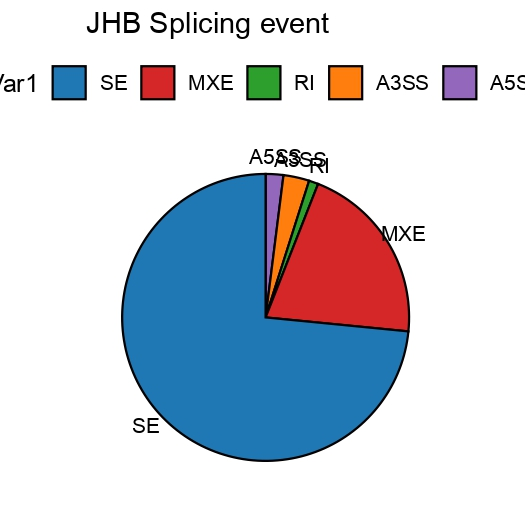
  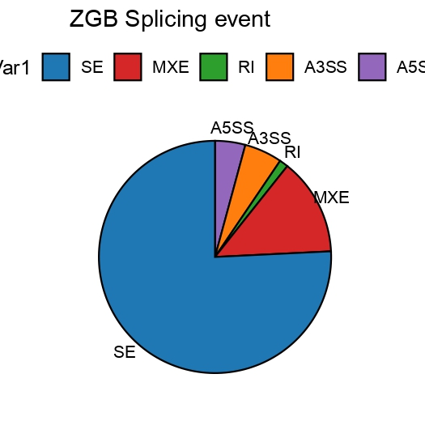
  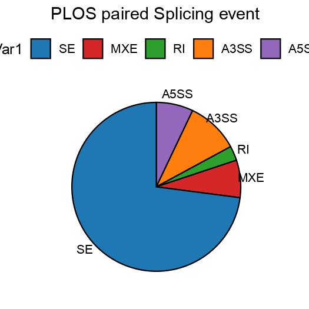
</div>

Fig.2B
```r
SE_JC <- fread("./Patients_data/JHB_data/SCLC_vs_Normal_AS/SE.MATS.JC.txt")
SE_JC <- as.data.frame(SE_JC)
head(SE_JC)
SE_JC$AS_Type <- "SE"
SE_JC <- SE_JC[,c("PValue","FDR","IncLevel1","IncLevel2","IncLevelDifference","AS_Type")]

RI_JC <- fread("./Patients_data/JHB_data/SCLC_vs_Normal_AS/RI.MATS.JC.txt")
RI_JC <- as.data.frame(RI_JC)
head(RI_JC)
RI_JC$AS_Type <- "RI"
RI_JC <- RI_JC[,c("PValue","FDR","IncLevel1","IncLevel2","IncLevelDifference","AS_Type")]


MXE_JC <- fread("./Patients_data/JHB_data/SCLC_vs_Normal_AS/MXE.MATS.JC.txt")
MXE_JC <- as.data.frame(MXE_JC)
head(MXE_JC)
MXE_JC$AS_Type <- "MXE"
MXE_JC <- MXE_JC[,c("PValue","FDR","IncLevel1","IncLevel2","IncLevelDifference","AS_Type")]


A3SS_JC <- fread("./Patients_data/JHB_data/SCLC_vs_Normal_AS/A3SS.MATS.JC.txt")
A3SS_JC <- as.data.frame(A3SS_JC)
head(A3SS_JC)
A3SS_JC$AS_Type <- "A3SS"
A3SS_JC <- A3SS_JC[,c("PValue","FDR","IncLevel1","IncLevel2","IncLevelDifference","AS_Type")]

A5SS_JC <- fread("./Patients_data/JHB_data/SCLC_vs_Normal_AS/A5SS.MATS.JC.txt")
A5SS_JC <- as.data.frame(A5SS_JC)
head(A5SS_JC)
A5SS_JC$AS_Type <- "A5SS"
A5SS_JC <- A5SS_JC[,c("PValue","FDR","IncLevel1","IncLevel2","IncLevelDifference","AS_Type")]

data <- rbind(SE_JC,RI_JC,MXE_JC,A3SS_JC,A5SS_JC)

JHB_splicing_data <- data
JHB_splicing_data$IncLevel1  <- gsub(",NA","",JHB_splicing_data$IncLevel1)
JHB_splicing_data$IncLevel2  <- gsub(",NA","",JHB_splicing_data$IncLevel2)

JHB_splicing_data$IncLevel1  <- gsub("NA,","",JHB_splicing_data$IncLevel1)
JHB_splicing_data$IncLevel2  <- gsub("NA,","",JHB_splicing_data$IncLevel2)

JHB_splicing_data$IncLevel1_mean_psi <- apply(JHB_splicing_data, 1, function(x) mean(as.numeric(strsplit(x["IncLevel1"], ",")[[1]]), na.rm = TRUE))
JHB_splicing_data$IncLevel2_mean_psi <- apply(JHB_splicing_data, 1, function(x) mean(as.numeric(strsplit(x["IncLevel2"], ",")[[1]]), na.rm = TRUE))

JHB_splicing_data <- read.csv(row.names=1,"./public_omics/JHB_data/JHB_splicing_data_event_summary.csv")
JHB_SCLC_splicing_events <- subset(JHB_splicing_data,PValue < 0.05 & IncLevelDifference < 0) 
JHB_Normal_splicing_events <- subset(JHB_splicing_data,PValue < 0.05 & IncLevelDifference > 0) 

JHB_SCLC_splicing_events1 <- data.frame(table(JHB_SCLC_splicing_events$AS_Type))
JHB_Normal_splicing_events1 <- data.frame(table(JHB_Normal_splicing_events$AS_Type))

JHB_SCLC_splicing_events1$Var2 <- "JHB_SCLC"
JHB_Normal_splicing_events1$Var2 <- "JHB_Normal"
# 查看修改后的结果
head(data)
data_long <- rbind(JHB_SCLC_splicing_events1,JHB_Normal_splicing_events1)

library(BuenColors)
library("ggpubr")
my_pal <- jdb_palette("corona")
names(my_pal) <- c("JHB_Normal","JHB_SCLC")
# 加载ggplot2包
library(ggplot2)
library(tidyr)
p1 <- ggplot(data_long, aes(x = Var2, y = Freq, fill = Var2)) +
  geom_bar(stat = "identity", position = "dodge") +
  facet_wrap(~ Var1, scales = "free_y", ncol = 5) +  # 为每个变量绘制单独的面板，Y轴独立
  labs(title = "", x = "", y = "Splicing Events") +
  scale_fill_manual(values = my_pal) +
  theme_bw() +
  theme(axis.text.x = element_text(angle = 45, hjust = 1,color="black"))  # 设置X轴标签倾斜45度，调整水平对齐
pdf("./output/v1_Fig2/JHB_splicing_events_summary_pvalue0.05.pdf",height=3.4,width=10)
p1
dev.off() 

ZGB_splicing_data <- read.csv(row.names=1,"./public_omics/ZGB_SCLC_DATA/Splicing_event_summary.csv")
ZGB_SCLC_splicing_events <- subset(ZGB_splicing_data,PValue < 0.05 & IncLevelDifference < 0) 
ZGB_Normal_splicing_events <- subset(ZGB_splicing_data,PValue < 0.05 & IncLevelDifference > 0) 

ZGB_SCLC_splicing_events1 <- data.frame(table(ZGB_SCLC_splicing_events$AS_Type))
ZGB_Normal_splicing_events1 <- data.frame(table(ZGB_Normal_splicing_events$AS_Type))

ZGB_SCLC_splicing_events1$Var2 <- "ZGB_SCLC"
ZGB_Normal_splicing_events1$Var2 <- "ZGB_Normal"
# 查看修改后的结果
head(data)
data_long <- rbind(ZGB_SCLC_splicing_events1,ZGB_Normal_splicing_events1)

library(BuenColors)
library("ggpubr")
my_pal <- jdb_palette("corona")
names(my_pal) <- c("ZGB_Normal","ZGB_SCLC")
# 加载ggplot2包
library(ggplot2)
library(tidyr)
p1 <- ggplot(data_long, aes(x = Var2, y = Freq, fill = Var2)) +
  geom_bar(stat = "identity", position = "dodge") +
  facet_wrap(~ Var1, scales = "free_y", ncol = 5) +  # 为每个变量绘制单独的面板，Y轴独立
  labs(title = "", x = "", y = "Splicing Events") +
  scale_fill_manual(values = my_pal) +
  theme_bw() +
  theme(axis.text.x = element_text(angle = 45, hjust = 1,color="black"))  # 设置X轴标签倾斜45度，调整水平对齐
pdf("./output/v1_Fig2/ZGB_splicing_events_summary_pvalue0.05.pdf",height=3.4,width=10)
p1
dev.off() 


PLOS_4paired_splicing_data <- read.csv(row.names=1,"./public_omics/PLOS_GENE_data/paired_4patients_PLOS_GENE_splicing_data_event_summary.csv")
PLOS_4paired_SCLC_splicing_events <- subset(PLOS_4paired_splicing_data,PValue < 0.05 & IncLevelDifference < 0) 
PLOS_4paired_Normal_splicing_events <- subset(PLOS_4paired_splicing_data,PValue < 0.05 & IncLevelDifference > 0) 

PLOS_4paired_SCLC_splicing_events1 <- data.frame(table(PLOS_4paired_SCLC_splicing_events$AS_Type))
PLOS_4paired_Normal_splicing_events1 <- data.frame(table(PLOS_4paired_Normal_splicing_events$AS_Type))

PLOS_4paired_SCLC_splicing_events1$Var2 <- "PLOS_4paired_SCLC"
PLOS_4paired_Normal_splicing_events1$Var2 <- "PLOS_4paired_Normal"
# 查看修改后的结果
head(data)
data_long <- rbind(PLOS_4paired_SCLC_splicing_events1,PLOS_4paired_Normal_splicing_events1)

library(BuenColors)
library("ggpubr")
my_pal <- jdb_palette("corona")
names(my_pal) <- c("PLOS_4paired_Normal","PLOS_4paired_SCLC")
# 加载ggplot2包
library(ggplot2)
library(tidyr)
p1 <- ggplot(data_long, aes(x = Var2, y = Freq, fill = Var2)) +
  geom_bar(stat = "identity", position = "dodge") +
  facet_wrap(~ Var1, scales = "free_y", ncol = 5) +  # 为每个变量绘制单独的面板，Y轴独立
  labs(title = "", x = "", y = "Splicing Events") +
  scale_fill_manual(values = my_pal) +
  theme_bw() +
  theme(axis.text.x = element_text(angle = 45, hjust = 1,color="black"))  # 设置X轴标签倾斜45度，调整水平对齐
pdf("./public_omics/figure/PLOS_4paired_splicing_events_summary_pvalue0.05.pdf",height=3.4,width=10)
p1
dev.off() 
```
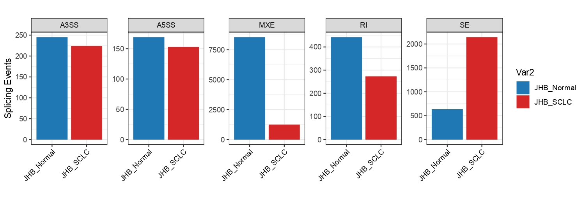
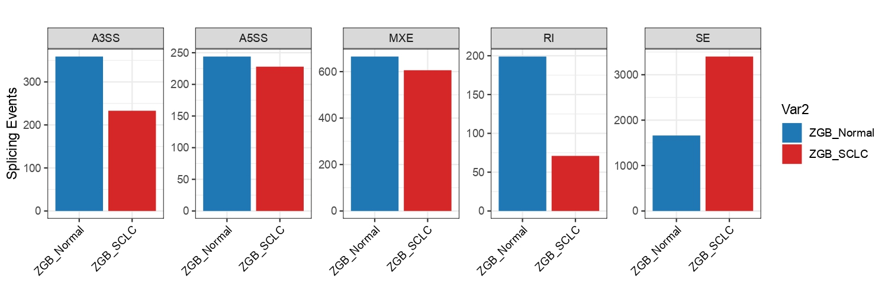
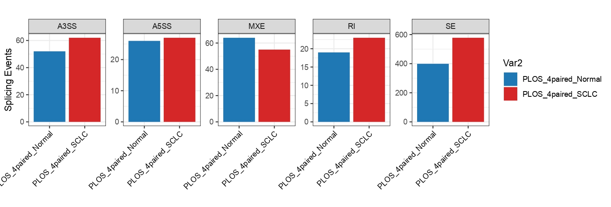

Fig.2C
```r
0000000000000 JHB DEGs 0000000000000000
0000000000000 JHB DEGs 0000000000000000
0000000000000 JHB DEGs 0000000000000000

JHB_splicing_data <- read.csv(row.names=1,"./public_omics/JHB_data/JHB_splicing_data_event_summary.csv")
JHB_sclc_SE <- JHB_splicing_data[JHB_splicing_data$AS_Type=="SE",]
JHB_normal_SE <- JHB_splicing_data[JHB_splicing_data$AS_Type=="SE",]

SE_JC <- fread("./Patients_data/JHB_data/SCLC_vs_Normal_AS/SE.MATS.JC.txt")
SE_JC <- as.data.frame(SE_JC)
head(SE_JC)
SE_JC$AS_Type <- "SE"
JHB_SE_sclc1 <- SE_JC[which(JHB_sclc_SE$IncLevelDifference < -0.1),]
JHB_SE_normal1 <- SE_JC[which((JHB_normal_SE$IncLevelDifference > 0.1)),]

dim(JHB_SE_sclc1)
dim(JHB_SE_normal1)

> dim(JHB_SE_sclc1)
[1] 33178    24
> dim(JHB_SE_normal1)
[1] 17304    24

JHB_SE_sclc1$new_names <- paste0(JHB_SE_sclc1$geneSymbol,"_",JHB_SE_sclc1$ID)
JHB_SE_normal1$new_names <- paste0(JHB_SE_normal1$geneSymbol,"_",JHB_SE_normal1$ID)

write.table(JHB_SE_sclc1,"./public_omics/1_for_mhc_predict/1_JHB_data/JHB_SE_Inc_0.1/JHB_Inc_0.1_sclc_SE1.txt",quote=FALSE,row.names=FALSE,sep="\t")
write.table(JHB_SE_normal1,"./public_omics/1_for_mhc_predict/1_JHB_data/JHB_SE_Inc_0.1/JHB_Inc_0.1_normal_SE1.txt",quote=FALSE,row.names=FALSE,sep="\t")

0000000000000 ZGB DEGs 0000000000000000
0000000000000 ZGB DEGs 0000000000000000
0000000000000 ZGB DEGs 0000000000000000
ZGB_splicing_data <- read.csv(row.names=1,"./public_omics/ZGB_SCLC_DATA/Splicing_event_summary.csv")
ZGB_sclc_SE <- ZGB_splicing_data[ZGB_splicing_data$AS_Type=="SE",]

SE_JC <- fread("./Patients_data/New_Version/NewPlot_0309/Fig2/Splicing_Events/ZGB/sclc5_vs_normal5/SE.MATS.JC.txt")
SE_JC <- as.data.frame(SE_JC)
head(SE_JC)
SE_JC$AS_Type <- "SE"

ZGB_SE_sclc1 <- SE_JC[which(ZGB_sclc_SE$IncLevelDifference < -0.1),]
ZGB_SE_normal1 <- SE_JC[which((ZGB_sclc_SE$IncLevelDifference > 0.1)),]

dim(ZGB_SE_sclc1)
dim(ZGB_SE_normal1)

> dim(ZGB_SE_sclc1)
[1] 4675   24
> dim(ZGB_SE_normal1)
[1] 3275   24

ZGB_SE_sclc1$new_names <- paste0(ZGB_SE_sclc1$geneSymbol,"_",ZGB_SE_sclc1$ID)
ZGB_SE_normal1$new_names <- paste0(ZGB_SE_normal1$geneSymbol,"_",ZGB_SE_normal1$ID)
# mkdir -p ./public_omics/1_for_mhc_predict/1_ZGB_data/ZGB_SE_Inc_0.1/
write.table(ZGB_SE_sclc1,"./public_omics/1_for_mhc_predict/1_ZGB_data/ZGB_SE_Inc_0.1/ZGB_Inc_0.1_sclc_SE1.txt",quote=FALSE,row.names=FALSE,sep="\t")
write.table(ZGB_SE_normal1,"./public_omics/1_for_mhc_predict/1_ZGB_data/ZGB_SE_Inc_0.1/ZGB_Inc_0.1_normal_SE1.txt",quote=FALSE,row.names=FALSE,sep="\t")

ZGB_splicing_data <- read.csv(row.names=1,"./public_omics/ZGB_SCLC_DATA/Splicing_event_summary.csv")
ZGB_sclc_SE <- ZGB_splicing_data[ZGB_splicing_data$AS_Type=="SE",]

SE_JC <- fread("./Patients_data/New_Version/NewPlot_0309/Fig2/Splicing_Events/ZGB/sclc5_vs_normal5/SE.MATS.JC.txt")
SE_JC <- as.data.frame(SE_JC)
head(SE_JC)
SE_JC$AS_Type <- "SE"

ZGB_SE_sclc1 <- SE_JC[which(ZGB_sclc_SE$IncLevelDifference < 0),]
ZGB_SE_normal1 <- SE_JC[which((ZGB_sclc_SE$IncLevelDifference > 0)),]

dim(ZGB_SE_sclc1)
dim(ZGB_SE_normal1)

> dim(ZGB_SE_sclc1)
[1] 25951    24
> dim(ZGB_SE_normal1)
[1] 17952    24

ZGB_SE_sclc1$new_names <- paste0(ZGB_SE_sclc1$geneSymbol,"_",ZGB_SE_sclc1$ID)
ZGB_SE_normal1$new_names <- paste0(ZGB_SE_normal1$geneSymbol,"_",ZGB_SE_normal1$ID)
# mkdir -p ./public_omics/1_for_mhc_predict/1_ZGB_data/ZGB_SE_Inc_0.1/
write.table(ZGB_SE_sclc1,"./public_omics/1_for_mhc_predict/1_ZGB_data/ZGB_all_SE_exon/ZGB_all_sclc_SE1_all.txt",quote=FALSE,row.names=FALSE,sep="\t")
write.table(ZGB_SE_normal1,"./public_omics/1_for_mhc_predict/1_ZGB_data/ZGB_all_SE_exon/ZGB_all_normal_SE1.txt",quote=FALSE,row.names=FALSE,sep="\t")


0000000000000 PLOS DEGs 0000000000000000
0000000000000 PLOS DEGs 0000000000000000
0000000000000 PLOS DEGs 0000000000000000

PLOS_GENE_splicing_data <- read.csv(row.names=1,"./public_omics/PLOS_GENE_data/paired_4patients_PLOS_GENE_splicing_data_event_summary.csv")
PLOS_sclc_SE <- PLOS_GENE_splicing_data[PLOS_GENE_splicing_data$AS_Type=="SE",]

SE_JC <- fread("./workshop/xm_workshop/projects/SCLC_Splicing/human_data/1_PLOS/1_rMATs/1_paired_4patients/SE.MATS.JC.txt")
SE_JC <- as.data.frame(SE_JC)
head(SE_JC)
SE_JC$AS_Type <- "SE"

PLOS_SE_sclc1 <- SE_JC[which(PLOS_sclc_SE$IncLevelDifference < -0),]
PLOS_SE_normal1 <- SE_JC[which((PLOS_sclc_SE$IncLevelDifference > 0)),]

dim(PLOS_SE_sclc1)
dim(PLOS_SE_normal1)

> dim(PLOS_SE_sclc1)
[1] 6295   24
> dim(PLOS_SE_normal1)
[1] 3310   24

PLOS_SE_sclc1$new_names <- paste0(PLOS_SE_sclc1$geneSymbol,"_",PLOS_SE_sclc1$ID)
PLOS_SE_normal1$new_names <- paste0(PLOS_SE_normal1$geneSymbol,"_",PLOS_SE_normal1$ID)
# mkdir -p ./public_omics/1_for_mhc_predict/2_PLOS_4patients/PLOS_all_SE_exon/
write.table(PLOS_SE_sclc1,"./public_omics/1_for_mhc_predict/2_PLOS_4patients/PLOS_all_SE_exon/PLOS_all_sclc_SE1.txt",quote=FALSE,row.names=FALSE,sep="\t")
write.table(PLOS_SE_normal1,"./public_omics/1_for_mhc_predict/2_PLOS_4patients/PLOS_all_SE_exon/PLOS_all_normal_SE1.txt",quote=FALSE,row.names=FALSE,sep="\t")

$$$$$$$$$$$$$$$$$$$$$$$$$$$$$$$$$$$$$$$$$$$$$$$$$$$$$JHB 免疫原性 SE
$$$$$$$$$$$$$$$$$$$$$$$$$$$$$$$$$$$$$$$$$$$$$$$$$$$$$JHB 免疫原性 SE
$$$$$$$$$$$$$$$$$$$$$$$$$$$$$$$$$$$$$$$$$$$$$$$$$$$$$JHB 免疫原性 SE
$$$$$$$$$$$$$$$$$$$$$$$$$$$$$$$$$$$$$$$$$$$$$$$$$$$$$JHB 免疫原性 SE

JHB_SE_sclc1 <- fread("./public_omics/1_for_mhc_predict/1_JHB_data/JHB_SE_Inc_0.1/JHB_Inc_0.1_sclc_SE1.txt",quote=FALSE,sep="\t")
JHB_SE_normal1 <- fread("./public_omics/1_for_mhc_predict/1_JHB_data/JHB_SE_Inc_0.1/JHB_Inc_0.1_normal_SE1.txt",quote=FALSE,sep="\t")
library(biomaRt)
library(BiocFileCache)
# celldex::HumanPrimaryCellAtlasData()
# CRCh38_human_ensembl <- useMart("ENSEMBL_MART_ENSEMBL", 
#                                 dataset = "hsapiens_gene_ensembl")

# CRCh37_human_ensembl <- useMart("ENSEMBL_MART_ENSEMBL", 
#                                 dataset = "hsapiens_gene_ensembl", 
#                                 host = "grch37.ensembl.org")
CRCh38_human_ensembl <- useEnsembl(
  biomart = "ENSEMBL_MART_ENSEMBL",
  dataset = "hsapiens_gene_ensembl"
)
# mkdir -p ./public_omics/1_for_mhc_predict/1_JHB_data/JHB_SE_Inc_0.1/
# BiocFileCache::BiocFileCache()
# options(biomaRt.cache = "/home/xiangmeng/.cache/R/BiocFileCache")
genes <- unique(JHB_SE_sclc1$geneSymbol)
CRCh38_JHB_sclc <- getBM(
      attributes = c("chromosome_name","ensembl_gene_id", "external_gene_name", 
                     "ensembl_transcript_id", "rank", "exon_chrom_start", 'cdna_coding_start', 'cdna_coding_end',
                     "exon_chrom_end"),
      filters = "external_gene_name",  
      values = genes, 
      mart = CRCh38_human_ensembl
    )
mcsaveRDS(CRCh38_JHB_sclc,"./public_omics/1_for_mhc_predict/1_JHB_data/JHB_SE_Inc_0.1/JHB_SE_all_sclc2_biomart-getBM_CRCh38.rds",mc.cores=20)

trans <- unique(CRCh38_JHB_sclc$ensembl_transcript_id)
JHB_cds_seq_sclc <- getSequence(
  id = trans,
  type = "ensembl_transcript_id",
  seqType = "cdna",  # 或者用 "coding" 表示 CDS
  mart = CRCh38_human_ensembl
  )
mcsaveRDS(JHB_cds_seq_sclc,"./public_omics/1_for_mhc_predict/1_JHB_data/JHB_SE_Inc_0.1/JHB_SE_all_sclc2_cds_seq_CRCh38.rds",mc.cores=20)

CRCh38_JHB_sclc <- mcreadRDS("./public_omics/1_for_mhc_predict/1_JHB_data/JHB_SE_Inc_0.1/JHB_SE_all_sclc2_biomart-getBM_CRCh38.rds",mc.cores=20)
JHB_cds_seq_sclc <- mcreadRDS("./public_omics/1_for_mhc_predict/1_JHB_data/JHB_SE_Inc_0.1/JHB_SE_all_sclc2_cds_seq_CRCh38.rds",mc.cores=20)
JHB_sclc_se <- future_lapply(1:nrow(JHB_SE_sclc1), get_peptide1_info, data = JHB_SE_sclc1,
  emsenbl=CRCh38_human_ensembl,gene_getBM =CRCh38_JHB_sclc,cds_seqs=JHB_cds_seq_sclc)
JHB_sclc_se_peptide_results2 <- rbindlist(JHB_sclc_se, use.names = TRUE, fill = TRUE)
mcsaveRDS(JHB_sclc_se_peptide_results2,"./public_omics/1_for_mhc_predict/1_JHB_data/JHB_SE_Inc_0.1/JHB_sclc_se_peptide_results2.rds",mc.cores=20)

JHB_sclc_final_lines <- paste0(">SE_", 1:nrow(JHB_sclc_se_peptide_results2), "\n", JHB_sclc_se_peptide_results2$peptide)
JHB_sclc_final_lines_vec <- as.vector(rbind(paste0(">SE_", 1:nrow(JHB_sclc_se_peptide_results2)), JHB_sclc_se_peptide_results2$peptide))
writeLines(JHB_sclc_final_lines_vec,
           con = "./public_omics/1_for_mhc_predict/1_JHB_data/JHB_SE_Inc_0.1/peptide_info_output_sclc_se.fasta")
JHB_sclc_final_lines_up_vec <- as.vector(rbind(paste0(">SE_", 1:nrow(JHB_sclc_se_peptide_results2)), JHB_sclc_se_peptide_results2$peptide_up))
writeLines(JHB_sclc_final_lines_up_vec,
           con = "./public_omics/1_for_mhc_predict/1_JHB_data/JHB_SE_Inc_0.1/peptide_info_output_sclc_up_se.fasta")
JHB_sclc_final_lines_down_vec <- as.vector(rbind(paste0(">SE_", 1:nrow(JHB_sclc_se_peptide_results2)), JHB_sclc_se_peptide_results2$peptide_down))
writeLines(JHB_sclc_final_lines_down_vec,
           con = "./public_omics/1_for_mhc_predict/1_JHB_data/JHB_SE_Inc_0.1/peptide_info_output_sclc_down_se.fasta")


000000000000000 normal
000000000000000 normal
000000000000000 normal

library(trqwe)
library(biomaRt)
library(BiocFileCache)
JHB_SE_normal1 <- fread("./public_omics/1_for_mhc_predict/1_JHB_data/JHB_SE_Inc_0.1/JHB_Inc_0.1_normal_SE1.txt",quote=FALSE,sep="\t")
CRCh38_human_ensembl <- useEnsembl(
  biomart = "ENSEMBL_MART_ENSEMBL",
  dataset = "hsapiens_gene_ensembl"
)
genes <- unique(JHB_SE_normal1$geneSymbol)
CRCh38_JHB_normal <- getBM(
      attributes = c("chromosome_name","ensembl_gene_id", "external_gene_name", 
                     "ensembl_transcript_id", "rank", "exon_chrom_start", 'cdna_coding_start', 'cdna_coding_end',
                     "exon_chrom_end"),
      filters = "external_gene_name",  
      values = genes, 
      mart = CRCh38_human_ensembl
    )
mcsaveRDS(CRCh38_JHB_normal,"./public_omics/1_for_mhc_predict/1_JHB_data/JHB_SE_Inc_0.1/JHB_SE_all_normal_biomart-getBM_CRCh38.rds",mc.cores=20)

trans <- unique(CRCh38_JHB_normal$ensembl_transcript_id)
CRCh38_JHB_cds_seq_normal <- getSequence(
  id = trans,
  type = "ensembl_transcript_id",
  seqType = "cdna",  # 或者用 "coding" 表示 CDS
  mart = CRCh38_human_ensembl
  )
mcsaveRDS(CRCh38_JHB_cds_seq_normal,"./public_omics/1_for_mhc_predict/1_JHB_data/JHB_SE_Inc_0.1/JHB_SE_all_normal_biomart-cds_seqCRCh38.rds",mc.cores=20)


get_peptide1_info <- function(i,data,emsenbl,gene_getBM,cds_seqs) {
  print(i)
  gene <- data$geneSymbol[i]
  exon_start <- data$exonStart_0base[i] + 1
  exon_end <- data$exonEnd[i]
  upstream_start <- data$upstreamES[i] +1
  upstream_end <- data$upstreamEE[i]
  downstream_start <- data$downstreamES[i] +1
  downstream_end <- data$downstreamEE[i]

  gene_info2 <- subset(gene_getBM,external_gene_name == gene)
    matched_rows <- gene_info2[
    gene_info2$exon_chrom_start == exon_start & 
      gene_info2$exon_chrom_end == exon_end, ]

  if (nrow(matched_rows) == 0) return(NULL)
  transcript_count <- table(gene_info2$ensembl_transcript_id)
  matched_rows$rank_score <- transcript_count[matched_rows$ensembl_transcript_id]

  top_transcript <- matched_rows[order(-matched_rows$rank_score), ][1, "ensembl_transcript_id"]
  mappped_tran <- subset(gene_info2, ensembl_transcript_id == top_transcript)
  exon1 <- subset(matched_rows, ensembl_transcript_id == top_transcript)

     cds_seq <- subset(cds_seqs,ensembl_transcript_id == top_transcript)

  if (nrow(cds_seq) == 0) return(NULL)

    if (nrow(exon1) == 0 || is.na(exon1$cdna_coding_start)) {
    protein_seq <- NULL  # Or handle this case differently
  } else {
    protein_seq <- Biostrings::translate(DNAString(paste(strsplit(cds_seq$cdna, NULL)[[1]][exon1$cdna_coding_start:exon1$cdna_coding_end], collapse = "")))
  }

     matched_rows1 <- gene_info2[
    gene_info2$exon_chrom_start == upstream_start & 
      gene_info2$exon_chrom_end == upstream_end, ]

  if (nrow(matched_rows1) == 0) {
    protein_seq1 <- NULL
  } else {

  transcript_count1 <- table(gene_info2$ensembl_transcript_id)
  matched_rows1$rank_score <- transcript_count1[matched_rows1$ensembl_transcript_id]
  top_transcript1 <- matched_rows1[order(-matched_rows1$rank_score), ][1, "ensembl_transcript_id"]
  mappped_tran1 <- subset(gene_info2,ensembl_transcript_id == top_transcript1)
  exon11 <- subset(matched_rows1, ensembl_transcript_id == top_transcript1)

   cds_seq1 <- subset(cds_seqs,ensembl_transcript_id == top_transcript1)

  if (nrow(exon11) == 0 || is.na(exon11$cdna_coding_start) ||nrow(cds_seq1) == 0 ) {
    protein_seq1 <- NULL  # Or handle this case differently
  } else {
    protein_seq1 <- Biostrings::translate(DNAString(paste(strsplit(cds_seq1$cdna, NULL)[[1]][exon11$cdna_coding_start:exon11$cdna_coding_end], collapse = "")))
  }}
  
      matched_rows2 <- gene_info2[
    gene_info2$exon_chrom_start == downstream_start & 
      gene_info2$exon_chrom_end == downstream_end, ]

 if (nrow(matched_rows2) == 0) {
    protein_seq2 <- NULL
  } else {
  transcript_count2 <- table(gene_info2$ensembl_transcript_id)
  matched_rows2$rank_score <- transcript_count2[matched_rows2$ensembl_transcript_id]
  top_transcript2 <- matched_rows2[order(-matched_rows2$rank_score), ][1, "ensembl_transcript_id"]
  mappped_tran2 <- subset(gene_info2,ensembl_transcript_id == top_transcript2)
  exon21 <- subset(matched_rows2, ensembl_transcript_id == top_transcript2)

  cds_seq2 <- subset(cds_seqs,ensembl_transcript_id == top_transcript2)

  if (nrow(exon21) == 0 || is.na(exon21$cdna_coding_start) ||nrow(cds_seq2) == 0) {
    protein_seq2 <- NULL  # Or handle this case differently
  } else {
    protein_seq2 <- Biostrings::translate(DNAString(paste(strsplit(cds_seq2$cdna, NULL)[[1]][exon21$cdna_coding_start:exon21$cdna_coding_end], collapse = "")))
  }
}

  return(data.frame(
    geneSymbol = gene,
    transcript_id = top_transcript,
    peptide = as.character(if (!is.null(protein_seq) && length(protein_seq) > 0) protein_seq else NA),
    peptide_up = as.character(if (!is.null(protein_seq1) && length(protein_seq1) > 0) protein_seq1 else NA),
    peptide_down = as.character(if (!is.null(protein_seq2) && length(protein_seq2) > 0) protein_seq2 else NA),
    exonStart_0base = data$exonStart_0base[i],
    exonEnd = data$exonEnd[i],
    upstream_start = data$upstreamES[i],
    upstream_end = data$upstreamEE[i],
    downstream_start = data$downstreamES[i],
    downstream_end = data$downstreamEE[i],
    order = i
  ))
  }

JHB_normal_se <- future_lapply(1:nrow(JHB_SE_normal1), get_peptide1_info, data = JHB_SE_normal1,
  emsenbl=CRCh38_human_ensembl,gene_getBM =CRCh38_JHB_normal,cds_seqs=CRCh38_JHB_cds_seq_normal)
JHB_normal_se_peptide_results2 <- rbindlist(JHB_normal_se, use.names = TRUE, fill = TRUE)
mcsaveRDS(JHB_normal_se_peptide_results2,"./public_omics/1_for_mhc_predict/1_JHB_data/JHB_SE_Inc_0.1/JHB_normal_se_peptide_results2_CRCh38.rds",mc.cores=20)

JHB_normal_final_lines <- paste0(">SE_", 1:nrow(JHB_normal_se_peptide_results2), "\n", JHB_normal_se_peptide_results2$peptide)
JHB_normal_final_lines_vec <- as.vector(rbind(paste0(">SE_", 1:nrow(JHB_normal_se_peptide_results2)), JHB_normal_se_peptide_results2$peptide))
writeLines(JHB_normal_final_lines_vec,
           con = "./public_omics/1_for_mhc_predict/1_JHB_data/JHB_SE_Inc_0.1/peptide_info_output_normal_se.fasta")
JHB_normal_final_lines_up_vec <- as.vector(rbind(paste0(">SE_", 1:nrow(JHB_normal_se_peptide_results2)), JHB_normal_se_peptide_results2$peptide_up))
writeLines(JHB_normal_final_lines_up_vec,
           con = "./public_omics/1_for_mhc_predict/1_JHB_data/JHB_SE_Inc_0.1/peptide_info_output_normal_up_se.fasta")
JHB_normal_final_lines_down_vec <- as.vector(rbind(paste0(">SE_", 1:nrow(JHB_normal_se_peptide_results2)), JHB_normal_se_peptide_results2$peptide_down))
writeLines(JHB_normal_final_lines_down_vec,
           con = "./public_omics/1_for_mhc_predict/1_JHB_data/JHB_SE_Inc_0.1/peptide_info_output_normal_down_se.fasta")


```

```shell 
mkdir -p ./public_omics/1_for_mhc_predict/1_JHB_data/JHB_SE_Inc_0.1/JHB_SE_Inc_0.1_sclc_SE
cd ./public_omics/1_for_mhc_predict/1_JHB_data/JHB_SE_Inc_0.1/JHB_SE_Inc_0.1_sclc_SE
./software/netMHCpan-4.1/netMHCpan \
-f ./public_omics/1_for_mhc_predict/1_JHB_data/JHB_SE_Inc_0.1/peptide_info_output_sclc_se.fasta \
-inptype 0 \
-a HLA-A02:01 > JHB_SE_Inc_0.1_sclc_SE_NetMHCpan.out

mkdir -p ./public_omics/1_for_mhc_predict/1_JHB_data/JHB_SE_Inc_0.1/JHB_SE_Inc_0.1_sclc_SE_up
cd ./public_omics/1_for_mhc_predict/1_JHB_data/JHB_SE_Inc_0.1/JHB_SE_Inc_0.1_sclc_SE_up
./software/netMHCpan-4.1/netMHCpan \
-f ./public_omics/1_for_mhc_predict/1_JHB_data/JHB_SE_Inc_0.1/peptide_info_output_sclc_up_se.fasta \
-inptype 0 \
-a HLA-A02:01 > JHB_SE_Inc_0.1_sclc_SE_up_NetMHCpan.out

mkdir -p ./public_omics/1_for_mhc_predict/1_JHB_data/JHB_SE_Inc_0.1/JHB_SE_Inc_0.1_sclc_SE_dn
cd ./public_omics/1_for_mhc_predict/1_JHB_data/JHB_SE_Inc_0.1/JHB_SE_Inc_0.1_sclc_SE_dn
./software/netMHCpan-4.1/netMHCpan \
-f ./public_omics/1_for_mhc_predict/1_JHB_data/JHB_SE_Inc_0.1/peptide_info_output_sclc_down_se.fasta \
-inptype 0 \
-a HLA-A02:01 > JHB_SE_Inc_0.1_sclc_SE_dn_NetMHCpan.out


mkdir -p ./public_omics/1_for_mhc_predict/1_JHB_data/JHB_SE_Inc_0.1/JHB_SE_Inc_0.1_normal_SE
cd ./public_omics/1_for_mhc_predict/1_JHB_data/JHB_SE_Inc_0.1/JHB_SE_Inc_0.1_normal_SE
./software/netMHCpan-4.1/netMHCpan \
-f ./public_omics/1_for_mhc_predict/1_JHB_data/JHB_SE_Inc_0.1/peptide_info_output_normal_se.fasta \
-inptype 0 \
-a HLA-A02:01 > JHB_SE_Inc_0.1_normal_SE_NetMHCpan.out

mkdir -p ./public_omics/1_for_mhc_predict/1_JHB_data/JHB_SE_Inc_0.1/JHB_SE_Inc_0.1_normal_SE_up
cd ./public_omics/1_for_mhc_predict/1_JHB_data/JHB_SE_Inc_0.1/JHB_SE_Inc_0.1_normal_SE_up
./software/netMHCpan-4.1/netMHCpan \
-f ./public_omics/1_for_mhc_predict/1_JHB_data/JHB_SE_Inc_0.1/peptide_info_output_normal_up_se.fasta \
-inptype 0 \
-a HLA-A02:01 > JHB_SE_Inc_0.1_normal_SE_up_NetMHCpan.out

mkdir -p ./public_omics/1_for_mhc_predict/1_JHB_data/JHB_SE_Inc_0.1/JHB_SE_Inc_0.1_normal_SE_dn
cd ./public_omics/1_for_mhc_predict/1_JHB_data/JHB_SE_Inc_0.1/JHB_SE_Inc_0.1_normal_SE_dn
./software/netMHCpan-4.1/netMHCpan \
-f ./public_omics/1_for_mhc_predict/1_JHB_data/JHB_SE_Inc_0.1/peptide_info_output_normal_down_se.fasta \
-inptype 0 \
-a HLA-A02:01 > JHB_SE_Inc_0.1_normal_SE_dn_NetMHCpan.out


cp ./public_omics/1_for_mhc_predict/1_JHB_data/JHB_psi_0.8_Inc_0.1_new/JHB_psi_0.8_Inc_0.1_new_sclc_SE/JHB_psi_0.8_Inc_0.1_new_sclc_SE_NetMHCpan.out \
./public_omics/1_for_mhc_predict/v1_outfile_SE
cp ./public_omics/1_for_mhc_predict/1_JHB_data/JHB_psi_0.8_Inc_0.1_new/JHB_psi_0.8_Inc_0.1_new_sclc_SE_up/JHB_psi_0.8_Inc_0.1_new_sclc_SE_up_NetMHCpan.out \
./public_omics/1_for_mhc_predict/v1_outfile_SE
cp ./public_omics/1_for_mhc_predict/1_JHB_data/JHB_psi_0.8_Inc_0.1_new/JHB_psi_0.8_Inc_0.1_new_sclc_SE_dn/JHB_psi_0.8_Inc_0.1_new_sclc_SE_dn_NetMHCpan.out \
./public_omics/1_for_mhc_predict/v1_outfile_SE
cp ./public_omics/1_for_mhc_predict/1_JHB_data/JHB_psi_0.8_Inc_0.1_new/JHB_psi_0.8_Inc_0.1_new_normal_SE/JHB_psi_0.8_Inc_0.1_new_normal_SE_NetMHCpan.out \
./public_omics/1_for_mhc_predict/v1_outfile_SE
cp ./public_omics/1_for_mhc_predict/1_JHB_data/JHB_psi_0.8_Inc_0.1_new/JHB_psi_0.8_Inc_0.1_new_normal_SE_up/JHB_psi_0.8_Inc_0.1_new_normal_SE_up_NetMHCpan.out \
./public_omics/1_for_mhc_predict/v1_outfile_SE
cp ./public_omics/1_for_mhc_predict/1_JHB_data/JHB_psi_0.8_Inc_0.1_new/JHB_psi_0.8_Inc_0.1_new_normal_SE_dn/JHB_psi_0.8_Inc_0.1_new_normal_SE_dn_NetMHCpan.out \
./public_omics/1_for_mhc_predict/v1_outfile_SE

cd ./public_omics/1_for_mhc_predict/v1_outfile_SE

for file in *.out; do
  output_file="${file%.out}_tmp.txt"  # 去掉 .out 后缀并添加 _tmp.txt
  grep " HLA-A\*02:01    " "$file" > "$output_file"
done
```

```r

JHB_psi_0.8_Inc_0.1_new_sclc_SE <- fread("./public_omics/1_for_mhc_predict/v1_outfile_SE/JHB_psi_0.8_Inc_0.1_new_sclc_SE_NetMHCpan_tmp.txt",header = FALSE, quote = FALSE,fill=TRUE,skip=661)
colnames(JHB_psi_0.8_Inc_0.1_new_sclc_SE) <- c("Pos", "MHC", "Peptide", "Core", "of","Gp", "Gl", "Ip", "Il", "Icore", "Identity", "Score_EL", "%Rank_EL", "BindLevel","tmp1")
JHB_psi_0.8_Inc_0.1_new_sclc_SE <- as.data.frame(JHB_psi_0.8_Inc_0.1_new_sclc_SE)
JHB_psi_0.8_Inc_0.1_new_sclc_SE_up <- fread("./public_omics/1_for_mhc_predict/v1_outfile_SE/JHB_psi_0.8_Inc_0.1_new_sclc_SE_up_NetMHCpan_tmp.txt",header = FALSE, quote = FALSE, fill = TRUE,skip=1097)
colnames(JHB_psi_0.8_Inc_0.1_new_sclc_SE_up) <- c("Pos", "MHC", "Peptide", "Core","of", "Gp", "Gl", "Ip", "Il", "Icore", "Identity", "Score_EL", "%Rank_EL", "BindLevel","tmp1")
JHB_psi_0.8_Inc_0.1_new_sclc_SE_up <- as.data.frame(JHB_psi_0.8_Inc_0.1_new_sclc_SE_up)
JHB_psi_0.8_Inc_0.1_new_sclc_SE_dn <- fread("./public_omics/1_for_mhc_predict/v1_outfile_SE/JHB_psi_0.8_Inc_0.1_new_sclc_SE_dn_NetMHCpan_tmp.txt",header = FALSE, quote = FALSE,fill=TRUE,skip=221)
colnames(JHB_psi_0.8_Inc_0.1_new_sclc_SE_dn) <- c("Pos", "MHC", "Peptide", "Core","of", "Gp", "Gl", "Ip", "Il", "Icore", "Identity", "Score_EL", "%Rank_EL", "BindLevel","tmp1")
JHB_psi_0.8_Inc_0.1_new_sclc_SE_dn <- as.data.frame(JHB_psi_0.8_Inc_0.1_new_sclc_SE_dn)

JHB_psi_0.8_Inc_0.1_new_normal_SE <- fread("./public_omics/1_for_mhc_predict/v1_outfile_SE/JHB_psi_0.8_Inc_0.1_new_normal_SE_NetMHCpan_tmp.txt",header = FALSE, quote = FALSE,fill=TRUE)
colnames(JHB_psi_0.8_Inc_0.1_new_normal_SE) <- c("Pos", "MHC", "Peptide", "Core", "of","Gp", "Gl", "Ip", "Il", "Icore", "Identity", "Score_EL", "%Rank_EL", "BindLevel","tmp1")
JHB_psi_0.8_Inc_0.1_new_normal_SE <- as.data.frame(JHB_psi_0.8_Inc_0.1_new_normal_SE)
JHB_psi_0.8_Inc_0.1_new_normal_SE_up <- fread("./public_omics/1_for_mhc_predict/v1_outfile_SE/JHB_psi_0.8_Inc_0.1_new_normal_SE_up_NetMHCpan_tmp.txt",header = FALSE, quote = FALSE, fill = TRUE,skip=464)
colnames(JHB_psi_0.8_Inc_0.1_new_normal_SE_up) <- c("Pos", "MHC", "Peptide", "Core", "of","Gp", "Gl", "Ip", "Il", "Icore", "Identity", "Score_EL", "%Rank_EL", "BindLevel","tmp1")
JHB_psi_0.8_Inc_0.1_new_normal_SE_up <- as.data.frame(JHB_psi_0.8_Inc_0.1_new_normal_SE_up)
JHB_psi_0.8_Inc_0.1_new_normal_SE_dn <- fread("./public_omics/1_for_mhc_predict/v1_outfile_SE/JHB_psi_0.8_Inc_0.1_new_normal_SE_dn_NetMHCpan_tmp.txt",header = FALSE, quote = FALSE,fill=TRUE,skip=222)
colnames(JHB_psi_0.8_Inc_0.1_new_normal_SE_dn) <- c("Pos", "MHC", "Peptide", "Core", "of","Gp", "Gl", "Ip", "Il", "Icore", "Identity", "Score_EL", "%Rank_EL", "BindLevel","tmp1")
JHB_psi_0.8_Inc_0.1_new_normal_SE_dn <- as.data.frame(JHB_psi_0.8_Inc_0.1_new_normal_SE_dn)

library(dplyr)
JHB_sclc_SE_score <- JHB_psi_0.8_Inc_0.1_new_sclc_SE %>%
  group_by(Identity) %>%  # 按 Identity 分组
  slice_min(`%Rank_EL`, n = 1, with_ties = FALSE) %>%  # 找出每组中 %Rank_EL 最小的行，`with_ties = FALSE` 确保每组只取一个最小值
  ungroup()
JHB_sclc_SE_score1 <- as.data.frame(JHB_sclc_SE_score)

library(dplyr)
JHB_sclc_SE_up_score <- JHB_psi_0.8_Inc_0.1_new_sclc_SE_up %>%
  group_by(Identity) %>%  # 按 Identity 分组
  slice_min(`%Rank_EL`, n = 1, with_ties = FALSE) %>%  # 找出每组中 %Rank_EL 最小的行，`with_ties = FALSE` 确保每组只取一个最小值
  ungroup()
JHB_sclc_SE_up_score1 <- as.data.frame(JHB_sclc_SE_up_score)

library(dplyr)
JHB_sclc_SE_dn_score <- JHB_psi_0.8_Inc_0.1_new_sclc_SE_dn %>%
  group_by(Identity) %>%  # 按 Identity 分组
  slice_min(`%Rank_EL`, n = 1, with_ties = FALSE) %>%  # 找出每组中 %Rank_EL 最小的行，`with_ties = FALSE` 确保每组只取一个最小值
  ungroup()
JHB_sclc_SE_dn_score1 <- as.data.frame(JHB_sclc_SE_dn_score)

library(dplyr)
JHB_normal_SE_score <- JHB_psi_0.8_Inc_0.1_new_normal_SE %>%
  group_by(Identity) %>%  # 按 Identity 分组
  slice_min(`%Rank_EL`, n = 1, with_ties = FALSE) %>%  # 找出每组中 %Rank_EL 最小的行，`with_ties = FALSE` 确保每组只取一个最小值
  ungroup()
JHB_normal_SE_score1 <- as.data.frame(JHB_normal_SE_score)

library(dplyr)
JHB_normal_SE_up_score <- JHB_psi_0.8_Inc_0.1_new_normal_SE_up %>%
  group_by(Identity) %>%  # 按 Identity 分组
  slice_min(`%Rank_EL`, n = 1, with_ties = FALSE) %>%  # 找出每组中 %Rank_EL 最小的行，`with_ties = FALSE` 确保每组只取一个最小值
  ungroup()
JHB_normal_SE_up_score1 <- as.data.frame(JHB_normal_SE_up_score)

library(dplyr)
JHB_normal_SE_dn_score <- JHB_psi_0.8_Inc_0.1_new_normal_SE_dn %>%
  group_by(Identity) %>%  # 按 Identity 分组
  slice_min(`%Rank_EL`, n = 1, with_ties = FALSE) %>%  # 找出每组中 %Rank_EL 最小的行，`with_ties = FALSE` 确保每组只取一个最小值
  ungroup()
JHB_normal_SE_dn_score1 <- as.data.frame(JHB_normal_SE_dn_score)

JHB_sclc_SE_score1_filter <- JHB_sclc_SE_score1[,c("Identity","%Rank_EL")]
JHB_sclc_SE_up_score1_filter <- JHB_sclc_SE_up_score1[,c("Identity","%Rank_EL")]
JHB_sclc_SE_dn_score1_filter <- JHB_sclc_SE_dn_score1[,c("Identity","%Rank_EL")]

colnames(JHB_sclc_SE_score1_filter) <- c("Identity","JHB_sclc_SE")
colnames(JHB_sclc_SE_up_score1_filter) <- c("Identity","JHB_sclc_SE_UP")
colnames(JHB_sclc_SE_dn_score1_filter) <- c("Identity","JHB_sclc_SE_DN")

JHB_SE_sclc1 <- fread("./public_omics/1_for_mhc_predict/1_JHB_data/JHB_psi_0.8_Inc_0.1/JHB_psi_0.8_Inc_0.1_sclc_SE1.txt",quote=FALSE)
JHB_SE_sclc1$order <- 1:nrow(JHB_SE_sclc1)
JHB_SE_normal1 <- fread("./public_omics/1_for_mhc_predict/1_JHB_data/JHB_psi_0.8_Inc_0.1/JHB_psi_0.8_Inc_0.1_normal_SE1.txt",quote=FALSE)
JHB_SE_normal1$order <- (1:nrow(JHB_SE_normal1))
JHB_SE_sclc1 <- as.data.frame(JHB_SE_sclc1)
JHB_SE_normal1 <- as.data.frame(JHB_SE_normal1)
rownames(JHB_SE_sclc1) <- JHB_SE_sclc1$new_names1
rownames(JHB_SE_normal1) <- JHB_SE_normal1$new_names1

JHB_SCLC_all_1 <- merge(JHB_sclc_SE_up_score1_filter,JHB_sclc_SE_dn_score1_filter,by="Identity")
JHB_SCLC_all <- merge(JHB_SCLC_all_1,JHB_sclc_SE_score1_filter,by="Identity")
JHB_SCLC_all$sclc_SE_DownstreamExon <- JHB_SCLC_all$JHB_sclc_SE/JHB_SCLC_all$JHB_sclc_SE_DN
JHB_SCLC_all$sclc_SE_UpstreamExon <- JHB_SCLC_all$JHB_sclc_SE/JHB_SCLC_all$JHB_sclc_SE_UP
JHB_SCLC_all$Identity1 <- paste0("SE_",(as.numeric(gsub("SE_","",JHB_SCLC_all$Identity))))
mcsaveRDS(JHB_SCLC_all,"./public_omics/1_for_mhc_predict/1_JHB_data/JHB_psi_0.8_Inc_0.1_new/JHB_sclc_all_SE_all_.rds",mc.cores=20)
JHB_SCLC_all <- mcreadRDS("./public_omics/1_for_mhc_predict/1_JHB_data/JHB_psi_0.8_Inc_0.1_new/JHB_sclc_all_SE_all_.rds",mc.cores=20)

library(trqwe)
library(ggplot2)
library(tidyr)
JHB_SCLC_all_long1 <- pivot_longer(JHB_SCLC_all, cols = starts_with("JHB_sclc_"), 
                          names_to = "Group", 
                          values_to = "value")

JHB_SCLC_all_long2 <- pivot_longer(JHB_SCLC_all, cols = starts_with("sclc_SE_"), 
                          names_to = "Group", 
                          values_to = "value")

JHB_sclc_se_peptide_results2 <- mcreadRDS("./public_omics/1_for_mhc_predict/1_JHB_data/JHB_psi_0.8_Inc_0.1_new/JHB_sclc_se_peptide_results2.rds",mc.cores=20)
JHB_sclc_se_peptide_results2$pepitie_names <- paste0("SE_",1:nrow(JHB_sclc_se_peptide_results2))
JHB_normal_se_peptide_results2 <- mcreadRDS("./public_omics/1_for_mhc_predict/1_JHB_data/JHB_psi_0.8_Inc_0.1_new/JHB_normal_se_peptide_results2_CRCh38.rds",mc.cores=20)
JHB_normal_se_peptide_results2$pepitie_names <- paste0("SE_",(1:nrow(JHB_normal_se_peptide_results2))+nrow(JHB_sclc_se_peptide_results2))


0000000000000000000 JHB normal 0000000000000000000000
0000000000000000000 JHB normal 0000000000000000000000
0000000000000000000 JHB normal 0000000000000000000000

JHB_normal_SE_score1_filter <- JHB_normal_SE_score1[,c("Identity","%Rank_EL")]
JHB_normal_SE_up_score1_filter <- JHB_normal_SE_up_score1[,c("Identity","%Rank_EL")]
JHB_normal_SE_dn_score1_filter <- JHB_normal_SE_dn_score1[,c("Identity","%Rank_EL")]

colnames(JHB_normal_SE_score1_filter) <- c("Identity","JHB_normal_SE")
colnames(JHB_normal_SE_up_score1_filter) <- c("Identity","JHB_normal_SE_UP")
colnames(JHB_normal_SE_dn_score1_filter) <- c("Identity","JHB_normal_SE_DN")

JHB_normal_all_1 <- merge(JHB_normal_SE_up_score1_filter,JHB_normal_SE_dn_score1_filter,by="Identity")
JHB_normal_all <- merge(JHB_normal_all_1,JHB_normal_SE_score1_filter,by="Identity")
JHB_normal_all$normal_SE_DownstreamExon <- JHB_normal_all$JHB_normal_SE/JHB_normal_all$JHB_normal_SE_DN
JHB_normal_all$normal_SE_UpstreamExon <- JHB_normal_all$JHB_normal_SE/JHB_normal_all$JHB_normal_SE_UP
JHB_normal_all$Identity1 <- paste0("SE_",(as.numeric(gsub("SE_","",JHB_normal_all$Identity))+nrow(JHB_SE_sclc1)))

mcsaveRDS(JHB_normal_all,"./public_omics/1_for_mhc_predict/1_JHB_data/JHB_psi_0.8_Inc_0.1_new/JHB_normal_all_SE_all_.rds",mc.cores=20)
JHB_normal_all <- mcreadRDS("./public_omics/1_for_mhc_predict/1_JHB_data/JHB_psi_0.8_Inc_0.1_new/JHB_normal_all_SE_all_.rds",mc.cores=20)

library(ggplot2)
library(tidyr)
JHB_normal_all_long1 <- pivot_longer(JHB_normal_all, cols = starts_with("JHB_normal_"), 
                          names_to = "Group", 
                          values_to = "value")

JHB_normal_all_long2 <- pivot_longer(JHB_normal_all, cols = starts_with("normal_SE_"), 
                          names_to = "Group", 
                          values_to = "value")


0000000000000000000 JHB normal and sclc 0000000000000000000000
0000000000000000000 JHB normal and sclc 0000000000000000000000
0000000000000000000 JHB normal and sclc 0000000000000000000000

colnames(JHB_SCLC_all_long1) <- c("Identity","SE/UpstreamExon","SE/DownstreamExon","Identity1","Group","value")
colnames(JHB_normal_all_long1) <- c("Identity","SE/UpstreamExon","SE/DownstreamExon","Identity1","Group","value")
All_JHB_data_mhc <- rbind(JHB_SCLC_all_long1,JHB_normal_all_long1)
All_JHB_data_mhc1 <- subset(All_JHB_data_mhc, Group %in% c("JHB_sclc_SE","JHB_normal_SE"))

JHB_SE_sclc1_filter <- subset(JHB_SE_sclc1,IncLevelDifference < -0.3 & PValue < 0.05)
# JHB_SE_sclc1_filter <- subset(JHB_SE_sclc1,PValue < 0.05)
JHB_sclc_se_peptide_results_filter <- subset(JHB_sclc_se_peptide_results2,order %in% as.character(JHB_SE_sclc1_filter$order))
JHB_SCLC_all_long1_filter <- subset(JHB_SCLC_all_long1,Identity %in% JHB_sclc_se_peptide_results_filter$pepitie_names)

JHB_SE_normal1_filter <- subset(JHB_SE_normal1,IncLevelDifference > 0.3 & PValue < 0.05)
# JHB_SE_normal1_filter <- subset(JHB_SE_normal1,PValue < 0.05)
JHB_normal_se_peptide_results_filter <- subset(JHB_normal_se_peptide_results2,order %in% as.character(JHB_SE_normal1_filter$order))
JHB_normal_all_long1_filter <- subset(JHB_normal_all_long1,Identity1 %in% JHB_normal_se_peptide_results_filter$pepitie_names)

All_JHB_data_mhc_filter <- rbind(JHB_SCLC_all_long1_filter,JHB_normal_all_long1_filter)
All_JHB_data_mhc_filter1 <- subset(All_JHB_data_mhc_filter, Group %in% c("JHB_sclc_SE","JHB_normal_SE"))
All_JHB_data_mhc_filter1$Group <- factor(All_JHB_data_mhc_filter1$Group,levels=c("JHB_normal_SE","JHB_sclc_SE"))

p2 <- ggplot(All_JHB_data_mhc_filter1, aes(x = -log10(value), fill = Group)) +
  geom_density(alpha=0.4) +
  scale_fill_manual(values=my_pal)+
  geom_vline(aes(xintercept=-log10(0.5),col="red"))+
  theme_bw() +
  labs(title = "Density Plot of SE BindLevel by JHB Cohort",
       x = "Affinity with HLA-A2", y = "Density")

pdf("./v1_figure/1_hsa_SE/JHB_SE_compare_sclc_and_normal_Inc0.3_p0.05_density.pdf",height=3,width=4.5)
p2
dev.off() 

my_pal <- jdb_palette("corona")
p1 <- ggplot(All_JHB_data_mhc_filter1, aes(x = Group, y = -log10(value), color = Group, fill = Group)) +
  geom_boxplot(color = "black", size = 0.7, outlier.shape=NA) +  # 设置边框为黑色
  scale_color_manual(values = my_pal, guide = "none") +
  scale_fill_manual(values = my_pal, guide = "none") +  # 为箱线图内部填充设置颜色
  theme_classic() +
  stat_summary(fun.y = median, geom = "point", colour = "darkred", size = 3) +
  theme(axis.text.x = element_text(angle = 45, hjust = 1, size = 10, color = "black"),
        axis.text.y = element_text(size = 10, color = "black")) +
  stat_compare_means(comparisons = list(c("JHB_normal_SE", "JHB_sclc_SE")), label = "p.signif", method = "t.test")
pdf("./v1_figure/1_hsa_SE/JHB_SE_compare_sclc_and_normal_Inc0.3_p0.05_boxplot.pdf",height=3.5,width=2.5)
p1
dev.off() 


All_JHB_data_mhc_filter1$b_levels <- "No_biding"
All_JHB_data_mhc_filter1$b_levels[which(All_JHB_data_mhc_filter1$value<2)] <- "Biding"
# ZGB_SCLC_MXE_sclc_long1_filter$b_levels[which(ZGB_SCLC_MXE_sclc_long1_filter$value<0.5)] <- "SB"

JHB_blevel_summary <- table(All_JHB_data_mhc_filter1$Group,All_JHB_data_mhc_filter1$b_levels)
JHB_blevel_summary1 <- melt(JHB_blevel_summary)

library(ggsci)
library(BuenColors)
library("ggpubr")
my_pal <- jdb_palette("corona")

JHB_blevel_summary1$Var2 <- factor(JHB_blevel_summary1$Var2,levels=c("No_biding","Biding"))
p1 <- ggplot(JHB_blevel_summary1, aes(x = Var1, y = value, fill = Var1)) +
  geom_col(position = "stack", color = "black") +
  facet_wrap(~Var2) +
  scale_fill_manual(values = my_pal) +
  theme_classic() + 
  labs(x = '', y = 'Count') +
  theme(axis.text.x = element_text(angle = 30, hjust = 1)) 

pdf("./v2_figure/JHB_Normal_SE_Inc0.3_p0.05biding_levels_count.pdf",height=4,width=6)
p1
dev.off()

aa <- as.data.frame(table(All_JHB_data_mhc_filter1$Group,All_JHB_data_mhc_filter1$b_levels))
aa_all <- c()
for (i in unique(aa$Var2)){
  group_sel <- subset(aa,Var2==i)
  group_sel$sum_number <- sum(group_sel$Freq)
  aa_all <- rbind(aa_all,group_sel)
}
all_group_normalised<- c()
for (i in unique(aa_all$Var1)){
  tmp_group <- subset(aa_all,Var1==i)
  tmp_group$cluster_all <- (tmp_group$Freq/tmp_group$sum_number)
  tmp_group$normal_ratio <- (tmp_group$cluster_all/sum(tmp_group$cluster_all))*100
  tmp_group$normal_ratio <- round(tmp_group$normal_ratio,2)
  all_group_normalised <- rbind(all_group_normalised,tmp_group)
}
all_group_normalised <- all_group_normalised[order(all_group_normalised$Var2,all_group_normalised$normal_ratio,decreasing=TRUE),]
p1 <- ggplot(all_group_normalised, aes(x = Var1, y = normal_ratio, fill = Var1)) +
  geom_col(position = "stack", color = "black") +
  facet_wrap(~Var2) +
  scale_fill_manual(values = my_pal) +
  theme_classic() + 
  labs(x = '', y = 'Percentage (%)') +
  theme(axis.text.x = element_text(angle = 30, hjust = 1)) 
pdf("./v2_figure/JHB_Normal_SE_Inc0.3_p0.05biding_levels_percentage.pdf",height=4,width=6)
p1
dev.off()
```

```r
$$$$$$$$$$$$$$$$$$$$$$$$$$$$$$$$$$$$$$$$$$$$$$$$$$$$$JHB 免疫原性 MXE
$$$$$$$$$$$$$$$$$$$$$$$$$$$$$$$$$$$$$$$$$$$$$$$$$$$$$JHB 免疫原性 MXE
$$$$$$$$$$$$$$$$$$$$$$$$$$$$$$$$$$$$$$$$$$$$$$$$$$$$$JHB 免疫原性 MXE
$$$$$$$$$$$$$$$$$$$$$$$$$$$$$$$$$$$$$$$$$$$$$$$$$$$$$JHB 免疫原性 MXE

JHB_SE_sclc1 <- fread("./public_omics/1_for_mhc_predict/1_JHB_data/JHB_psi_0.8_Inc_0.1/JHB_psi_0.8_Inc_0.1_sclc_SE1.txt",quote=FALSE,sep="\t")
JHB_SE_normal1 <- fread("./public_omics/1_for_mhc_predict/1_JHB_data/JHB_psi_0.8_Inc_0.1/JHB_psi_0.8_Inc_0.1_normal_SE1.txt",quote=FALSE,sep="\t")
library(biomaRt)
library(BiocFileCache)
# celldex::HumanPrimaryCellAtlasData()
CRCh38_human_ensembl <- useMart("ENSEMBL_MART_ENSEMBL", 
                                dataset = "hsapiens_gene_ensembl")

CRCh37_human_ensembl <- useMart("ENSEMBL_MART_ENSEMBL", 
                                dataset = "hsapiens_gene_ensembl", 
                                host = "grch37.ensembl.org")
CRCh38_human_ensembl <- useEnsembl(
  biomart = "ENSEMBL_MART_ENSEMBL",
  dataset = "hsapiens_gene_ensembl"
)
mkdir -p ./public_omics/1_for_mhc_predict/1_JHB_data/JHB_psi_0.8_Inc_0.1_new/
# BiocFileCache::BiocFileCache()
# options(biomaRt.cache = "/home/xiangmeng/.cache/R/BiocFileCache")
genes <- unique(JHB_SE_sclc1$geneSymbol)
CRCh38_JHB_sclc <- getBM(
      attributes = c("chromosome_name","ensembl_gene_id", "external_gene_name", 
                     "ensembl_transcript_id", "rank", "exon_chrom_start", 'cdna_coding_start', 'cdna_coding_end',
                     "exon_chrom_end"),
      filters = "external_gene_name",  
      values = genes, 
      mart = CRCh38_human_ensembl
    )
mcsaveRDS(CRCh38_JHB_sclc,"./public_omics/1_for_mhc_predict/1_JHB_data/JHB_psi_0.8_Inc_0.1_new/JHB_SE_all_sclc2_biomart-getBM_CRCh38.rds",mc.cores=20)

trans <- unique(CRCh38_JHB_sclc$ensembl_transcript_id)
JHB_cds_seq_sclc <- getSequence(
  id = trans,
  type = "ensembl_transcript_id",
  seqType = "cdna",  # 或者用 "coding" 表示 CDS
  mart = CRCh38_human_ensembl
  )
mcsaveRDS(JHB_cds_seq_sclc,"./public_omics/1_for_mhc_predict/1_JHB_data/JHB_psi_0.8_Inc_0.1_new/JHB_SE_all_sclc2_cds_seq_CRCh38.rds",mc.cores=20)

CRCh38_JHB_sclc <- mcreadRDS("./public_omics/1_for_mhc_predict/1_JHB_data/JHB_psi_0.8_Inc_0.1_new/JHB_SE_all_sclc2_biomart-getBM_CRCh38.rds",mc.cores=20)
JHB_cds_seq_sclc <- mcreadRDS("./public_omics/1_for_mhc_predict/1_JHB_data/JHB_psi_0.8_Inc_0.1_new/JHB_SE_all_sclc2_cds_seq_CRCh38.rds",mc.cores=20)
JHB_sclc_se <- future_lapply(1:nrow(JHB_SE_sclc1), get_peptide1_info, data = JHB_SE_sclc1,
  emsenbl=CRCh38_human_ensembl,gene_getBM =CRCh38_JHB_sclc,cds_seqs=JHB_cds_seq_sclc)
JHB_sclc_se_peptide_results2 <- rbindlist(JHB_sclc_se, use.names = TRUE, fill = TRUE)
mcsaveRDS(JHB_sclc_se_peptide_results2,"./public_omics/1_for_mhc_predict/1_JHB_data/JHB_psi_0.8_Inc_0.1_new/JHB_sclc_se_peptide_results2.rds",mc.cores=20)

JHB_sclc_final_lines <- paste0(">SE_", 1:nrow(JHB_sclc_se_peptide_results2), "\n", JHB_sclc_se_peptide_results2$peptide)
JHB_sclc_final_lines_vec <- as.vector(rbind(paste0(">SE_", 1:nrow(JHB_sclc_se_peptide_results2)), JHB_sclc_se_peptide_results2$peptide))
writeLines(JHB_sclc_final_lines_vec,
           con = "./public_omics/1_for_mhc_predict/1_JHB_data/JHB_psi_0.8_Inc_0.1_new/peptide_info_output_sclc_se.fasta")
JHB_sclc_final_lines_up_vec <- as.vector(rbind(paste0(">SE_", 1:nrow(JHB_sclc_se_peptide_results2)), JHB_sclc_se_peptide_results2$peptide_up))
writeLines(JHB_sclc_final_lines_up_vec,
           con = "./public_omics/1_for_mhc_predict/1_JHB_data/JHB_psi_0.8_Inc_0.1_new/peptide_info_output_sclc_up_se.fasta")
JHB_sclc_final_lines_down_vec <- as.vector(rbind(paste0(">SE_", 1:nrow(JHB_sclc_se_peptide_results2)), JHB_sclc_se_peptide_results2$peptide_down))
writeLines(JHB_sclc_final_lines_down_vec,
           con = "./public_omics/1_for_mhc_predict/1_JHB_data/JHB_psi_0.8_Inc_0.1_new/peptide_info_output_sclc_down_se.fasta")

mkdir -p ./public_omics/1_for_mhc_predict/1_JHB_data/JHB_psi_0.8_Inc_0.1_new/JHB_psi_0.8_Inc_0.1_new_sclc_SE
cd ./public_omics/1_for_mhc_predict/1_JHB_data/JHB_psi_0.8_Inc_0.1_new/JHB_psi_0.8_Inc_0.1_new_sclc_SE
./software/netMHCpan-4.1/netMHCpan \
-f ./public_omics/1_for_mhc_predict/1_JHB_data/JHB_psi_0.8_Inc_0.1_new/peptide_info_output_sclc_se.fasta \
-inptype 0 \
-a HLA-A02:01 > JHB_psi_0.8_Inc_0.1_new_sclc_SE_NetMHCpan.out

mkdir -p ./public_omics/1_for_mhc_predict/1_JHB_data/JHB_psi_0.8_Inc_0.1_new/JHB_psi_0.8_Inc_0.1_new_sclc_SE_up
cd ./public_omics/1_for_mhc_predict/1_JHB_data/JHB_psi_0.8_Inc_0.1_new/JHB_psi_0.8_Inc_0.1_new_sclc_SE_up
./software/netMHCpan-4.1/netMHCpan \
-f ./public_omics/1_for_mhc_predict/1_JHB_data/JHB_psi_0.8_Inc_0.1_new/peptide_info_output_sclc_up_se.fasta \
-inptype 0 \
-a HLA-A02:01 > JHB_psi_0.8_Inc_0.1_new_sclc_SE_up_NetMHCpan.out

mkdir -p ./public_omics/1_for_mhc_predict/1_JHB_data/JHB_psi_0.8_Inc_0.1_new/JHB_psi_0.8_Inc_0.1_new_sclc_SE_dn
cd ./public_omics/1_for_mhc_predict/1_JHB_data/JHB_psi_0.8_Inc_0.1_new/JHB_psi_0.8_Inc_0.1_new_sclc_SE_dn
./software/netMHCpan-4.1/netMHCpan \
-f ./public_omics/1_for_mhc_predict/1_JHB_data/JHB_psi_0.8_Inc_0.1_new/peptide_info_output_sclc_down_se.fasta \
-inptype 0 \
-a HLA-A02:01 > JHB_psi_0.8_Inc_0.1_new_sclc_SE_dn_NetMHCpan.out


000000000000000 normal
000000000000000 normal
000000000000000 normal

library(trqwe)

genes <- unique(JHB_SE_normal1$geneSymbol)
CRCh38_JHB_normal <- getBM(
      attributes = c("chromosome_name","ensembl_gene_id", "external_gene_name", 
                     "ensembl_transcript_id", "rank", "exon_chrom_start", 'cdna_coding_start', 'cdna_coding_end',
                     "exon_chrom_end"),
      filters = "external_gene_name",  
      values = genes, 
      mart = CRCh38_human_ensembl
    )
mcsaveRDS(CRCh38_JHB_normal,"./public_omics/1_for_mhc_predict/1_JHB_data/JHB_psi_0.8_Inc_0.1/JHB_SE_all_normal_biomart-getBM_CRCh38.rds",mc.cores=20)

trans <- unique(CRCh38_JHB_normal$ensembl_transcript_id)
CRCh38_JHB_cds_seq_normal <- getSequence(
  id = trans,
  type = "ensembl_transcript_id",
  seqType = "cdna",  # 或者用 "coding" 表示 CDS
  mart = CRCh38_human_ensembl
  )
mcsaveRDS(CRCh38_JHB_cds_seq_normal,"./public_omics/1_for_mhc_predict/1_JHB_data/JHB_psi_0.8_Inc_0.1/JHB_SE_all_normal_biomart-cds_seqCRCh38.rds",mc.cores=20)

# JHB_sclc_se_peptide_results2 <- rbindlist(All_filter_miQC_scclc2, use.names = TRUE, fill = TRUE)
# mcsaveRDS(JHB_sclc_se_peptide_results2,"./public_omics/1_for_mhc_predict/1_JHB_data/JHB_psi_0.8_Inc_0.1/JHB_SE_all_normal2_biomart-AA1_v0323.rds",mc.cores=20)

get_peptide1_MXE_info <- function(i,data,emsenbl,gene_getBM,cds_seqs) {
  print(i)
  gene <- data$geneSymbol[i]
  exon_start <- data$exonStart_0base[i] + 1
  exon_end <- data$exonEnd[i]
  upstream_start <- data$upstreamES[i] +1
  upstream_end <- data$upstreamEE[i]
  downstream_start <- data$downstreamES[i] +1
  downstream_end <- data$downstreamEE[i]

  gene_info2 <- subset(gene_getBM,external_gene_name == gene)
    matched_rows <- gene_info2[
    gene_info2$exon_chrom_start == exon_start & 
      gene_info2$exon_chrom_end == exon_end, ]

  if (nrow(matched_rows) == 0) return(NULL)
  transcript_count <- table(gene_info2$ensembl_transcript_id)
  matched_rows$rank_score <- transcript_count[matched_rows$ensembl_transcript_id]

  top_transcript <- matched_rows[order(-matched_rows$rank_score), ][1, "ensembl_transcript_id"]
  mappped_tran <- subset(gene_info2, ensembl_transcript_id == top_transcript)
  exon1 <- subset(matched_rows, ensembl_transcript_id == top_transcript)

     cds_seq <- subset(cds_seqs,ensembl_transcript_id == top_transcript)

  if (nrow(cds_seq) == 0) return(NULL)

    if (nrow(exon1) == 0 || is.na(exon1$cdna_coding_start)) {
    protein_seq <- NULL  # Or handle this case differently
  } else {
    protein_seq <- Biostrings::translate(DNAString(paste(strsplit(cds_seq$cdna, NULL)[[1]][exon1$cdna_coding_start:exon1$cdna_coding_end], collapse = "")))
  }

     matched_rows1 <- gene_info2[
    gene_info2$exon_chrom_start == upstream_start & 
      gene_info2$exon_chrom_end == upstream_end, ]

  if (nrow(matched_rows1) == 0) {
    protein_seq1 <- NULL
  } else {

  transcript_count1 <- table(gene_info2$ensembl_transcript_id)
  matched_rows1$rank_score <- transcript_count1[matched_rows1$ensembl_transcript_id]
  top_transcript1 <- matched_rows1[order(-matched_rows1$rank_score), ][1, "ensembl_transcript_id"]
  mappped_tran1 <- subset(gene_info2,ensembl_transcript_id == top_transcript1)
  exon11 <- subset(matched_rows1, ensembl_transcript_id == top_transcript1)

   cds_seq1 <- subset(cds_seqs,ensembl_transcript_id == top_transcript1)

  if (nrow(exon11) == 0 || is.na(exon11$cdna_coding_start) ||nrow(cds_seq1) == 0 ) {
    protein_seq1 <- NULL  # Or handle this case differently
  } else {
    protein_seq1 <- Biostrings::translate(DNAString(paste(strsplit(cds_seq1$cdna, NULL)[[1]][exon11$cdna_coding_start:exon11$cdna_coding_end], collapse = "")))
  }}
  
      matched_rows2 <- gene_info2[
    gene_info2$exon_chrom_start == downstream_start & 
      gene_info2$exon_chrom_end == downstream_end, ]

 if (nrow(matched_rows2) == 0) {
    protein_seq2 <- NULL
  } else {
  transcript_count2 <- table(gene_info2$ensembl_transcript_id)
  matched_rows2$rank_score <- transcript_count2[matched_rows2$ensembl_transcript_id]
  top_transcript2 <- matched_rows2[order(-matched_rows2$rank_score), ][1, "ensembl_transcript_id"]
  mappped_tran2 <- subset(gene_info2,ensembl_transcript_id == top_transcript2)
  exon21 <- subset(matched_rows2, ensembl_transcript_id == top_transcript2)

  cds_seq2 <- subset(cds_seqs,ensembl_transcript_id == top_transcript2)

  if (nrow(exon21) == 0 || is.na(exon21$cdna_coding_start) ||nrow(cds_seq2) == 0) {
    protein_seq2 <- NULL  # Or handle this case differently
  } else {
    protein_seq2 <- Biostrings::translate(DNAString(paste(strsplit(cds_seq2$cdna, NULL)[[1]][exon21$cdna_coding_start:exon21$cdna_coding_end], collapse = "")))
  }
}

  return(data.frame(
    geneSymbol = gene,
    transcript_id = top_transcript,
    peptide = as.character(if (!is.null(protein_seq) && length(protein_seq) > 0) protein_seq else NA),
    peptide_up = as.character(if (!is.null(protein_seq1) && length(protein_seq1) > 0) protein_seq1 else NA),
    peptide_down = as.character(if (!is.null(protein_seq2) && length(protein_seq2) > 0) protein_seq2 else NA),
    exonStart_0base = data$exonStart_0base[i],
    exonEnd = data$exonEnd[i],
    upstream_start = data$upstreamES[i],
    upstream_end = data$upstreamEE[i],
    downstream_start = data$downstreamES[i],
    downstream_end = data$downstreamEE[i],
    order = i
  ))
  }


JHB_normal_se <- future_lapply(1:nrow(JHB_SE_normal1), get_peptide1_info, data = JHB_SE_normal1,
  emsenbl=CRCh38_human_ensembl,gene_getBM =CRCh38_JHB_normal,cds_seqs=CRCh38_JHB_cds_seq_normal)
JHB_normal_se_peptide_results2 <- rbindlist(JHB_normal_se, use.names = TRUE, fill = TRUE)
mcsaveRDS(JHB_normal_se_peptide_results2,"./public_omics/1_for_mhc_predict/1_JHB_data/JHB_psi_0.8_Inc_0.1_new/JHB_normal_se_peptide_results2_CRCh38.rds",mc.cores=20)

JHB_normal_final_lines <- paste0(">SE_", 1:nrow(JHB_normal_se_peptide_results2), "\n", JHB_normal_se_peptide_results2$peptide)
JHB_normal_final_lines_vec <- as.vector(rbind(paste0(">SE_", 1:nrow(JHB_normal_se_peptide_results2)), JHB_normal_se_peptide_results2$peptide))
writeLines(JHB_normal_final_lines_vec,
           con = "./public_omics/1_for_mhc_predict/1_JHB_data/JHB_psi_0.8_Inc_0.1_new/peptide_info_output_normal_se.fasta")
JHB_normal_final_lines_up_vec <- as.vector(rbind(paste0(">SE_", 1:nrow(JHB_normal_se_peptide_results2)), JHB_normal_se_peptide_results2$peptide_up))
writeLines(JHB_normal_final_lines_up_vec,
           con = "./public_omics/1_for_mhc_predict/1_JHB_data/JHB_psi_0.8_Inc_0.1_new/peptide_info_output_normal_up_se.fasta")
JHB_normal_final_lines_down_vec <- as.vector(rbind(paste0(">SE_", 1:nrow(JHB_normal_se_peptide_results2)), JHB_normal_se_peptide_results2$peptide_down))
writeLines(JHB_normal_final_lines_down_vec,
           con = "./public_omics/1_for_mhc_predict/1_JHB_data/JHB_psi_0.8_Inc_0.1_new/peptide_info_output_normal_down_se.fasta")

mkdir -p ./public_omics/1_for_mhc_predict/1_JHB_data/JHB_psi_0.8_Inc_0.1_new/JHB_psi_0.8_Inc_0.1_new_normal_SE
cd ./public_omics/1_for_mhc_predict/1_JHB_data/JHB_psi_0.8_Inc_0.1_new/JHB_psi_0.8_Inc_0.1_new_normal_SE
./software/netMHCpan-4.1/netMHCpan \
-f ./public_omics/1_for_mhc_predict/1_JHB_data/JHB_psi_0.8_Inc_0.1_new/peptide_info_output_normal_se.fasta \
-inptype 0 \
-a HLA-A02:01 > JHB_psi_0.8_Inc_0.1_new_normal_SE_NetMHCpan.out

mkdir -p ./public_omics/1_for_mhc_predict/1_JHB_data/JHB_psi_0.8_Inc_0.1_new/JHB_psi_0.8_Inc_0.1_new_normal_SE_up
cd ./public_omics/1_for_mhc_predict/1_JHB_data/JHB_psi_0.8_Inc_0.1_new/JHB_psi_0.8_Inc_0.1_new_normal_SE_up
./software/netMHCpan-4.1/netMHCpan \
-f ./public_omics/1_for_mhc_predict/1_JHB_data/JHB_psi_0.8_Inc_0.1_new/peptide_info_output_normal_up_se.fasta \
-inptype 0 \
-a HLA-A02:01 > JHB_psi_0.8_Inc_0.1_new_normal_SE_up_NetMHCpan.out

mkdir -p ./public_omics/1_for_mhc_predict/1_JHB_data/JHB_psi_0.8_Inc_0.1_new/JHB_psi_0.8_Inc_0.1_new_normal_SE_dn
cd ./public_omics/1_for_mhc_predict/1_JHB_data/JHB_psi_0.8_Inc_0.1_new/JHB_psi_0.8_Inc_0.1_new_normal_SE_dn
./software/netMHCpan-4.1/netMHCpan \
-f ./public_omics/1_for_mhc_predict/1_JHB_data/JHB_psi_0.8_Inc_0.1_new/peptide_info_output_normal_down_se.fasta \
-inptype 0 \
-a HLA-A02:01 > JHB_psi_0.8_Inc_0.1_new_normal_SE_dn_NetMHCpan.out


$$$$$$$$$$ JHB $$$$$$$$$$$
$$$$$$$$$$ JHB $$$$$$$$$$$
$$$$$$$$$$ JHB $$$$$$$$$$$

cd ./public_omics/1_for_mhc_predict/1_JHB_data/MXE_Inc_0.1_new/
for file in *.out; do
  output_file="${file%.out}_tmp.txt"  # 去掉 .out 后缀并添加 _tmp.txt
  grep " HLA-A\*02:01    " "$file" > "$output_file"
done

JHB_SCLC_MXE_Inc_0.1_sclc_MXE1_2nd <- fread("./public_omics/1_for_mhc_predict/1_JHB_data/MXE_Inc_0.1_new/JHB_psi_0.8_Inc_0.1MXE_1st_NetMHCpan_tmp.txt",header = FALSE, quote = FALSE,fill=TRUE,skip=227)
colnames(JHB_SCLC_MXE_Inc_0.1_sclc_MXE1_2nd) <- c("Pos", "MHC", "Peptide", "Core", "of","Gp", "Gl", "Ip", "Il", "Icore", "Identity", "Score_EL", "%Rank_EL", "BindLevel","tmp1")
JHB_SCLC_MXE_Inc_0.1_sclc_MXE1_2nd <- as.data.frame(JHB_SCLC_MXE_Inc_0.1_sclc_MXE1_2nd)
JHB_SCLC_MXE_Inc_0.1_sclc_MXE1_1st <- fread("./public_omics/1_for_mhc_predict/1_JHB_data/MXE_Inc_0.1_new/JHB_psi_0.8_Inc_0.1MXE_2nd_NetMHCpan_tmp.txt",header = FALSE, quote = FALSE, fill = TRUE,skip=449)
colnames(JHB_SCLC_MXE_Inc_0.1_sclc_MXE1_1st) <- c("Pos", "MHC", "Peptide", "Core","of", "Gp", "Gl", "Ip", "Il", "Icore", "Identity", "Score_EL", "%Rank_EL", "BindLevel","tmp1")
JHB_SCLC_MXE_Inc_0.1_sclc_MXE1_1st <- as.data.frame(JHB_SCLC_MXE_Inc_0.1_sclc_MXE1_1st)

library(dplyr)
JHB_SCLC_sclc_MXE1_1st <- JHB_SCLC_MXE_Inc_0.1_sclc_MXE1_1st %>%
  group_by(Identity) %>%  # 按 Identity 分组
  slice_min(`%Rank_EL`, n = 1, with_ties = FALSE) %>%  # 找出每组中 %Rank_EL 最小的行，`with_ties = FALSE` 确保每组只取一个最小值
  ungroup()
JHB_SCLC_sclc_MXE1_1st1 <- as.data.frame(JHB_SCLC_sclc_MXE1_1st)

library(dplyr)
JHB_SCLC_sclc_MXE1_2nd <- JHB_SCLC_MXE_Inc_0.1_sclc_MXE1_2nd %>%
  group_by(Identity) %>%  # 按 Identity 分组
  slice_min(`%Rank_EL`, n = 1, with_ties = FALSE) %>%  # 找出每组中 %Rank_EL 最小的行，`with_ties = FALSE` 确保每组只取一个最小值
  ungroup()
JHB_SCLC_sclc_MXE1_2nd1 <- as.data.frame(JHB_SCLC_sclc_MXE1_2nd)

JHB_SCLC_sclc_MXE1_1st1_filter <- JHB_SCLC_sclc_MXE1_1st1[,c("Identity","%Rank_EL")]
JHB_SCLC_sclc_MXE1_2nd1_filter <- JHB_SCLC_sclc_MXE1_2nd1[,c("Identity","%Rank_EL")]
colnames(JHB_SCLC_sclc_MXE1_1st1_filter) <- c("Identity","JHB_SCLC_sclc_MXE1_1st1")
colnames(JHB_SCLC_sclc_MXE1_2nd1_filter) <- c("Identity","JHB_SCLC_sclc_MXE1_2nd1")

JHB_MXE_sclc1 <- fread("./public_omics/1_for_mhc_predict/1_JHB_data/MXE_Inc_0.1/MXE_Inc_0.1_sclc_skipped_exon.txt",quote=FALSE,sep="\t")
JHB_MXE_normal1 <- fread("./public_omics/1_for_mhc_predict/1_JHB_data/MXE_Inc_0.1/MXE_Inc_0.1_normal_skipped_exon.txt",quote=FALSE,sep="\t")
JHB_MXE_all1 <- rbind(JHB_MXE_sclc1,JHB_MXE_normal1)
JHB_MXE_all1$order <- 1:nrow(JHB_MXE_all1)
JHB_MXE_all1 <- as.data.frame(JHB_MXE_all1)
rownames(JHB_MXE_all1) <- JHB_MXE_all1$new_names1

JHB_sclc_MXE_peptide_results2 <- mcreadRDS("./public_omics/1_for_mhc_predict/1_JHB_data/MXE_Inc_0.1_new/JHB_sclc_MXE_peptide_results2_CRCh38.rds",mc.cores=20)
JHB_sclc_MXE_peptide_results2$pepitie_names <- paste0("SE_",1:nrow(JHB_sclc_MXE_peptide_results2))

JHB_SCLC_MXE_sclc <- merge(JHB_SCLC_sclc_MXE1_1st1_filter,JHB_SCLC_sclc_MXE1_2nd1_filter,by="Identity")
JHB_SCLC_MXE_sclc$Identity1 <- paste0("SE_",(as.numeric(gsub("SE_","",JHB_SCLC_MXE_sclc$Identity))))

SCLC_skiped_exon_1st1 <- subset(JHB_MXE_all1, strand == "+" & IncLevelDifference < -0.1)
SCLC_skiped_exon_2st1 <- subset(JHB_MXE_all1, strand == "-" & IncLevelDifference < -0.1)
normal_skiped_exon_1st1 <- subset(JHB_MXE_all1, strand == "+" & IncLevelDifference > 0.1)
normal_skiped_exon_2st1 <- subset(JHB_MXE_all1, strand == "-" & IncLevelDifference > 0.1)

SCLC_skiped_exon_1st1_results_filter <- subset(JHB_sclc_MXE_peptide_results2,order %in% as.character(SCLC_skiped_exon_1st1$order))
SCLC_skiped_exon_2st1_results_filter <- subset(JHB_sclc_MXE_peptide_results2,order %in% as.character(SCLC_skiped_exon_2st1$order))
normal_skiped_exon_1st1_results_filter <- subset(JHB_sclc_MXE_peptide_results2,order %in% as.character(normal_skiped_exon_1st1$order))
normal_skiped_exon_2st1_results_filter <- subset(JHB_sclc_MXE_peptide_results2,order %in% as.character(normal_skiped_exon_2st1$order))

# JHB_SE_sclc1_filter <- subset(JHB_SE_sclc1,IncLevelDifference < -0.4 & PValue < 0.05)
# JHB_SE_sclc1_filter <- subset(JHB_SE_sclc1,PValue < 0.05)
# JHB_sclc_se_peptide_results_filter <- subset(JHB_sclc_se_peptide_results2,order %in% as.character(JHB_SE_sclc1_filter$order))
# JHB_SCLC_all_long1_filter <- subset(JHB_SCLC_all_long1,Identity %in% JHB_sclc_se_peptide_results_filter$pepitie_names)

library(ggplot2)
library(tidyr)
JHB_SCLC_MXE_sclc_long1 <- pivot_longer(JHB_SCLC_MXE_sclc, cols = starts_with("JHB_SCLC_sclc_"), 
                          names_to = "Group", 
                          values_to = "value")
JHB_SCLC_MXE_sclc_long1$group1 <- gsub("JHB_SCLC_sclc_MXE1_","",JHB_SCLC_MXE_sclc_long1$Group)
JHB_SCLC_MXE_sclc_long1$group2 <- "null"
JHB_SCLC_MXE_sclc_long1$group2[which((JHB_SCLC_MXE_sclc_long1$Identity1 %in% SCLC_skiped_exon_1st1_results_filter$pepitie_names) & (JHB_SCLC_MXE_sclc_long1$group1 == "1st1"))] <- "SCLC_JHB_SCLC_skip_exon"
JHB_SCLC_MXE_sclc_long1$group2[which((JHB_SCLC_MXE_sclc_long1$Identity1 %in% SCLC_skiped_exon_2st1_results_filter$pepitie_names) & (JHB_SCLC_MXE_sclc_long1$group1 == "2nd1"))] <- "SCLC_JHB_SCLC_skip_exon"
JHB_SCLC_MXE_sclc_long1$group2[which((JHB_SCLC_MXE_sclc_long1$Identity1 %in% normal_skiped_exon_1st1_results_filter$pepitie_names) & (JHB_SCLC_MXE_sclc_long1$group1 == "1st1"))] <- "Normal_JHB_Normal_skip_exon"
JHB_SCLC_MXE_sclc_long1$group2[which((JHB_SCLC_MXE_sclc_long1$Identity1 %in% normal_skiped_exon_2st1_results_filter$pepitie_names) & (JHB_SCLC_MXE_sclc_long1$group1 == "2nd1"))] <- "Normal_JHB_Normal_skip_exon"
JHB_SCLC_MXE_sclc_long1$group2[which((JHB_SCLC_MXE_sclc_long1$Identity1 %in% SCLC_skiped_exon_1st1_results_filter$pepitie_names) & (JHB_SCLC_MXE_sclc_long1$group1 == "2nd1"))] <- "SCLC_JHB_Normal_skip_exon"
JHB_SCLC_MXE_sclc_long1$group2[which((JHB_SCLC_MXE_sclc_long1$Identity1 %in% SCLC_skiped_exon_2st1_results_filter$pepitie_names) & (JHB_SCLC_MXE_sclc_long1$group1 == "1st1"))] <- "SCLC_JHB_Normal_skip_exon"
JHB_SCLC_MXE_sclc_long1$group2[which((JHB_SCLC_MXE_sclc_long1$Identity1 %in% normal_skiped_exon_1st1_results_filter$pepitie_names) & (JHB_SCLC_MXE_sclc_long1$group1 == "2nd1"))] <- "Normal_JHB_SCLC_skip_exon"
JHB_SCLC_MXE_sclc_long1$group2[which((JHB_SCLC_MXE_sclc_long1$Identity1 %in% normal_skiped_exon_2st1_results_filter$pepitie_names) & (JHB_SCLC_MXE_sclc_long1$group1 == "1st1"))] <- "Normal_JHB_SCLC_skip_exon"

JHB_MXE_sclc1_filter <- subset(JHB_MXE_all1,IncLevelDifference < -0.5)
# JHB_MXE_sclc1_filter <- subset(JHB_MXE_all1,PValue < 0.05)
JHB_sclc_MXE_peptide_results_filter <- subset(JHB_sclc_MXE_peptide_results2,order %in% as.character(JHB_MXE_sclc1_filter$order))
JHB_SCLC_MXE_sclc_long1_filter <- subset(JHB_SCLC_MXE_sclc_long1,Identity1 %in% JHB_sclc_MXE_peptide_results_filter$pepitie_names)

library(BuenColors)
library("ggpubr")
my_pal <- jdb_palette("corona")[1:4]
p1 <- ggplot(JHB_SCLC_MXE_sclc_long1_filter, aes(x = -log10(value), fill = group2)) +
  geom_density(alpha=0.3) +
  scale_fill_manual(values=my_pal)+
  geom_vline(aes(xintercept=-log10(0.5),col="red"))+
  theme_bw() +
  labs(title = "Density Plot of MXE BindLevel by JHB Cohort",
       x = "Affinity with HLA-A2", y = "Density")
pdf("./v2_figure/2_hsa_MXE/JHB_SCLC_MXE_skip_exon_affinity_density_inc0.5.pdf",height=3,width=4.5)
p1
dev.off() 

my_pal <- jdb_palette("corona")
p1 <- ggplot(JHB_SCLC_MXE_sclc_long1_filter, aes(x = group2, y = -log10(value), color = group2, fill = group2)) +
  geom_boxplot(color = "black", size = 0.7) +  # 设置边框为黑色
  scale_color_manual(values = my_pal, guide = "none") +
  scale_fill_manual(values = my_pal, guide = "none") +  # 为箱线图内部填充设置颜色
  theme_classic() +
  stat_summary(fun.y = median, geom = "point", colour = "darkred", size = 3) +
  theme(axis.text.x = element_text(angle = 45, hjust = 1, size = 10, color = "black"),
        axis.text.y = element_text(size = 10, color = "black")) +
  stat_compare_means(comparisons = list(c("SCLC_JHB_Normal_skip_exon", "SCLC_JHB_SCLC_skip_exon")), method = "t.test")
pdf("./v2_figure/2_hsa_MXE/JHB_SCLC_MXE_skip_exon_affinity_inc0.5_boxplot.pdf",height=3.5,width=2.5)
p1
dev.off() 

JHB_MXE_sclc1_filter <- subset(JHB_MXE_all1,IncLevelDifference > 0.5 )
# JHB_MXE_sclc1_filter <- subset(JHB_MXE_all1,PValue < 0.05)
JHB_sclc_MXE_peptide_results_filter <- subset(JHB_sclc_MXE_peptide_results2,order %in% as.character(JHB_MXE_sclc1_filter$order))
JHB_SCLC_MXE_sclc_long1_filter <- subset(JHB_SCLC_MXE_sclc_long1,Identity1 %in% JHB_sclc_MXE_peptide_results_filter$pepitie_names)

library(BuenColors)
library("ggpubr")
my_pal <- jdb_palette("corona")[1:4]
p1 <- ggplot(JHB_SCLC_MXE_sclc_long1_filter, aes(x = -log10(value), fill = group2)) +
  geom_density(alpha=0.3) +
  scale_fill_manual(values=my_pal)+
  geom_vline(aes(xintercept=-log10(0.5),col="red"))+
  theme_bw() +
  labs(title = "Density Plot of MXE BindLevel by JHB Cohort",
       x = "Affinity with HLA-A2", y = "Density")
pdf("./v2_figure/2_hsa_MXE/JHB_Normal_MXE_skip_exon_affinity_density_inc0.5.pdf",height=3,width=4.5)
p1
dev.off() 

my_pal <- jdb_palette("corona")
p1 <- ggplot(JHB_SCLC_MXE_sclc_long1_filter, aes(x = group2, y = -log10(value), color = group2, fill = group2)) +
  geom_boxplot(color = "black", size = 0.7) +  # 设置边框为黑色
  scale_color_manual(values = my_pal, guide = "none") +
  scale_fill_manual(values = my_pal, guide = "none") +  # 为箱线图内部填充设置颜色
  theme_classic() +
  stat_summary(fun.y = median, geom = "point", colour = "darkred", size = 3) +
  theme(axis.text.x = element_text(angle = 45, hjust = 1, size = 10, color = "black"),
        axis.text.y = element_text(size = 10, color = "black")) +
  stat_compare_means(comparisons = list(c("Normal_JHB_Normal_skip_exon", "Normal_JHB_SCLC_skip_exon")), method = "t.test")
pdf("./v2_figure/2_hsa_MXE/JHB_Normal_MXE_skip_exon_affinity_inc0.5_boxplot.pdf",height=3.5,width=2.5)
p1
dev.off() 

JHB_MXE_sclc1_filter <- subset(JHB_MXE_all1,IncLevelDifference < -0.5)
JHB_sclc_MXE_peptide_results_filter <- subset(JHB_sclc_MXE_peptide_results2,order %in% as.character(JHB_MXE_sclc1_filter$order))
JHB_SCLC_MXE_sclc_long1_filter <- subset(JHB_SCLC_MXE_sclc_long1,Identity1 %in% JHB_sclc_MXE_peptide_results_filter$pepitie_names)

JHB_SCLC_MXE_sclc_long1_filter$b_levels <- "No_biding"
JHB_SCLC_MXE_sclc_long1_filter$b_levels[which(JHB_SCLC_MXE_sclc_long1_filter$value<2)] <- "Biding"
# JHB_SCLC_MXE_sclc_long1_filter$b_levels[which(JHB_SCLC_MXE_sclc_long1_filter$value<0.5)] <- "SB"

JHB_blevel_summary <- table(JHB_SCLC_MXE_sclc_long1_filter$group2,JHB_SCLC_MXE_sclc_long1_filter$b_levels)
JHB_blevel_summary1 <- melt(JHB_blevel_summary)

library(ggsci)
library(BuenColors)
library("ggpubr")
my_pal <- jdb_palette("corona")

JHB_blevel_summary1$Var2 <- factor(JHB_blevel_summary1$Var2,levels=c("No_biding","Biding"))
p1 <- ggplot(JHB_blevel_summary1, aes(x = Var1, y = value, fill = Var1)) +
  geom_col(position = "stack", color = "black") +
  facet_wrap(~Var2) +
  scale_fill_manual(values = my_pal) +
  theme_classic() + 
  labs(x = '', y = 'Count') +
  theme(axis.text.x = element_text(angle = 30, hjust = 1)) 

pdf("./v2_figure/2_hsa_MXE/JHB_SCLC_SE_Inc0.5_biding_levels_count.pdf",height=4,width=6)
p1
dev.off()

aa <- as.data.frame(table(JHB_SCLC_MXE_sclc_long1_filter$group2,JHB_SCLC_MXE_sclc_long1_filter$b_levels))
aa_all <- c()
for (i in unique(aa$Var2)){
  group_sel <- subset(aa,Var2==i)
  group_sel$sum_number <- sum(group_sel$Freq)
  aa_all <- rbind(aa_all,group_sel)
}
all_group_normalised<- c()
for (i in unique(aa_all$Var1)){
  tmp_group <- subset(aa_all,Var1==i)
  tmp_group$cluster_all <- (tmp_group$Freq/tmp_group$sum_number)
  tmp_group$normal_ratio <- (tmp_group$cluster_all/sum(tmp_group$cluster_all))*100
  tmp_group$normal_ratio <- round(tmp_group$normal_ratio,2)
  all_group_normalised <- rbind(all_group_normalised,tmp_group)
}
all_group_normalised <- all_group_normalised[order(all_group_normalised$Var2,all_group_normalised$normal_ratio,decreasing=TRUE),]
p1 <- ggplot(all_group_normalised, aes(x = Var1, y = normal_ratio, fill = Var1)) +
  geom_col(position = "stack", color = "black") +
  facet_wrap(~Var2) +
  scale_fill_manual(values = my_pal) +
  theme_classic() + 
  labs(x = '', y = 'Percentage (%)') +
  theme(axis.text.x = element_text(angle = 30, hjust = 1)) 
pdf("./v2_figure/2_hsa_MXE/JHB_SCLC_SE_Inc0.5_biding_levels_percentage.pdf",height=4,width=6)
p1
dev.off()


JHB_MXE_sclc1_filter <- subset(JHB_MXE_all1,IncLevelDifference >0.5)
JHB_sclc_MXE_peptide_results_filter <- subset(JHB_sclc_MXE_peptide_results2,order %in% as.character(JHB_MXE_sclc1_filter$order))
JHB_SCLC_MXE_sclc_long1_filter <- subset(JHB_SCLC_MXE_sclc_long1,Identity1 %in% JHB_sclc_MXE_peptide_results_filter$pepitie_names)

JHB_SCLC_MXE_sclc_long1_filter$b_levels <- "No_biding"
JHB_SCLC_MXE_sclc_long1_filter$b_levels[which(JHB_SCLC_MXE_sclc_long1_filter$value<2)] <- "Biding"
# JHB_SCLC_MXE_sclc_long1_filter$b_levels[which(JHB_SCLC_MXE_sclc_long1_filter$value<0.5)] <- "SB"

JHB_blevel_summary <- table(JHB_SCLC_MXE_sclc_long1_filter$group2,JHB_SCLC_MXE_sclc_long1_filter$b_levels)
JHB_blevel_summary1 <- melt(JHB_blevel_summary)

library(ggsci)
library(BuenColors)
library("ggpubr")
my_pal <- jdb_palette("corona")

JHB_blevel_summary1$Var2 <- factor(JHB_blevel_summary1$Var2,levels=c("No_biding","Biding"))
p1 <- ggplot(JHB_blevel_summary1, aes(x = Var1, y = value, fill = Var1)) +
  geom_col(position = "stack", color = "black") +
  facet_wrap(~Var2) +
  scale_fill_manual(values = my_pal) +
  theme_classic() + 
  labs(x = '', y = 'Count') +
  theme(axis.text.x = element_text(angle = 30, hjust = 1)) 

pdf("./v2_figure/2_hsa_MXE/JHB_Normal_SE_Inc0.5_biding_levels_count.pdf",height=4,width=6)
p1
dev.off()

aa <- as.data.frame(table(JHB_SCLC_MXE_sclc_long1_filter$group2,JHB_SCLC_MXE_sclc_long1_filter$b_levels))
aa_all <- c()
for (i in unique(aa$Var2)){
  group_sel <- subset(aa,Var2==i)
  group_sel$sum_number <- sum(group_sel$Freq)
  aa_all <- rbind(aa_all,group_sel)
}
all_group_normalised<- c()
for (i in unique(aa_all$Var1)){
  tmp_group <- subset(aa_all,Var1==i)
  tmp_group$cluster_all <- (tmp_group$Freq/tmp_group$sum_number)
  tmp_group$normal_ratio <- (tmp_group$cluster_all/sum(tmp_group$cluster_all))*100
  tmp_group$normal_ratio <- round(tmp_group$normal_ratio,2)
  all_group_normalised <- rbind(all_group_normalised,tmp_group)
}
all_group_normalised <- all_group_normalised[order(all_group_normalised$Var2,all_group_normalised$normal_ratio,decreasing=TRUE),]
p1 <- ggplot(all_group_normalised, aes(x = Var1, y = normal_ratio, fill = Var1)) +
  geom_col(position = "stack", color = "black") +
  facet_wrap(~Var2) +
  scale_fill_manual(values = my_pal) +
  theme_classic() + 
  labs(x = '', y = 'Percentage (%)') +
  theme(axis.text.x = element_text(angle = 30, hjust = 1)) 
pdf("./v2_figure/2_hsa_MXE/JHB_Normal_SE_Inc0.5_biding_levels_percentage.pdf",height=4,width=6)
p1
dev.off()
```
ZGB MXE
<div style="display: flex; justify-content: space-between;">
  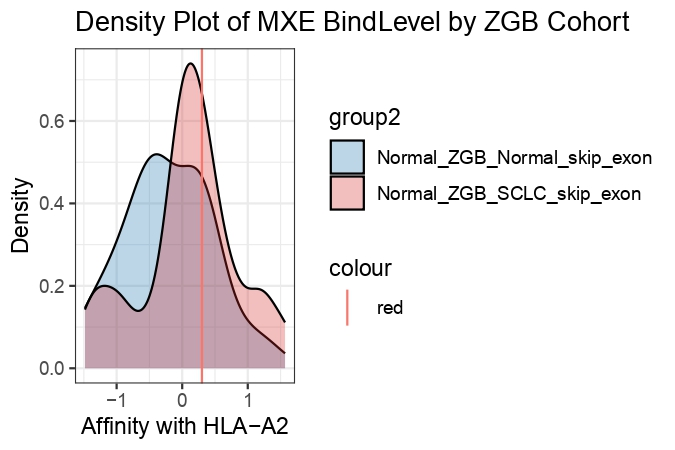
  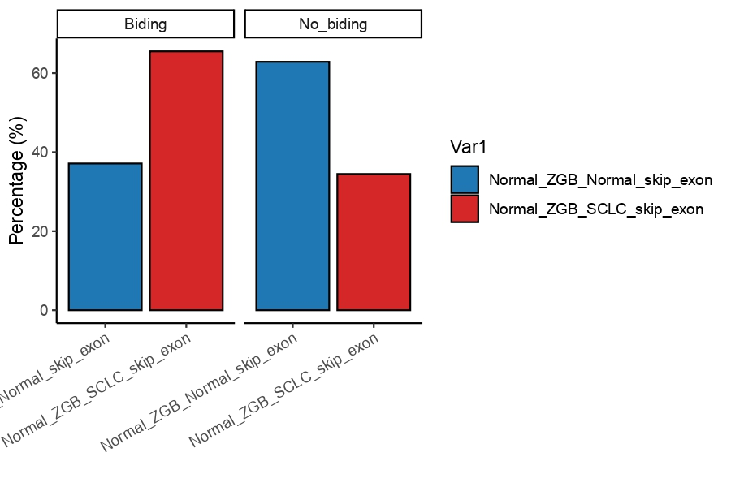
  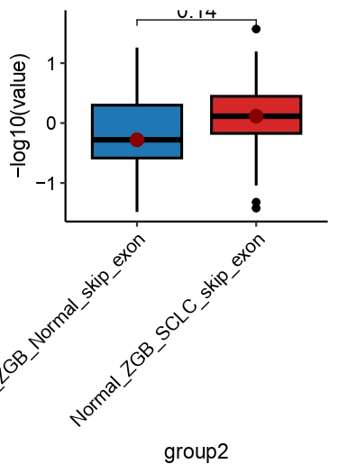
</div>

<div style="display: flex; justify-content: space-between;">
  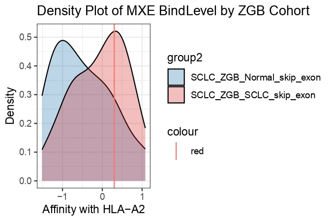
  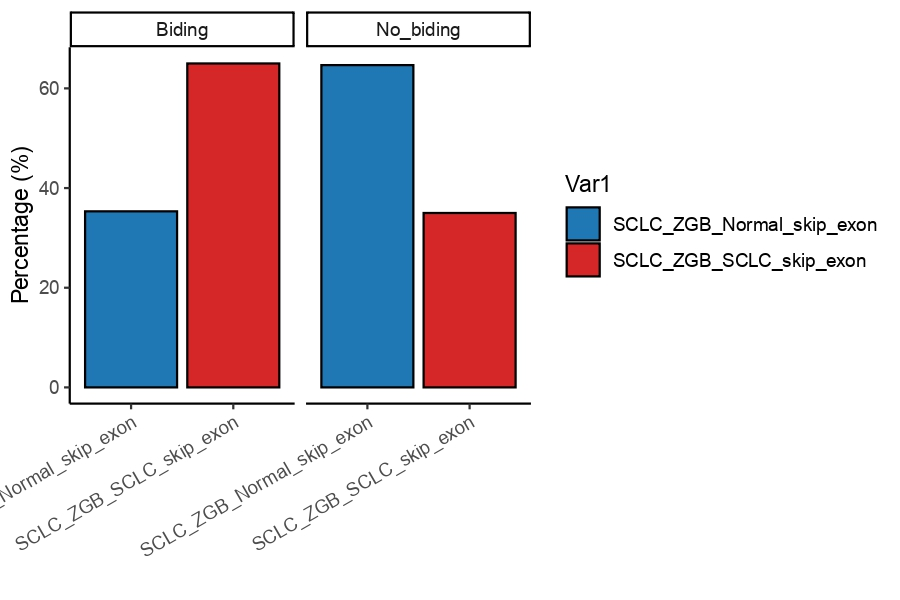
  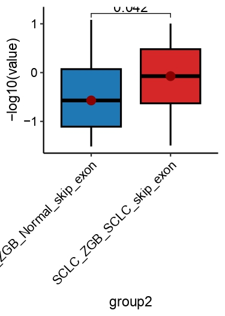
</div>

ZGB SE
<div style="display: flex; justify-content: space-between;">
  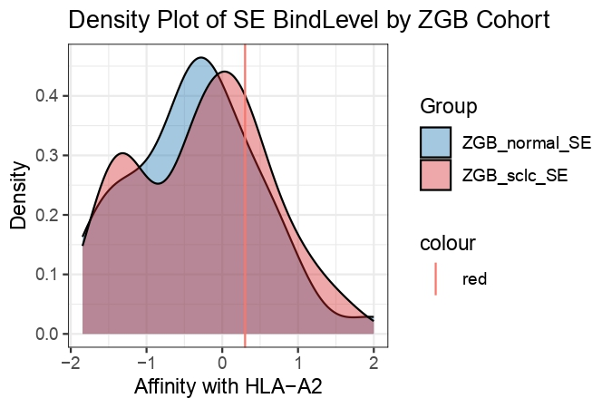
  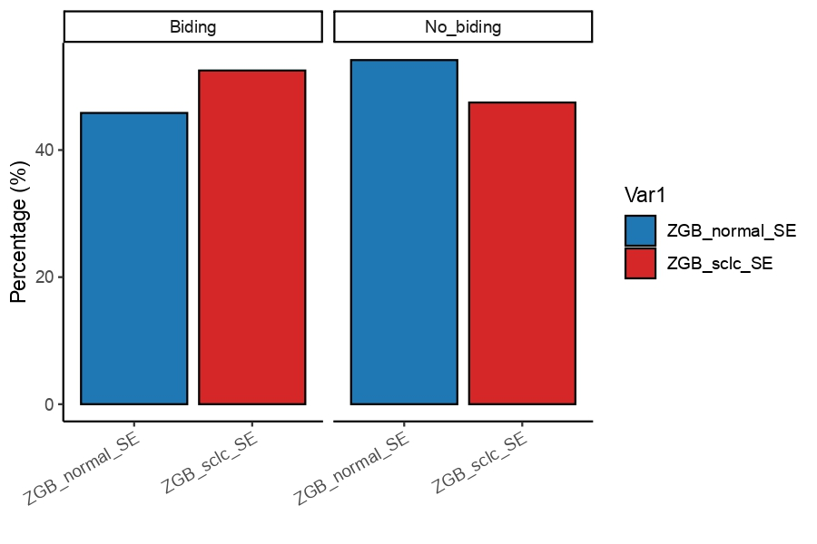
  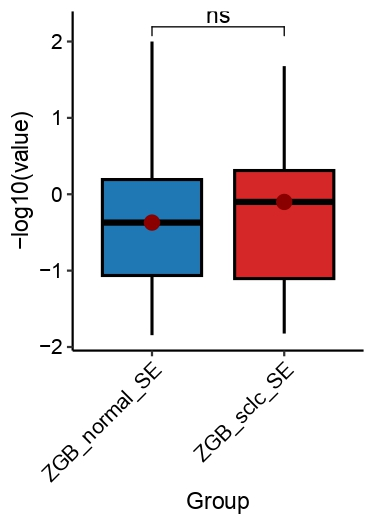
</div>

JHB SE
<div style="display: flex; justify-content: space-between;">
  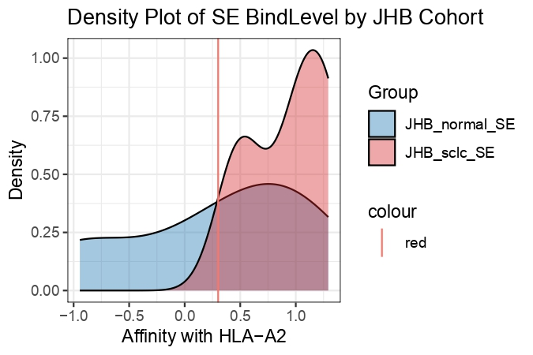
  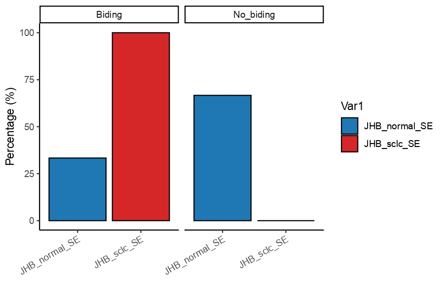
  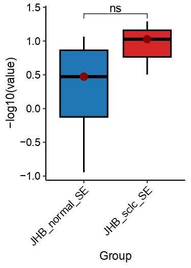
</div>
