# Figure4-6
In this pipeline, we showed the detail codes of visualization of Figures.
## Figure4A
```r
library(Rsamtools)
library(GenomicFeatures)
library(GenomicAlignments)
library(BiocParallel)
library(pheatmap)
library(RColorBrewer)
library(PoiClaClu)
library(org.Mm.eg.db)
library(AnnotationDbi)
library(DOSE)
library(clusterProfiler)
library(topGO)
library(pathview)
library(org.Hs.eg.db)
library(AnnotationDbi)
library(DOSE)
library(clusterProfiler)
library(topGO)
library(ggplot2)
library(data.table)
library(tidyr)
library(nichenetr)
library(VennDiagram)

splicing_gene <- read.csv(file="./splicing_factor.csv")
colnames(splicing_gene) <- c("order","symbol")
all_FPKM <- read.csv(file="./SCLC_vs_Normal_3vs3_DEGS_Normalize_Count.csv")
all_FPKM <- all_FPKM[,c(3:9)]
all_FPKM <- na.omit(all_FPKM)

select_all_FPKM <- c()
for(i in splicing_gene$symbol){
  y <- all_FPKM$symbol
  select <- all_FPKM[with(all_FPKM,y==i),]
  select_all_FPKM <- rbind(select_all_FPKM,select)
}

range(select_all_FPKM$baseMean)

select_all_FPKM <- select_all_FPKM[order(select_all_FPKM$log2FoldChange,decreasing=F),]
select_all_FPKM$order <- c(1:nrow(select_all_FPKM))
select_all_FPKM$threshold = as.factor(ifelse(select_all_FPKM$log2FoldChange > 0, 'Up','Down'))
select_all_FPKM = select_all_FPKM %>% mutate(Hsa_Genes = convert_mouse_to_human_symbols(symbol)) %>% drop_na()
mouse_Up <- subset(select_all_FPKM,threshold=="Up")
mouse_Down <- subset(select_all_FPKM,threshold=="Down")

resSCLC <- read.csv(file="./resSCLC.csv")
rownames(resSCLC) <- resSCLC$X
colnames(splicing_gene) <- c("order","symbol")
splicing_gene$symbol <- as.character(splicing_gene$symbol)
splicing_factor_huamn <- as.data.frame(convert_mouse_to_human_symbols(splicing_gene$symbol))
colnames(splicing_factor_huamn) <- c("HGNC.symbol")
splicing_factor_huamn$HGNC.symbol <- as.character(splicing_factor_huamn$HGNC.symbol)
human_SCLC <- resSCLC[splicing_factor_huamn$HGNC.symbol,]
human_SCLC <- na.omit(human_SCLC)
human_SCLC$threshold = as.factor(ifelse(human_SCLC$log2FoldChange > 0, 'Up','Down'))
human_SCLC_Up <- subset(human_SCLC,threshold=="Up")
human_SCLC_Down <- subset(human_SCLC,threshold=="Down")

T<-venn.diagram(list(human=na.omit(human_SCLC_Up$X),mouse=na.omit(mouse_Up$Hsa_Genes)),
filename=NULL,
lwd=1,                         #圈线粗度
lty=1,                         #圈线类型
col=c('#0099CC','#FF6666'),    #圈线颜色
fill=c('#0099CC','#FF6666'),   #填充颜色
cat.col=c('#0099CC','#FF6666'),#A和B的颜色
cat.cex = 2.5,                 #A和B的大小
rotation.degree = 45,          #旋转角度
main = "human & mouse",                  #主标题内容
main.cex = 2,                  #主标题大小
sub = "",        #亚标题内容
sub.cex = 1,                   #亚标题字大小
cex=1.5,                       #里面交集字的大小
alpha = 0.5,                   #透明度
reverse=TRUE)

grid.draw(T)
```
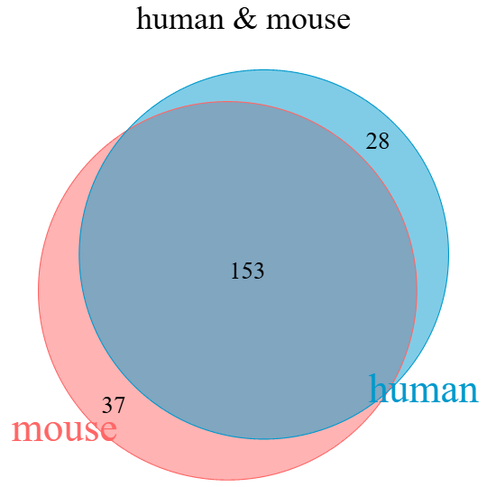

## Figure4C
Figure4C PRMT5 high vs PRMT5 low AS
```r
JHB_data_all1 <- read.csv(row.names=1,"./JHB_cell_data_result1.csv")
JHB_data_all1_tumor <- JHB_data_all1[,grep("T",colnames(JHB_data_all1))]
JHB_data_all1_tumor1 <- as.data.frame(t(JHB_data_all1_tumor))

dim(JHB_data_all1_tumor1)
[1]   107 26101

JHB_data_all1_tumor_PRMT5 <- subset(JHB_data_all1_tumor1,select=c("PRMT5"))
JHB_data_all1_tumor_PRMT5$sample <- rownames(JHB_data_all1_tumor_PRMT5)
JHB_data_all1_tumor_PRMT5 <- JHB_data_all1_tumor_PRMT5[order(JHB_data_all1_tumor_PRMT5$PRMT5),]
JHB_data_all1_tumor_PRMT5_02_high <- tail(JHB_data_all1_tumor_PRMT5,21)
JHB_data_all1_tumor_PRMT5_02_low <- head(JHB_data_all1_tumor_PRMT5,21)
JHB_data_all1_tumor_PRMT5_02_high$Group <- "High"
JHB_data_all1_tumor_PRMT5_02_low$Group <- "Low"
JHB_PRMT5_GROUP_exp20 <- rbind(JHB_data_all1_tumor_PRMT5_02_high,JHB_data_all1_tumor_PRMT5_02_low)
write.csv(JHB_PRMT5_GROUP_exp20,"./JHB_PRMT5_GROUP_exp20.csv")

cd ~/home/SCLC_Splicing/Patients_data/PRMT5_HI_LO_JHB_exp20/bam/
vim PRMT5High_bam.txt
~/home/SCLC_Splicing/Patients_data/PRMT5_HI_LO_JHB_exp20/bam/T181230.Aligned.sortedByCoord.out.bam,~/home/SCLC_Splicing/Patients_data/PRMT5_HI_LO_JHB_exp20/bam/T171209.Aligned.sortedByCoord.out.bam,~/home/SCLC_Splicing/Patients_data/PRMT5_HI_LO_JHB_exp20/bam/T190197.Aligned.sortedByCoord.out.bam,~/home/SCLC_Splicing/Patients_data/PRMT5_HI_LO_JHB_exp20/bam/T130214.Aligned.sortedByCoord.out.bam,~/home/SCLC_Splicing/Patients_data/PRMT5_HI_LO_JHB_exp20/bam/T171477.Aligned.sortedByCoord.out.bam,~/home/SCLC_Splicing/Patients_data/PRMT5_HI_LO_JHB_exp20/bam/T140188.Aligned.sortedByCoord.out.bam,~/home/SCLC_Splicing/Patients_data/PRMT5_HI_LO_JHB_exp20/bam/T141181.Aligned.sortedByCoord.out.bam,~/home/SCLC_Splicing/Patients_data/PRMT5_HI_LO_JHB_exp20/bam/T120163.Aligned.sortedByCoord.out.bam,~/home/SCLC_Splicing/Patients_data/PRMT5_HI_LO_JHB_exp20/bam/T150921.Aligned.sortedByCoord.out.bam,~/home/SCLC_Splicing/Patients_data/PRMT5_HI_LO_JHB_exp20/bam/T160730.Aligned.sortedByCoord.out.bam,~/home/SCLC_Splicing/Patients_data/PRMT5_HI_LO_JHB_exp20/bam/T180643.Aligned.sortedByCoord.out.bam,~/home/SCLC_Splicing/Patients_data/PRMT5_HI_LO_JHB_exp20/bam/T160774.Aligned.sortedByCoord.out.bam,~/home/SCLC_Splicing/Patients_data/PRMT5_HI_LO_JHB_exp20/bam/T150025.Aligned.sortedByCoord.out.bam,~/home/SCLC_Splicing/Patients_data/PRMT5_HI_LO_JHB_exp20/bam/T160725.Aligned.sortedByCoord.out.bam,~/home/SCLC_Splicing/Patients_data/PRMT5_HI_LO_JHB_exp20/bam/T161286.Aligned.sortedByCoord.out.bam,~/home/SCLC_Splicing/Patients_data/PRMT5_HI_LO_JHB_exp20/bam/T150143.Aligned.sortedByCoord.out.bam,~/home/SCLC_Splicing/Patients_data/PRMT5_HI_LO_JHB_exp20/bam/T161152.Aligned.sortedByCoord.out.bam,~/home/SCLC_Splicing/Patients_data/PRMT5_HI_LO_JHB_exp20/bam/T160642.Aligned.sortedByCoord.out.bam,~/home/SCLC_Splicing/Patients_data/PRMT5_HI_LO_JHB_exp20/bam/T160662.Aligned.sortedByCoord.out.bam,~/home/SCLC_Splicing/Patients_data/PRMT5_HI_LO_JHB_exp20/bam/T180562.Aligned.sortedByCoord.out.bam,~/home/SCLC_Splicing/Patients_data/PRMT5_HI_LO_JHB_exp20/bam/T181063.Aligned.sortedByCoord.out.bam
vim PRMT5Low_bam.txt
~/home/SCLC_Splicing/Patients_data/PRMT5_HI_LO_JHB_exp20/bam/T120111.Aligned.sortedByCoord.out.bam,~/home/SCLC_Splicing/Patients_data/PRMT5_HI_LO_JHB_exp20/bam/T141139.Aligned.sortedByCoord.out.bam,~/home/SCLC_Splicing/Patients_data/PRMT5_HI_LO_JHB_exp20/bam/T130397.Aligned.sortedByCoord.out.bam,~/home/SCLC_Splicing/Patients_data/PRMT5_HI_LO_JHB_exp20/bam/T150558.Aligned.sortedByCoord.out.bam,~/home/SCLC_Splicing/Patients_data/PRMT5_HI_LO_JHB_exp20/bam/T140332.Aligned.sortedByCoord.out.bam,~/home/SCLC_Splicing/Patients_data/PRMT5_HI_LO_JHB_exp20/bam/T130157.Aligned.sortedByCoord.out.bam,~/home/SCLC_Splicing/Patients_data/PRMT5_HI_LO_JHB_exp20/bam/T190533.Aligned.sortedByCoord.out.bam,~/home/SCLC_Splicing/Patients_data/PRMT5_HI_LO_JHB_exp20/bam/T170050.Aligned.sortedByCoord.out.bam,~/home/SCLC_Splicing/Patients_data/PRMT5_HI_LO_JHB_exp20/bam/T140098.Aligned.sortedByCoord.out.bam,~/home/SCLC_Splicing/Patients_data/PRMT5_HI_LO_JHB_exp20/bam/T150208.Aligned.sortedByCoord.out.bam,~/home/SCLC_Splicing/Patients_data/PRMT5_HI_LO_JHB_exp20/bam/T150452.Aligned.sortedByCoord.out.bam,~/home/SCLC_Splicing/Patients_data/PRMT5_HI_LO_JHB_exp20/bam/T170172.Aligned.sortedByCoord.out.bam,~/home/SCLC_Splicing/Patients_data/PRMT5_HI_LO_JHB_exp20/bam/T190206.Aligned.sortedByCoord.out.bam,~/home/SCLC_Splicing/Patients_data/PRMT5_HI_LO_JHB_exp20/bam/T140630.Aligned.sortedByCoord.out.bam,~/home/SCLC_Splicing/Patients_data/PRMT5_HI_LO_JHB_exp20/bam/T160086.Aligned.sortedByCoord.out.bam,~/home/SCLC_Splicing/Patients_data/PRMT5_HI_LO_JHB_exp20/bam/T160772.Aligned.sortedByCoord.out.bam,~/home/SCLC_Splicing/Patients_data/PRMT5_HI_LO_JHB_exp20/bam/T130023.Aligned.sortedByCoord.out.bam,~/home/SCLC_Splicing/Patients_data/PRMT5_HI_LO_JHB_exp20/bam/T171236.Aligned.sortedByCoord.out.bam,~/home/SCLC_Splicing/Patients_data/PRMT5_HI_LO_JHB_exp20/bam/T140627.Aligned.sortedByCoord.out.bam,~/home/SCLC_Splicing/Patients_data/PRMT5_HI_LO_JHB_exp20/bam/T120285.Aligned.sortedByCoord.out.bam,~/home/SCLC_Splicing/Patients_data/PRMT5_HI_LO_JHB_exp20/bam/T141102.Aligned.sortedByCoord.out.bam

python ~/home/rmats-turbo-master/rmats.py \
--b1 ~home/Splicing_SCLC/JHB_Cohort/PRMT5_HI_LO_JHB_exp20_AS/PRMT5High_bam.txt \
--b2 ~home/Splicing_SCLC/JHB_Cohort/PRMT5_HI_LO_JHB_exp20_AS/PRMT5Low_bam.txt \
--gtf /mnt/data/public_data/reference/Human/Homo_sapiens.GRCh38.90.gtf \
--od ~home/Splicing_SCLC/JHB_Cohort/PRMT5_HI_LO_JHB_exp20_AS \
--tmp ~home/Splicing_SCLC/JHB_Cohort/PRMT5_HI_LO_JHB_exp20_AS/tmp_as \
-t paired --nthread 10 --readLength 150


SE_JC <- fread("~home/Splicing_SCLC/JHB_Cohort/PRMT5_HI_LO_JHB_exp20_AS/SE.MATS.JC.txt")
SE_JC <- as.data.frame(SE_JC)
head(SE_JC)
SE_JC$AS_Type <- "SE"
SE_JC <- SE_JC[,c("PValue","FDR","IncLevel1","IncLevel2","IncLevelDifference","AS_Type")]

RI_JC <- fread("~home/Splicing_SCLC/JHB_Cohort/PRMT5_HI_LO_JHB_exp20_AS/RI.MATS.JC.txt")
RI_JC <- as.data.frame(RI_JC)
head(RI_JC)
RI_JC$AS_Type <- "RI"
RI_JC <- RI_JC[,c("PValue","FDR","IncLevel1","IncLevel2","IncLevelDifference","AS_Type")]

MXE_JC <- fread("~home/Splicing_SCLC/JHB_Cohort/PRMT5_HI_LO_JHB_exp20_AS/MXE.MATS.JC.txt")
MXE_JC <- as.data.frame(MXE_JC)
head(MXE_JC)
MXE_JC$AS_Type <- "MXE"
MXE_JC <- MXE_JC[,c("PValue","FDR","IncLevel1","IncLevel2","IncLevelDifference","AS_Type")]

A3SS_JC <- fread("~home/Splicing_SCLC/JHB_Cohort/PRMT5_HI_LO_JHB_exp20_AS/A3SS.MATS.JC.txt")
A3SS_JC <- as.data.frame(A3SS_JC)
head(A3SS_JC)
A3SS_JC$AS_Type <- "A3SS"
A3SS_JC <- A3SS_JC[,c("PValue","FDR","IncLevel1","IncLevel2","IncLevelDifference","AS_Type")]

A5SS_JC <- fread("~home/Splicing_SCLC/JHB_Cohort/PRMT5_HI_LO_JHB_exp20_AS/A5SS.MATS.JC.txt")
A5SS_JC <- as.data.frame(A5SS_JC)
head(A5SS_JC)
A5SS_JC$AS_Type <- "A5SS"
A5SS_JC <- A5SS_JC[,c("PValue","FDR","IncLevel1","IncLevel2","IncLevelDifference","AS_Type")]
data <- rbind(SE_JC,RI_JC,MXE_JC,A3SS_JC,A5SS_JC)

write.csv(data,"Fig4C-1-Cohort1-AS-all.csv")


PRMT5Hig_splicing_events <- data[data$IncLevelDifference<0&data$PValue<0.05,]
PRMT5low_splicing_events <- data[data$IncLevelDifference>0&data$PValue<0.05,]
PRMT5Hig_splicing_events1 <- data.frame(table(PRMT5Hig_splicing_events$AS_Type))
PRMT5low_splicing_events1 <- data.frame(table(PRMT5low_splicing_events$AS_Type))

PRMT5Hig_splicing_events1$Var2 <- "PRMT5High"
PRMT5low_splicing_events1$Var2 <- "PRMT5Low"

data_long <- rbind(PRMT5Hig_splicing_events1,PRMT5low_splicing_events1)

library(ggplot2)
library(tidyr)  
data_long$Var2 <- factor(data_long$Var2,levels=c("PRMT5Low","PRMT5High"))
p <- ggplot(data_long, aes(x = Var2, y = Freq, fill = Var2)) +
  geom_bar(stat = "identity", position = "dodge") +
  facet_wrap(~ Var1, scales = "free_y",ncol=5) +  # 为每个变量绘制单独的面板，并且每个面板的Y轴是独立的
  labs(title = "", x = "", y = "Splicing Events") +
  scale_fill_manual(values = c("PRMT5High"="#b20000","PRMT5Low"="#2873B3"))+
  theme_bw() 
ggsave(p,file="Fig4C-1-Cohort1-bar-splicing_events-by-prmt5.pdf",height=3,width=10)

///////////////////////////////Cohort2
GSE60052_data_all1 <- read.table(row.names=1,header=TRUE,file="./GSE60052_79tumor.7normal.normalized.log2.data.Rda.tsv")
GSE60052_data_clinic <- read.csv(row.names=1,header=TRUE,file="./sample.csv")
GSE60052_data_all1_normal <- GSE60052_data_all1[,(grep("normal",colnames(GSE60052_data_all1)))]
GSE60052_data_all1_tumor <- GSE60052_data_all1[, !colnames(GSE60052_data_all1) %in% colnames(GSE60052_data_all1_normal)]
GSE60052_data_all1_tumor1 <- as.data.frame(t(GSE60052_data_all1_tumor))
GSE60052_data_all1_tumor_PRMT5 <- subset(GSE60052_data_all1_tumor1,select=c("PRMT5"))
GSE60052_data_all1_tumor_PRMT5$sample <- rownames(GSE60052_data_all1_tumor_PRMT5)
GSE60052_data_all1_tumor_PRMT5 <- GSE60052_data_all1_tumor_PRMT5[order(GSE60052_data_all1_tumor_PRMT5$PRMT5),]
GSE60052_data_all1_tumor_PRMT5_02_high <- tail(GSE60052_data_all1_tumor_PRMT5,16)
GSE60052_data_all1_tumor_PRMT5_02_low <- head(GSE60052_data_all1_tumor_PRMT5,16)
GSE60052_data_all1_tumor_PRMT5_02_high$Group <- "High"
GSE60052_data_all1_tumor_PRMT5_02_low$Group <- "Low"

PLOS_PRMT5_GROUP_exp20 <- rbind(GSE60052_data_all1_tumor_PRMT5_02_high,GSE60052_data_all1_tumor_PRMT5_02_low)
write.csv(PLOS_PRMT5_GROUP_exp20,"~/home/SCLC_Splicing/Patients_data/PRMT5_HI_LO_PLOS_exp20/PLOS_PRMT5_GROUP_exp20.csv")


#rMATS

cd ~home/Splicing_SCLC/PLOS_Cohort/PRMT5_HI_LO_PLOS_exp20_AS

vim PRMT5High_bam.txt
~/home/SCLC_Splicing/Patients_data/PRMT5_HI_LO_PLOS_exp20/sortedByCoord.out.bam/SRR1797231Aligned.sortedByCoord.out.bam,~/home/SCLC_Splicing/Patients_data/PRMT5_HI_LO_PLOS_exp20/sortedByCoord.out.bam/SRR1797233Aligned.sortedByCoord.out.bam,~/home/SCLC_Splicing/Patients_data/PRMT5_HI_LO_PLOS_exp20/sortedByCoord.out.bam/SRR1797247Aligned.sortedByCoord.out.bam,~/home/SCLC_Splicing/Patients_data/PRMT5_HI_LO_PLOS_exp20/sortedByCoord.out.bam/SRR1797248Aligned.sortedByCoord.out.bam,~/home/SCLC_Splicing/Patients_data/PRMT5_HI_LO_PLOS_exp20/sortedByCoord.out.bam/SRR1797253Aligned.sortedByCoord.out.bam,~/home/SCLC_Splicing/Patients_data/PRMT5_HI_LO_PLOS_exp20/sortedByCoord.out.bam/SRR1797254Aligned.sortedByCoord.out.bam,~/home/SCLC_Splicing/Patients_data/PRMT5_HI_LO_PLOS_exp20/sortedByCoord.out.bam/SRR1797259Aligned.sortedByCoord.out.bam,~/home/SCLC_Splicing/Patients_data/PRMT5_HI_LO_PLOS_exp20/sortedByCoord.out.bam/SRR1797261Aligned.sortedByCoord.out.bam,~/home/SCLC_Splicing/Patients_data/PRMT5_HI_LO_PLOS_exp20/sortedByCoord.out.bam/SRR1797262Aligned.sortedByCoord.out.bam,~/home/SCLC_Splicing/Patients_data/PRMT5_HI_LO_PLOS_exp20/sortedByCoord.out.bam/SRR1797266Aligned.sortedByCoord.out.bam,~/home/SCLC_Splicing/Patients_data/PRMT5_HI_LO_PLOS_exp20/sortedByCoord.out.bam/SRR1797267Aligned.sortedByCoord.out.bam,~/home/SCLC_Splicing/Patients_data/PRMT5_HI_LO_PLOS_exp20/sortedByCoord.out.bam/SRR1797269Aligned.sortedByCoord.out.bam,~/home/SCLC_Splicing/Patients_data/PRMT5_HI_LO_PLOS_exp20/sortedByCoord.out.bam/SRR1797271Aligned.sortedByCoord.out.bam,~/home/SCLC_Splicing/Patients_data/PRMT5_HI_LO_PLOS_exp20/sortedByCoord.out.bam/SRR1797288Aligned.sortedByCoord.out.bam,~/home/SCLC_Splicing/Patients_data/PRMT5_HI_LO_PLOS_exp20/sortedByCoord.out.bam/SRR1797292Aligned.sortedByCoord.out.bam,~/home/SCLC_Splicing/Patients_data/PRMT5_HI_LO_PLOS_exp20/sortedByCoord.out.bam/SRR1797294Aligned.sortedByCoord.out.bam,
vim PRMT5Low_bam.txt
~/home/SCLC_Splicing/Patients_data/PRMT5_HI_LO_PLOS_exp20/sortedByCoord.out.bam/SRR1797226Aligned.sortedByCoord.out.bam,~/home/SCLC_Splicing/Patients_data/PRMT5_HI_LO_PLOS_exp20/sortedByCoord.out.bam/SRR1797230Aligned.sortedByCoord.out.bam,~/home/SCLC_Splicing/Patients_data/PRMT5_HI_LO_PLOS_exp20/sortedByCoord.out.bam/SRR1797234Aligned.sortedByCoord.out.bam,~/home/SCLC_Splicing/Patients_data/PRMT5_HI_LO_PLOS_exp20/sortedByCoord.out.bam/SRR1797236Aligned.sortedByCoord.out.bam,~/home/SCLC_Splicing/Patients_data/PRMT5_HI_LO_PLOS_exp20/sortedByCoord.out.bam/SRR1797246Aligned.sortedByCoord.out.bam,~/home/SCLC_Splicing/Patients_data/PRMT5_HI_LO_PLOS_exp20/sortedByCoord.out.bam/SRR1797273Aligned.sortedByCoord.out.bam,~/home/SCLC_Splicing/Patients_data/PRMT5_HI_LO_PLOS_exp20/sortedByCoord.out.bam/SRR1797275Aligned.sortedByCoord.out.bam,~/home/SCLC_Splicing/Patients_data/PRMT5_HI_LO_PLOS_exp20/sortedByCoord.out.bam/SRR1797276Aligned.sortedByCoord.out.bam,~/home/SCLC_Splicing/Patients_data/PRMT5_HI_LO_PLOS_exp20/sortedByCoord.out.bam/SRR1797282Aligned.sortedByCoord.out.bam,~/home/SCLC_Splicing/Patients_data/PRMT5_HI_LO_PLOS_exp20/sortedByCoord.out.bam/SRR1797284Aligned.sortedByCoord.out.bam,~/home/SCLC_Splicing/Patients_data/PRMT5_HI_LO_PLOS_exp20/sortedByCoord.out.bam/SRR1797287Aligned.sortedByCoord.out.bam,~/home/SCLC_Splicing/Patients_data/PRMT5_HI_LO_PLOS_exp20/sortedByCoord.out.bam/SRR1797290Aligned.sortedByCoord.out.bam,~/home/SCLC_Splicing/Patients_data/PRMT5_HI_LO_PLOS_exp20/sortedByCoord.out.bam/SRR1797295Aligned.sortedByCoord.out.bam,~/home/SCLC_Splicing/Patients_data/PRMT5_HI_LO_PLOS_exp20/sortedByCoord.out.bam/SRR1797300Aligned.sortedByCoord.out.bam,~/home/SCLC_Splicing/Patients_data/PRMT5_HI_LO_PLOS_exp20/sortedByCoord.out.bam/SRR1797302Aligned.sortedByCoord.out.bam,~/home/SCLC_Splicing/Patients_data/PRMT5_HI_LO_PLOS_exp20/sortedByCoord.out.bam/SRR1797303Aligned.sortedByCoord.out.bam,

cd ~home/Splicing_SCLC/PLOS_Cohort/PRMT5_HI_LO_PLOS_exp20_AS
python ~/home/rmats-turbo-master/rmats.py \
--b1 ~home/Splicing_SCLC/PLOS_Cohort/PRMT5_HI_LO_PLOS_exp20_AS/PRMT5High_bam.txt \
--b2 ~home/Splicing_SCLC/PLOS_Cohort/PRMT5_HI_LO_PLOS_exp20_AS/PRMT5Low_bam.txt \
--gtf ~/home/SCLC_Splicing/Patients_data/PRMT5_HI_LO_PLOS_exp20/genes.gtf \
--od ~home/Splicing_SCLC/PLOS_Cohort/PRMT5_HI_LO_PLOS_exp20_AS \
--tmp ~home/Splicing_SCLC/PLOS_Cohort/PRMT5_HI_LO_PLOS_exp20_AS/tmp_as \
-t paired --nthread 10 --readLength 90


SE_JC <- fread("~home/Splicing_SCLC/PLOS_Cohort/PRMT5_HI_LO_PLOS_exp20_AS/SE.MATS.JC.txt")
SE_JC <- as.data.frame(SE_JC)
head(SE_JC)
SE_JC$AS_Type <- "SE"
SE_JC <- SE_JC[,c("PValue","FDR","IncLevel1","IncLevel2","IncLevelDifference","AS_Type")]

RI_JC <- fread("~home/Splicing_SCLC/PLOS_Cohort/PRMT5_HI_LO_PLOS_exp20_AS/RI.MATS.JC.txt")
RI_JC <- as.data.frame(RI_JC)
head(RI_JC)
RI_JC$AS_Type <- "RI"
RI_JC <- RI_JC[,c("PValue","FDR","IncLevel1","IncLevel2","IncLevelDifference","AS_Type")]

MXE_JC <- fread("~home/Splicing_SCLC/PLOS_Cohort/PRMT5_HI_LO_PLOS_exp20_AS/MXE.MATS.JC.txt")
MXE_JC <- as.data.frame(MXE_JC)
head(MXE_JC)
MXE_JC$AS_Type <- "MXE"
MXE_JC <- MXE_JC[,c("PValue","FDR","IncLevel1","IncLevel2","IncLevelDifference","AS_Type")]

A3SS_JC <- fread("~home/Splicing_SCLC/PLOS_Cohort/PRMT5_HI_LO_PLOS_exp20_AS/A3SS.MATS.JC.txt")
A3SS_JC <- as.data.frame(A3SS_JC)
head(A3SS_JC)
A3SS_JC$AS_Type <- "A3SS"
A3SS_JC <- A3SS_JC[,c("PValue","FDR","IncLevel1","IncLevel2","IncLevelDifference","AS_Type")]

A5SS_JC <- fread("~home/Splicing_SCLC/PLOS_Cohort/PRMT5_HI_LO_PLOS_exp20_AS/A5SS.MATS.JC.txt")
A5SS_JC <- as.data.frame(A5SS_JC)
head(A5SS_JC)
A5SS_JC$AS_Type <- "A5SS"
A5SS_JC <- A5SS_JC[,c("PValue","FDR","IncLevel1","IncLevel2","IncLevelDifference","AS_Type")]
dataPLOS <- rbind(SE_JC,RI_JC,MXE_JC,A3SS_JC,A5SS_JC)

write.csv(dataPLOS,"Fig4C-2-Cohort2-AS-all.csv")

PRMT5Hig_splicing_events <- dataPLOS[dataPLOS$IncLevelDifference<0,]
PRMT5low_splicing_events <- dataPLOS[dataPLOS$IncLevelDifference>0,]
PRMT5Hig_splicing_events1 <- data.frame(table(PRMT5Hig_splicing_events$AS_Type))
PRMT5low_splicing_events1 <- data.frame(table(PRMT5low_splicing_events$AS_Type))

PRMT5Hig_splicing_events1$Var2 <- "PRMT5High"
PRMT5low_splicing_events1$Var2 <- "PRMT5Low"

data_long <- rbind(PRMT5Hig_splicing_events1,PRMT5low_splicing_events1)

library(ggplot2)
library(tidyr)  
data_long$Var2 <- factor(data_long$Var2,levels=c("PRMT5Low","PRMT5High"))
p <- ggplot(data_long, aes(x = Var2, y = Freq, fill = Var2)) +
  geom_bar(stat = "identity", position = "dodge") +
  facet_wrap(~ Var1, scales = "free_y",ncol=5) +  # 为每个变量绘制单独的面板，并且每个面板的Y轴是独立的
  labs(title = "", x = "", y = "Splicing Events") +
  scale_fill_manual(values = c("PRMT5High"="#b20000","PRMT5Low"="#2873B3"))+
  theme_bw() 
```
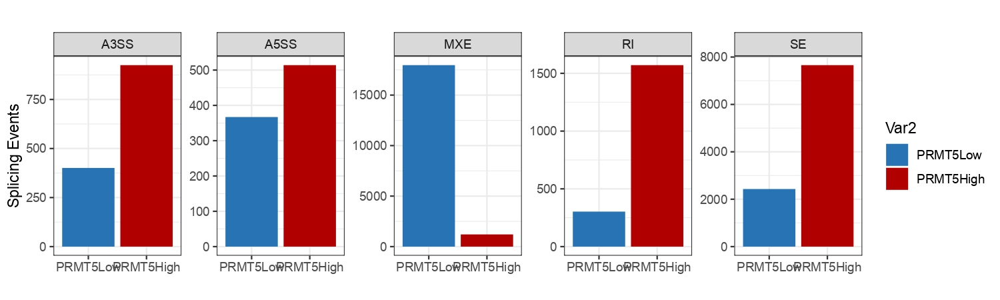
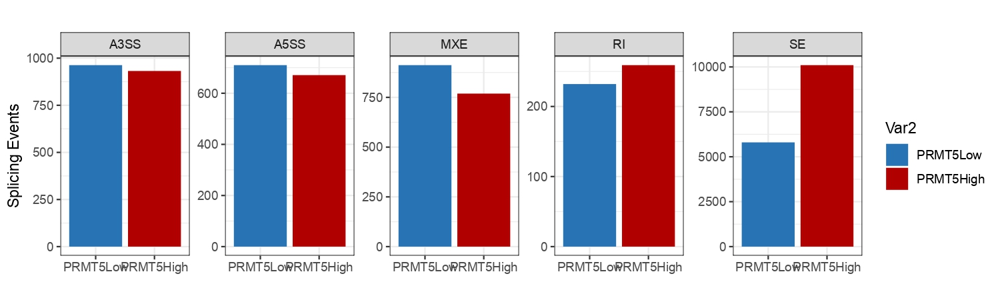

## Figure4D PRMT5 survive
```r
JHB_data_all1 <- read.csv(row.names=1,"./JHB_cell_data_result1.csv")
Cell_Zhangpeng_clinical <- read.csv(row.names=1,"./Zhangpeng_SCLC_and_Normal_Clinical.csv")
rownames(Cell_Zhangpeng_clinical) <- paste0("T",rownames(Cell_Zhangpeng_clinical))
JHB_data_all1_tumor <- JHB_data_all1[,grep("T",colnames(JHB_data_all1))]
JHB_data_all1_tumor1 <- as.data.frame(t(JHB_data_all1_tumor))

JHB_both_cli <- intersect(rownames(JHB_data_all1_tumor1),rownames(Cell_Zhangpeng_clinical))
JHB_both_cli_clinical <- cbind(Cell_Zhangpeng_clinical[JHB_both_cli,],JHB_data_all1_tumor1[JHB_both_cli,])
meta <- as.data.frame(JHB_both_cli_clinical)
all_merge <- meta[!is.na(as.character(meta$Survial..months.)),]
all_merge$Status. <- as.character(all_merge$Status.)
all_merge$final_Status. <- ifelse(all_merge$Status.=="alive",0,1)
all_merge$Survial..months. <- as.numeric(gsub(" (died for operation-associated complication)","",all_merge$Survial..months.))
all_merge1 <- all_merge[!is.na(all_merge$Survial..months.),]

library("survival")
library("survminer")
all_merge1.cut <- surv_cutpoint(
   all_merge1,
   time = "Survial..months.",
   event = "final_Status.",
   variables = c("PRMT5"),
   progressbar=TRUE,
   minprop=0.15
)

all_merge1.cut.cat <- surv_categorize(all_merge1.cut) 
library(survival)
fit <- survfit(Surv(Survial..months., final_Status.) ~ PRMT5, data = all_merge1.cut.cat)
p1 <- ggsurvplot(fit, data = all_merge1.cut.cat,
surv.median.line = "hv",
pval = TRUE,
ggtheme = theme_bw(),
risk.table=TRUE)
p1
```
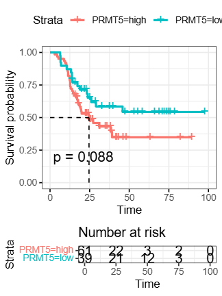

## SupplementaryFigure4A

```r
SCLC_sce_Lung_obj <- mcreadRDS("./SCLC_sce_Lung_obj.rds",mc.cores=20)
Idents(object = SCLC_sce_Lung_obj) <- ("cell_type_fine")

data.sel <- as.data.frame(FetchData(object = SCLC_sce_Lung_obj, vars = c("PRMT5","U2AF1","cell_type_fine"),slot="data"))
table(data.sel$cell_type_fine)
data.sel_new <- data.sel
data.sel_new$cell_type_fine <- factor(data.sel_new$cell_type_fine,levels=c("SCLC-A","SCLC-N","SCLC-P","AE1","AEP","B cell","Basal","Ciliated","Club","DC","Endothelial","Fibroblast","Hepatocyte","Ionocyte","Macrophage","Mast","Mucinous","Neuroendocrine","Neutrophil","Plasma cell","T cell","Tuft"))
data.sel_new$cell_type_new <- ifelse(data.sel_new$cell_type_fine=="SCLC-A" |data.sel_new$cell_type_fine=="SCLC-N"| data.sel_new$cell_type_fine=="SCLC-P" , data.sel_new$cell_type_fine, "other")
data.sel_new$cell_type_new <- ifelse(data.sel_new$cell_type_new=="1", "SCLC-A-N",data.sel_new$cell_type_new)
data.sel_new$cell_type_new <- ifelse(data.sel_new$cell_type_new=="2", "SCLC-A-N",data.sel_new$cell_type_new)
data.sel_new$cell_type_new <- ifelse(data.sel_new$cell_type_new=="3", "SCLC-P",data.sel_new$cell_type_new)
data.sel_new$cell_type_new <- factor(data.sel_new$cell_type_new,levels=c("SCLC-A-N","SCLC-P","other"))


ggboxplot(data.sel_new, x = "cell_type_fine", y = "PRMT5", fill="cell_type_fine",title=paste0("PRMT5",".in.SCLC"), legend = "none",outlier.shape = NA,notch = FALSE) +rotate_x_text(angle = 45)

ggboxplot(data.sel_new, "cell_type_new", "PRMT5",
    color = "cell_type_new", 
    add = "jitter", shape = "cell_type_new",
   notch = TRUE,title="no_GD All TCGA cancer_type")+ stat_compare_means(comparisons =list(c("SCLC-A-N","SCLC-P"),c("SCLC-A-N","other"),c("SCLC-P","other")),
    label = "p.signif", method = "t.test",paired=FALSE)
```
<div style="display: flex; justify-content: space-between;">
  
  
</div>

## Figure5A
Prepare the sample table and load packages

```r
vim sample_sampletable1.tsv
ids sample deal new order
1 linbajieAligned.sortedByCoord.out.bam linbajie Ctrl 1
2 liverAligned.sortedByCoord.out.bam liver Ctrl 2
3 Lung171217Aligned.sortedByCoord.out.bam lung Ctrl 3
4 drug_1Aligned.sortedByCoord.out.bam drug_1 DRUG 4
5 drug_2Aligned.sortedByCoord.out.bam drug_2 DRUG 5
6 drug_3Aligned.sortedByCoord.out.bam drug_3 DRUG 6

library(Rsamtools)
library(GenomicFeatures)
library(GenomicAlignments)
library(BiocParallel)
library(pheatmap)
library(RColorBrewer)
library(PoiClaClu)
library(org.Mm.eg.db)
library(AnnotationDbi)
library(DOSE)
library(clusterProfiler)
library(topGO)
library(pathview)
library(org.Hs.eg.db)
library(AnnotationDbi)
library(DOSE)
library(clusterProfiler)
library(topGO)
library(ggplot2)
```

```r
sampleTable <- read.table("./sample_sampletable1.tsv", header = TRUE,sep=" ")
sampleTable
filenames <- file.path("./Bam_Out_GRCM39/", sampleTable$sample)
file.exists(filenames)
bamfiles <- BamFileList(filenames, yieldSize=2000000)
register(MulticoreParam(workers=10))
registered()

library("GenomicFeatures")
gtffile <- "/mnt/data2/public_data/mouse/Mus_musculus_GRCm39/Mus_musculus.GRCm39.109.gtf"
txdb <- makeTxDbFromGFF(gtffile, format = "gtf", circ_seqs = character())
txdb
ebg <- exonsBy(txdb,by="gene")
ebg

se <- summarizeOverlaps(features=ebg, reads=bamfiles,
mode="Union",
singleEnd=FALSE,
ignore.strand=TRUE,
fragments=FALSE) 

sampleTable$deal <- as.factor(sampleTable$deal)
sampleTable$new <- as.factor(sampleTable$new)

colData(se) <- DataFrame(sampleTable)

library("DESeq2")
dds <- DESeqDataSet(se, design = ~ new)
countdata <- assay(se)
coldata <- colData(se)

dds <- estimateSizeFactors(dds)
normalized_counts <- counts(dds, normalized=TRUE)
colnames(normalized_counts) <- sampleTable$sample
dds <- DESeq(dds)
res_1 <- results(dds, contrast=c("new","DRUG","Ctrl"))

res_1$symbol <- mapIds(x = org.Mm.eg.db,keys = rownames(res_1),keytype = "ENSEMBL",column = "SYMBOL",multiVals = "first")
res_1$entrez <- mapIds(x = org.Mm.eg.db,keys = rownames(res_1),keytype ="ENSEMBL",column ="ENTREZID",multiVals="first")
AA <- res_1$symbol
AA <- as.character(AA)
res_1$GENENAME <- mapIds(x = org.Mm.eg.db,keys = AA,keytype ="SYMBOL",column ="GENENAME",multiVals="first")
res_1$GENENAME <- as.character(res_1$GENENAME)

res_1 <- data.frame(res_1)
res_1$ensembl <- rownames(res_1)

res_2 <- res_1[which(res_1$pvalue<0.05),]
upres_1 <- res_2[which(res_2$log2FoldChange>0),]
downres_1  <- res_2[which(res_2$log2FoldChange<0),]
ee<-as.matrix(upres_1$entrez)
dd <- as.data.frame(ee)
GOupres_1_all <- enrichGO(gene = dd, 
                   OrgDb = "org.Mm.eg.db",
                                ont = "all", 
                             pvalueCutoff = 0.05, 
                     pAdjustMethod = "none", 
                     qvalueCutoff = 1,
                     minGSSize = 10, 
                     maxGSSize = 500, 
                     readable = T, 
                     pool = FALSE)

ee<-as.matrix(downres_1$entrez)
dd <- as.vector(ee)
GOdownres_1_all <- enrichGO(gene = dd, 
                   OrgDb = "org.Mm.eg.db",
                     ont = "all", 
                     pvalueCutoff = 0.05, 
                     pAdjustMethod = "none", 
                     qvalueCutoff = 0.05,
                     minGSSize = 10, 
                     maxGSSize = 500, 
                     readable = T, 
                     pool = FALSE)

GO_down_RNA_10 <- GOdownres_1_all
GO_down_RNA_10 <- GO_down_RNA_10[GO_down_RNA_10$Description%in%c("RNA splicing",
"RNA splicing, via transesterification reactions",
"mRNA splicing, via spliceosome",
"regulation of RNA splicing",
"regulation of mRNA splicing, via spliceosome",
"tRNA splicing, via endonucleolytic cleavage and ligation",
"positive regulation of mRNA splicing, via spliceosome",
"RNA splicing, via endonucleolytic cleavage and ligation",
"alternative mRNA splicing, via spliceosome",
"negative regulation of RNA splicing"
)]
GO_down_RNA_10 <- GO_down_RNA_10[-c(3,7,9),]
GO_down_RNA_10$log10_Pvalue <- -log(GO_down_RNA_10$p.adjust,10)

p1 <- ggbarplot(GO_down_RNA_10, 
  x = "Description", 
  y = "log10_Pvalue",
  color = "#5B8FCF",            # Set bar border colors to white
  fill ="#5B8FCF",
  sort.val = "asc",          # Sort the value in dscending order
  x.text.angle = 90,           # Rotate vertically x axis texts
  rotate = TRUE,
  title="GSK_DOWN GO")

```
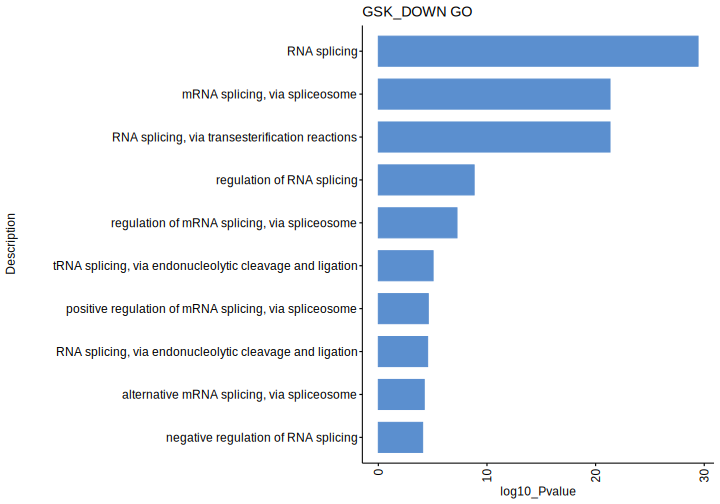

## Figure5B
```r
library(nichenetr)
library(tidyr)
drug_vs_ctrl_df_all <- res_1
SP_genes <- read.csv("./GO_term_summary_20250205_003645.csv")
SP_genes_1 <- SP_genes %>% mutate(human_gene = convert_mouse_to_human_symbols(as.character(SP_genes$Symbol))) %>% drop_na()

drug_vs_ctrl_factor <- drug_vs_ctrl_df_all[drug_vs_ctrl_df_all$symbol%in%c(SP_genes_1$Symbol),]
drug_vs_ctrl_factor$log2FoldChange = as.factor(ifelse(drug_vs_ctrl_factor$log2FoldChange > 0, 'Up','Down'))

library(ggsci)
cc <- as.data.frame(table(drug_vs_ctrl_factor$log2FoldChange))
library(ggpubr)
p1 <- ggbarplot(cc, x = "Var1", y = "Freq", fill="Var1",
  title="drug_vs_ctrl_factor", outlier.shape = NA,rotate = FALSE,
  lab.size=1)+      scale_fill_d3( "category20")
cc$name <- "drug_vs_ctrl_factor"

p1
```
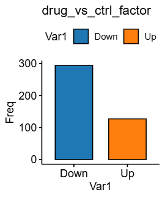

## Figure5C
```r

library(BuenColors)
library(ggrepel)
drug_vs_ctrl_df_all <- res_1
drug_vs_ctrl_factor <- drug_vs_ctrl_df_all[drug_vs_ctrl_df_all$symbol%in%c(SP_genes_1$Symbol),]
drug_vs_ctrl_factor <- drug_vs_ctrl_factor[order(drug_vs_ctrl_factor$log2FoldChange,decreasing=F),]
drug_vs_ctrl_factor$order <- c(1:nrow(drug_vs_ctrl_factor))
drug_vs_ctrl_factor$X <- drug_vs_ctrl_factor$symbol
library(dplyr)
drug_vs_ctrl_factor$threshold = as.factor(ifelse((drug_vs_ctrl_factor$log2FoldChange) > 0, 'Up','Down'))
library(ggplot2)

my_pal1 <- jdb_palette("corona")[1:2]
names(my_pal1) <- c("Down","Up")
drug_vs_ctrl_factor <- drug_vs_ctrl_factor[order(drug_vs_ctrl_factor$log2FoldChange,decreasing=F),]
tmpgene <- drug_vs_ctrl_factor$X[1:5]
p1 <- ggplot(data = drug_vs_ctrl_factor, aes(x = order, y = log2FoldChange, colour = threshold)) +
  geom_point(alpha = 0.8, size = 2) +
  scale_color_manual(values = my_pal1) +
  labs(title = "drug vs ctrl splicing factor") +
  geom_text_repel(
    data = rbind(drug_vs_ctrl_factor %>% top_n(5, wt = log2FoldChange), subset(drug_vs_ctrl_factor, X %in% c(tmpgene,"Prmt5"))),
    aes(label = X),
    hjust = 0, vjust = 1.5, color = "black") +
  theme(plot.margin = unit(rep(2, 4), 'cm')) +
  theme(panel.border = element_rect(color = "black", fill = NA, size = 1)) +
  theme(axis.text = element_text(size = 10), axis.title = element_text(size = 12)) +
  theme(panel.background = element_blank(), # 去掉面板背景
        plot.background = element_blank()) +  # 去掉整个图形背景
  geom_hline(yintercept = 0, linetype = "dashed", color = "gray")  # 在y=0处画灰色虚线
p1
```
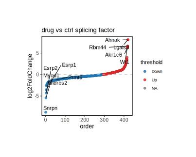

## Figure5D and Supplementary Figure5B
```r
SE_JC <- fread("./rMATS_mDrug_vs_mSCLC_v1/SE.MATS.JC.txt")
SE_JC <- as.data.frame(SE_JC)
head(SE_JC)
SE_JC$AS_Type <- "SE"
SE_JC <- SE_JC[,c("PValue","FDR","IncLevel1","IncLevel2","IncLevelDifference","AS_Type")]
RI_JC <- fread("./rMATS_mDrug_vs_mSCLC_v1/RI.MATS.JC.txt")
RI_JC <- as.data.frame(RI_JC)
head(RI_JC)
RI_JC$AS_Type <- "RI"
RI_JC <- RI_JC[,c("PValue","FDR","IncLevel1","IncLevel2","IncLevelDifference","AS_Type")]
MXE_JC <- fread("./rMATS_mDrug_vs_mSCLC_v1/MXE.MATS.JC.txt")
MXE_JC <- as.data.frame(MXE_JC)
head(MXE_JC)
MXE_JC$AS_Type <- "MXE"
MXE_JC <- MXE_JC[,c("PValue","FDR","IncLevel1","IncLevel2","IncLevelDifference","AS_Type")]
A3SS_JC <- fread("./rMATS_mDrug_vs_mSCLC_v1/A3SS.MATS.JC.txt")
A3SS_JC <- as.data.frame(A3SS_JC)
head(A3SS_JC)
A3SS_JC$AS_Type <- "A3SS"
A3SS_JC <- A3SS_JC[,c("PValue","FDR","IncLevel1","IncLevel2","IncLevelDifference","AS_Type")]
A5SS_JC <- fread("./rMATS_mDrug_vs_mSCLC_v1/A5SS.MATS.JC.txt")
A5SS_JC <- as.data.frame(A5SS_JC)
head(A5SS_JC)
A5SS_JC$AS_Type <- "A5SS"
A5SS_JC <- A5SS_JC[,c("PValue","FDR","IncLevel1","IncLevel2","IncLevelDifference","AS_Type")]
data <- rbind(SE_JC,RI_JC,MXE_JC,A3SS_JC,A5SS_JC)
DRUG_splicing_events <- data[data$IncLevelDifference<0&data$PValue<0.05,]
DMSO_splicing_events <- data[data$IncLevelDifference>0&data$PValue<0.05,]
DRUG_splicing_events1 <- data.frame(table(DRUG_splicing_events$AS_Type))
DMSO_splicing_events1 <- data.frame(table(DMSO_splicing_events$AS_Type))
DRUG_splicing_events1$Var2 <- "DRUG"
DMSO_splicing_events1$Var2 <- "DMSO"
data_long <- rbind(DRUG_splicing_events1,DMSO_splicing_events1)
library(ggplot2)
library(tidyr)  
data_long$Var2 <- factor(data_long$Var2,levels=c("DMSO","DRUG"))
p <- ggplot(data_long, aes(x = Var2, y = Freq, fill = Var2)) +
  geom_bar(stat = "identity", position = "dodge") +
  facet_wrap(~ Var1, scales = "free_y",ncol=5) +  # 为每个变量绘制单独的面板，并且每个面板的Y轴是独立的
  labs(title = "", x = "", y = "Splicing Events") +
  scale_fill_manual(values = c("DRUG"="#b20000","DMSO"="#2873B3"))+
  theme_bw() 
p
```
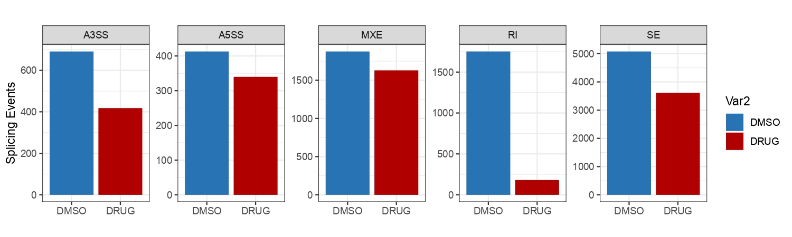

## Figure5E
```r

library(data.table)
library(trqwe)
library(data.table)
library(trqwe)

SCLC_SE <- read.table("./mmu_SE_drug_vs_sclc/mmu_SE_drug_vs_sclc_sclc_SE_NetMHCpan_clean.txt",header=FALSE)
SCLC_SE_UP <- read.table("./mmu_SE_drug_vs_sclc/mmu_SE_drug_vs_sclc_sclc_SE_UP_NetMHCpan_clean.txt",header=FALSE)
SCLC_SE_DN <- read.table("./mmu_SE_drug_vs_sclc/mmu_SE_drug_vs_sclc_sclc_SE_DN_NetMHCpan_clean.txt",header=FALSE)
DRUG_SE <- read.table("./mmu_SE_drug_vs_sclc/mmu_SE_drug_vs_sclc_drug_SE_NetMHCpan_clean.txt",header=FALSE)
DRUG_SE_UP <- read.table("./mmu_SE_drug_vs_sclc/mmu_SE_drug_vs_sclc_drug_SE_UP_NetMHCpan_clean.txt",header=FALSE)
DRUG_SE_DN <- read.table("./mmu_SE_drug_vs_sclc/mmu_SE_drug_vs_sclc_drug_SE_DN_NetMHCpan_clean.txt",header=FALSE)
colnames(SCLC_SE) <- c("Pos", "MHC", "Peptide", "Core", "Gp", "Gl", "Ip", "Il", "Icore", "Identity", "Score_EL", "%Rank_EL", "BindLevel")
colnames(SCLC_SE_UP) <- c("Pos", "MHC", "Peptide", "Core", "Gp", "Gl", "Ip", "Il", "Icore", "Identity", "Score_EL", "%Rank_EL", "BindLevel")
colnames(SCLC_SE_DN) <- c("Pos", "MHC", "Peptide", "Core", "Gp", "Gl", "Ip", "Il", "Icore", "Identity", "Score_EL", "%Rank_EL", "BindLevel")
colnames(DRUG_SE) <- c("Pos", "MHC", "Peptide", "Core", "Gp", "Gl", "Ip", "Il", "Icore", "Identity", "Score_EL", "%Rank_EL", "BindLevel")
colnames(DRUG_SE_UP) <- c("Pos", "MHC", "Peptide", "Core", "Gp", "Gl", "Ip", "Il", "Icore", "Identity", "Score_EL", "%Rank_EL", "BindLevel")
colnames(DRUG_SE_DN) <- c("Pos", "MHC", "Peptide", "Core", "Gp", "Gl", "Ip", "Il", "Icore", "Identity", "Score_EL", "%Rank_EL", "BindLevel")
SE_JC_SCLC <- read.table("./mmu_SE_drug_vs_sclc/mmu_SE_drug_sclc_sclc.txt",header=TRUE,sep="\t")
SE_JC_DRUG <- read.table("./mmu_SE_drug_vs_sclc/mmu_SE_drug_sclc_drug.txt",header=TRUE,sep="\t")
mmu_drug_se_peptide_results2 <- mcreadRDS("./mmu_SE_drug_vs_sclc/mmu_drug_se_peptide_results2.rds",mc.cores=20)
mmu_sclc_se_peptide_results2 <- mcreadRDS("./mmu_SE_drug_vs_sclc/mmu_sclc_se_peptide_results2.rds",mc.cores=20)
mmu_drug_se_peptide_results2$New_ID <- paste("SE",mmu_drug_se_peptide_results2$order,sep="_")
mmu_sclc_se_peptide_results2$New_ID <- paste("SE",mmu_sclc_se_peptide_results2$order,sep="_")
mmu_drug_se_peptide_results2$Nrow_ID <- paste("SE",1:nrow(mmu_drug_se_peptide_results2),sep="_")
mmu_sclc_se_peptide_results2$Nrow_ID <- paste("SE",1:nrow(mmu_sclc_se_peptide_results2),sep="_")
SE_JC_SCLC$New_ID <- paste("SE",1:nrow(SE_JC_SCLC),sep="_")
SE_JC_DRUG$New_ID <- paste("SE",1:nrow(SE_JC_DRUG),sep="_")
SE_JC_SCLC1 <- merge(mmu_sclc_se_peptide_results2,SE_JC_SCLC,by="New_ID",all.x=TRUE)
SE_JC_DRUG1 <- merge(mmu_drug_se_peptide_results2,SE_JC_DRUG,by="New_ID",all.x=TRUE)

##########H2Ld
SCLC_SE1 <- SCLC_SE[SCLC_SE$MHC%in%c("H-2-Ld"),]
SCLC_SE_UP1 <- SCLC_SE_UP[SCLC_SE_UP$MHC%in%c("H-2-Ld"),]
SCLC_SE_DN1 <- SCLC_SE_DN[SCLC_SE_DN$MHC%in%c("H-2-Ld"),]

DRUG_SE1 <- DRUG_SE[DRUG_SE$MHC%in%c("H-2-Ld"),]
DRUG_SE_UP1 <- DRUG_SE_UP[DRUG_SE_UP$MHC%in%c("H-2-Ld"),]
DRUG_SE_DN1 <- DRUG_SE_DN[DRUG_SE_DN$MHC%in%c("H-2-Ld"),]

SCLC_SE2 <- aggregate(SCLC_SE1$BindLevel, by = list(type = SCLC_SE1$Score_EL), FUN = min)
SCLC_SE_UP2 <- aggregate(SCLC_SE_UP1$BindLevel, by = list(type = SCLC_SE_UP1$Score_EL), FUN = min)
SCLC_SE_DN2 <- aggregate(SCLC_SE_DN1$BindLevel, by = list(type = SCLC_SE_DN1$Score_EL), FUN = min)
DRUG_SE2 <- aggregate(DRUG_SE1$BindLevel, by = list(type = DRUG_SE1$Score_EL), FUN = min)
DRUG_SE_UP2 <- aggregate(DRUG_SE_UP1$BindLevel, by = list(type = DRUG_SE_UP1$Score_EL), FUN = min)
DRUG_SE_DN2 <- aggregate(DRUG_SE_DN1$BindLevel, by = list(type = DRUG_SE_DN1$Score_EL), FUN = min)

colnames(SCLC_SE2) <- c("Nrow_ID","SCLC_SE_score")
colnames(SCLC_SE_UP2) <- c("Nrow_ID","SCLC_SE_UP_score")
colnames(SCLC_SE_DN2) <- c("Nrow_ID","SCLC_SE_DN_score")
colnames(DRUG_SE2) <- c("Nrow_ID","DRUG_SE_score")
colnames(DRUG_SE_UP2) <- c("Nrow_ID","DRUG_SE_UP_score")
colnames(DRUG_SE_DN2) <- c("Nrow_ID","DRUG_SE_DN_score")

#合并SCLC
mmu_DRUG_SE_m_UP <- merge(DRUG_SE2,DRUG_SE_UP2,by="Nrow_ID")
mmu_DRUG_SE_m_UP_m_DN <- merge(mmu_DRUG_SE_m_UP,DRUG_SE_DN2,by="Nrow_ID")
mmu_DRUG_ALL_Affinity <- merge(mmu_DRUG_SE_m_UP_m_DN,SE_JC_DRUG1,by="Nrow_ID",all.x=TRUE)
mmu_SCLC_SE_m_UP <- merge(SCLC_SE2,SCLC_SE_UP2,by="Nrow_ID")
mmu_SCLC_SE_m_UP_m_DN <- merge(mmu_SCLC_SE_m_UP,SCLC_SE_DN2,by="Nrow_ID")
mmu_SCLC_ALL_Affinity <- merge(mmu_SCLC_SE_m_UP_m_DN,SE_JC_SCLC1,by="Nrow_ID",all.x=TRUE)


dim(mmu_SCLC_ALL_Affinity)
dim(mmu_DRUG_ALL_Affinity)
mmu_SCLC_ALL_Affinity1 <- mmu_SCLC_ALL_Affinity[mmu_SCLC_ALL_Affinity$PValue<=0.05,]
mmu_DRUG_ALL_Affinity1 <- mmu_DRUG_ALL_Affinity[mmu_DRUG_ALL_Affinity$PValue<=0.05,]

DRUG_SE3 <- mmu_DRUG_ALL_Affinity1[,c("Nrow_ID","DRUG_SE_score")]
SCLC_SE3 <- mmu_SCLC_ALL_Affinity1[,c("Nrow_ID","SCLC_SE_score")]
DRUG_SE3$Group <- "DRUG"
SCLC_SE3$Group <- "Ctrl"
colnames(DRUG_SE3) <- c("Nrow_ID","SE_score","Group")
colnames(SCLC_SE3) <- c("Nrow_ID","SE_score","Group")
SE_mmu_merge1 <- rbind(DRUG_SE3,SCLC_SE3) 
library(ggplot2)
library(ggpubr)
p1 <- ggplot(SE_mmu_merge1, aes(x = -log10(SE_score), fill = Group)) +
  geom_density(alpha=0.4) +
  scale_fill_brewer(palette="Dark2")+
  geom_vline(aes(xintercept=-log10(0.5),col="red"))+
  theme_bw() +
  labs(title = "Density Plot of SE BindLevel by mmu Cohort",
       x = "Affinity with H-2-Ld", y = "Density")
```
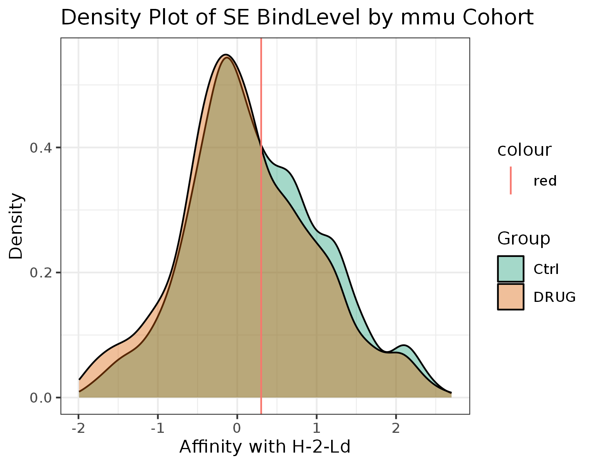

```r
####箱型图
library(ggthemes)
library(ggplot2)
library(tibble)
library(ggpubr)
SE_mmu_merge1$Group <- factor(SE_mmu_merge1$Group,levels=c("Ctrl","DRUG"))
SE_mmu_merge1$SE_score1 <- -log10(SE_mmu_merge1$SE_score)
e <- ggplot(SE_mmu_merge1, aes(x = Group, y = SE_score1))
p2 <- e + geom_boxplot(aes(fill = Group)) + 
  xlab("")+ylab("Affinity with H-2-Ld")+
  stat_compare_means(comparisons = list(c("Ctrl","DRUG")),method = "wilcox.test",paired = F)+
  theme_bw() + theme(panel.grid=element_blank())+
  scale_fill_manual(values = c("#00AFBB", "#FC4E07"))+
  theme(axis.text.x = element_text(angle = 25, hjust = 1))
p3 <- p2 +  stat_summary(fun=median, geom="line", aes(group=1), 
                 color = "#000000", linewidth = 0.8)+ 
  stat_summary(fun=median, geom="point",color = "red")
p3
```
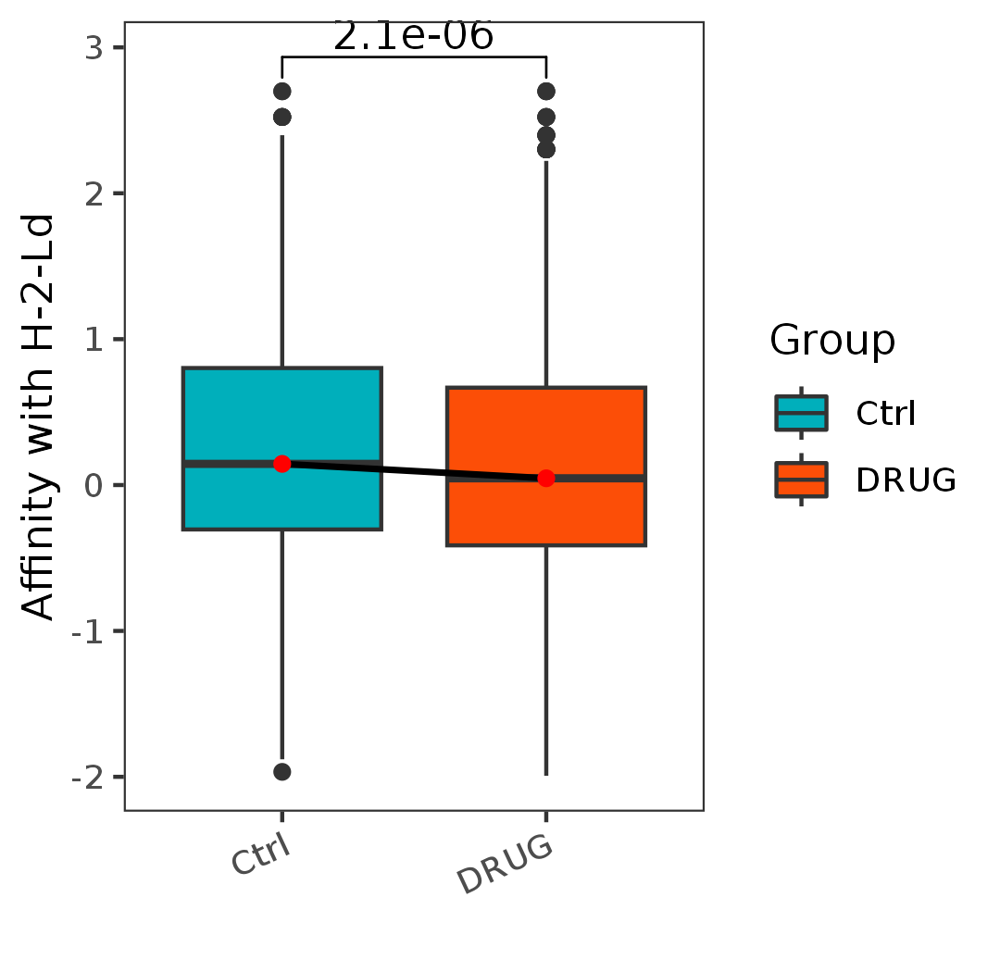

```r
#####Strong Binding
data_long2 <- SE_mmu_merge1
data_long2$Group4 <- "No Binding"
data_long2[which(data_long2$SE_score<2),"Group4"] <- "MHC-I Binding"
data_long2$Group4 <- factor(data_long2$Group4,levels=c("No Binding","MHC-I Binding"))
data_long2$Group <- factor(data_long2$Group,levels=c("Ctrl","DRUG"))
dat <- data.frame(table(data_long2$Group,data_long2$Group4))
dat1 <- dat
total_DRUG <- sum(dat1$Freq[dat1$Var1 == "DRUG"])
total_sclc <- sum(dat1$Freq[dat1$Var1 == "Ctrl"])
dat1$Relative_Abundance <- ifelse(dat1$Var1 == "DRUG", dat1$Freq / total_DRUG, dat1$Freq / total_sclc)
dat1$Total <- ifelse(dat1$Var1 == "DRUG",  total_DRUG, total_sclc)
dat1$Var2 <- factor(dat1$Var2,levels=c("No Binding","MHC-I Binding"))
dat1$Var1 <- factor(dat1$Var1,levels=c("Ctrl","DRUG"))
p4 <- ggplot(dat1, aes(x = Var1, y = Relative_Abundance, fill = Var1)) +
  geom_bar(stat = "identity", position = "dodge") +
  labs(title = "", x = "", y = "Ratio of SE") +
  scale_fill_manual(values = c("Ctrl"="#003399","DRUG"="#990000")) +
  facet_wrap(~Var2, scales = "free_y")+ 
  theme_bw()  +#
  theme(axis.text.x = element_blank())
library(cowplot) 
```
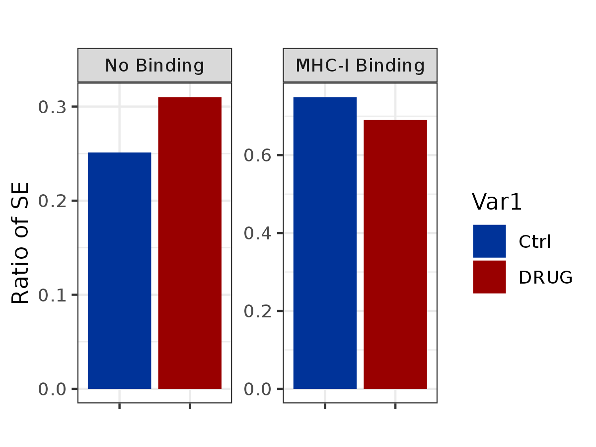

## Supplementary Figure5C

```r
################H-2-Kb
################H-2-Kb
################H-2-Kb
SCLC_SE1 <- SCLC_SE[SCLC_SE$MHC%in%c("H-2-Kb"),]
SCLC_SE_UP1 <- SCLC_SE_UP[SCLC_SE_UP$MHC%in%c("H-2-Kb"),]
SCLC_SE_DN1 <- SCLC_SE_DN[SCLC_SE_DN$MHC%in%c("H-2-Kb"),]
DRUG_SE1 <- DRUG_SE[DRUG_SE$MHC%in%c("H-2-Kb"),]
DRUG_SE_UP1 <- DRUG_SE_UP[DRUG_SE_UP$MHC%in%c("H-2-Kb"),]
DRUG_SE_DN1 <- DRUG_SE_DN[DRUG_SE_DN$MHC%in%c("H-2-Kb"),]

SCLC_SE2 <- aggregate(SCLC_SE1$BindLevel, by = list(type = SCLC_SE1$Score_EL), FUN = min)
SCLC_SE_UP2 <- aggregate(SCLC_SE_UP1$BindLevel, by = list(type = SCLC_SE_UP1$Score_EL), FUN = min)
SCLC_SE_DN2 <- aggregate(SCLC_SE_DN1$BindLevel, by = list(type = SCLC_SE_DN1$Score_EL), FUN = min)

DRUG_SE2 <- aggregate(DRUG_SE1$BindLevel, by = list(type = DRUG_SE1$Score_EL), FUN = min)
DRUG_SE_UP2 <- aggregate(DRUG_SE_UP1$BindLevel, by = list(type = DRUG_SE_UP1$Score_EL), FUN = min)
DRUG_SE_DN2 <- aggregate(DRUG_SE_DN1$BindLevel, by = list(type = DRUG_SE_DN1$Score_EL), FUN = min)

colnames(SCLC_SE2) <- c("Nrow_ID","SCLC_SE_score")
colnames(SCLC_SE_UP2) <- c("Nrow_ID","SCLC_SE_UP_score")
colnames(SCLC_SE_DN2) <- c("Nrow_ID","SCLC_SE_DN_score")
colnames(DRUG_SE2) <- c("Nrow_ID","DRUG_SE_score")
colnames(DRUG_SE_UP2) <- c("Nrow_ID","DRUG_SE_UP_score")
colnames(DRUG_SE_DN2) <- c("Nrow_ID","DRUG_SE_DN_score")

#合并SCLC
mmu_DRUG_SE_m_UP <- merge(DRUG_SE2,DRUG_SE_UP2,by="Nrow_ID")
mmu_DRUG_SE_m_UP_m_DN <- merge(mmu_DRUG_SE_m_UP,DRUG_SE_DN2,by="Nrow_ID")
mmu_DRUG_ALL_Affinity <- merge(mmu_DRUG_SE_m_UP_m_DN,SE_JC_DRUG1,by="Nrow_ID",all.x=TRUE)
mmu_SCLC_SE_m_UP <- merge(SCLC_SE2,SCLC_SE_UP2,by="Nrow_ID")
mmu_SCLC_SE_m_UP_m_DN <- merge(mmu_SCLC_SE_m_UP,SCLC_SE_DN2,by="Nrow_ID")
mmu_SCLC_ALL_Affinity <- merge(mmu_SCLC_SE_m_UP_m_DN,SE_JC_SCLC1,by="Nrow_ID",all.x=TRUE)


dim(mmu_SCLC_ALL_Affinity)
dim(mmu_DRUG_ALL_Affinity)
######先整体比较
mmu_SCLC_ALL_Affinity1 <- mmu_SCLC_ALL_Affinity[mmu_SCLC_ALL_Affinity$PValue<=0.05,]
mmu_DRUG_ALL_Affinity1 <- mmu_DRUG_ALL_Affinity[mmu_DRUG_ALL_Affinity$PValue<=0.05,]
DRUG_SE3 <- mmu_DRUG_ALL_Affinity1[,c("Nrow_ID","DRUG_SE_score")]
SCLC_SE3 <- mmu_SCLC_ALL_Affinity1[,c("Nrow_ID","SCLC_SE_score")]
DRUG_SE3$Group <- "DRUG"
SCLC_SE3$Group <- "Ctrl"
colnames(DRUG_SE3) <- c("Nrow_ID","SE_score","Group")
colnames(SCLC_SE3) <- c("Nrow_ID","SE_score","Group")
SE_mmu_merge1 <- rbind(DRUG_SE3,SCLC_SE3) 

library(ggplot2)
library(ggpubr)
p1 <- ggplot(SE_mmu_merge1, aes(x = -log10(SE_score), fill = Group)) +
  geom_density(alpha=0.4) +
  scale_fill_brewer(palette="Dark2")+
  geom_vline(aes(xintercept=-log10(0.5),col="red"))+
  theme_bw() +
  labs(title = "Density Plot of SE BindLevel by mmu Cohort",
       x = "Affinity with H-2-Kb", y = "Density")
ggsave(p1,file="Supplementary Figure.5-1-density-DRUG-SCLC-SE-P005.png",height=4,width=5.1)
```


```r
####箱型图
library(ggthemes)
library(ggplot2)
library(tibble)
library(ggpubr)
SE_mmu_merge1$Group <- factor(SE_mmu_merge1$Group,levels=c("Ctrl","DRUG"))
SE_mmu_merge1$SE_score1 <- -log10(SE_mmu_merge1$SE_score)
e <- ggplot(SE_mmu_merge1, aes(x = Group, y = SE_score1))
p1 <- e + geom_boxplot(aes(fill = Group)) + 
  xlab("")+ylab("Affinity with H-2-Kb")+
  stat_compare_means(comparisons = list(c("Ctrl","DRUG")),method = "wilcox.test",paired = F)+
  theme_bw() + theme(panel.grid=element_blank())+
  scale_fill_manual(values = c("#00AFBB", "#FC4E07"))+
  theme(axis.text.x = element_text(angle = 25, hjust = 1))
p2 <- p1 +  stat_summary(fun=median, geom="line", aes(group=1), 
                 color = "#000000", linewidth = 0.8)+ 
  stat_summary(fun=median, geom="point",color = "red")
p2
ggsave(p2,file="Supplementary Figure.5-2-boxplot-DRUG-SCLC-SE-P005.png",height=3.5,width=3.6)
```


```r
#####Strong Binding
data_long2 <- SE_mmu_merge1
data_long2$Group4 <- "No Binding"
data_long2[which(data_long2$SE_score<2),"Group4"] <- "Weak Binding"
data_long2$Group4 <- factor(data_long2$Group4,levels=c("No Binding","Weak Binding"))
data_long2$Group <- factor(data_long2$Group,levels=c("Ctrl","DRUG"))
dat <- data.frame(table(data_long2$Group,data_long2$Group4))
dat1 <- dat
total_DRUG <- sum(dat1$Freq[dat1$Var1 == "DRUG"])
total_sclc <- sum(dat1$Freq[dat1$Var1 == "Ctrl"])
dat1$Relative_Abundance <- ifelse(dat1$Var1 == "DRUG", dat1$Freq / total_DRUG, dat1$Freq / total_sclc)
dat1$Total <- ifelse(dat1$Var1 == "DRUG",  total_DRUG, total_sclc)
dat1$Var2 <- factor(dat1$Var2,levels=c("No Binding","Weak Binding"))
dat1$Var1 <- factor(dat1$Var1,levels=c("Ctrl","DRUG"))
p2 <- ggplot(dat1, aes(x = Var1, y = Relative_Abundance, fill = Var1)) +
  geom_bar(stat = "identity", position = "dodge") +
  labs(title = "", x = "", y = "Ratio of SE") +
  scale_fill_manual(values = c("Ctrl"="#003399","DRUG"="#990000")) +
  facet_wrap(~Var2, scales = "free_y")+ 
  theme_bw()  +#
  theme(axis.text.x = element_blank())

ggsave(p2,file="Supplementary Figure.5-3-bar-DRUG-SCLC-SE-strongbing-P005.png",height=3,width=4)
```


## Figure5G
```r

/usr/local/R4.2/bin/R
library(data.table)
library(trqwe)

MXE_mmu_1st <- read.table("./mmu_MXE_drug_vs_sclc/mmu_MXE_drug_sclc_1st_NetMHCpan_clean.txt",header=FALSE)
MXE_mmu_2nd <- read.table("./mmu_MXE_drug_vs_sclc/mmu_MXE_drug_sclc_2nd_NetMHCpan_clean.txt",header=FALSE)
colnames(MXE_mmu_1st) <- c("Pos", "MHC", "Peptide", "Core", "Gp", "Gl", "Ip", "Il", "Icore", "Identity", "Score_EL", "%Rank_EL", "BindLevel")
colnames(MXE_mmu_2nd) <- c("Pos", "MHC", "Peptide", "Core", "Gp", "Gl", "Ip", "Il", "Icore", "Identity", "Score_EL", "%Rank_EL", "BindLevel")
mmu_MXE_all1 <- mcreadRDS("./mmu_MXE_drug_vs_sclc/mmu_MXE_all1.rds",mc.cores=20)
mmu_sclc_MXE_peptide_results2 <- mcreadRDS("./mmu_MXE_drug_vs_sclc/mmu_sclc_MXE_peptide_results2_GRCM39.rds",mc.cores=20)

mmu_sclc_MXE_peptide_results2$New_ID <- paste("SE",mmu_sclc_MXE_peptide_results2$order,sep="_")
mmu_sclc_MXE_peptide_results2$Nrow_ID <- paste("SE",1:nrow(mmu_sclc_MXE_peptide_results2),sep="_")
mmu_MXE_all1$New_ID <- paste("SE",1:nrow(mmu_MXE_all1),sep="_")
mmu_sclc_MXE_peptide_results2 <- subset(mmu_sclc_MXE_peptide_results2,select=c(New_ID,Nrow_ID))
mmu_sclc_MXE_peptide_results2 <- data.frame(mmu_sclc_MXE_peptide_results2)
mmu_MXE_all1 <- subset(mmu_MXE_all1,select=-c(ID))
mmu_MXE_all_info <- merge(mmu_sclc_MXE_peptide_results2,mmu_MXE_all1,by.x="New_ID",by.y="New_ID",all.x=TRUE)
##############H2Ld
MXE_mmu_1st1 <- MXE_mmu_1st[MXE_mmu_1st$MHC%in%c("H-2-Ld"),]
MXE_mmu_2nd1 <- MXE_mmu_2nd[MXE_mmu_2nd$MHC%in%c("H-2-Ld"),]
MXE_mmu_1st2 <- aggregate(MXE_mmu_1st1$BindLevel, by = list(type = MXE_mmu_1st1$Score_EL), FUN = min)
MXE_mmu_2nd2 <- aggregate(MXE_mmu_2nd1$BindLevel, by = list(type = MXE_mmu_2nd1$Score_EL), FUN = min)
colnames(MXE_mmu_1st2) <- c("ID","MXE_mmu_1st")
colnames(MXE_mmu_2nd2) <- c("ID","MXE_mmu_2nd")

mm_MXE_all_score <- merge(MXE_mmu_1st2,MXE_mmu_2nd2,by="ID")
library(ggplot2)
library(tidyr)
mm_MXE_all_score_long <- pivot_longer(mm_MXE_all_score, cols = starts_with("MXE_mmu"), 
                          names_to = "Group", 
                          values_to = "value")


mm_MXE_merge <- merge(mm_MXE_all_score_long,mmu_MXE_all_info,by.x="ID",by.y="Nrow_ID",all.x=TRUE)
mm_MXE_merge$Group1 <- "SCLC"
mm_MXE_merge[which(mm_MXE_merge$IncLevelDifference<0),"Group1"] <- "DRUG"
mm_MXE_merge$Group_skip <- "skip_2nd"
mm_MXE_merge[which(mm_MXE_merge$strand=="-"),"Group_skip"] <- "skip_1st"

mm_MXE_merge$Group2 <- ifelse((mm_MXE_merge$Group_skip=="skip_2nd")&(mm_MXE_merge$Group=="MXE_mmu_2nd"), "skip_exon",
ifelse((mm_MXE_merge$Group_skip=="skip_1st")&(mm_MXE_merge$Group=="MXE_mmu_1st"), "skip_exon", "retain_exon"))

mm_MXE_merge1 <- mm_MXE_merge[mm_MXE_merge$FDR<=0.05,]
mm_MXE_merge_use <- subset(mm_MXE_merge1,select=c( ID,Group,Group1,Group2,value,Group_skip))
mm_MXE_merge_use$Group3 <- paste(mm_MXE_merge_use$Group1,mm_MXE_merge_use$Group2,sep="_")
mm_MXE_merge_use <- mm_MXE_merge_use[mm_MXE_merge_use$Group3%in%c("SCLC_retain_exon","SCLC_skip_exon","DRUG_skip_exon","DRUG_retain_exon"),]
mm_MXE_merge_use$Group3 <- factor(mm_MXE_merge_use$Group3,levels=c("SCLC_retain_exon","SCLC_skip_exon","DRUG_skip_exon","DRUG_retain_exon"))
library(ggpubr)
mm_MXE_merge_use$value1 <- -log10(mm_MXE_merge_use$value)
```
```r
###Ctrl
mxe_SCLC_mmu_merge1 <- mm_MXE_merge_use[mm_MXE_merge_use$Group3%in%c("SCLC_retain_exon","SCLC_skip_exon"),]
library(ggplot2)
library(ggpubr)
p1 <- ggplot(mxe_SCLC_mmu_merge1, aes(x = value1, fill = Group3)) +
  geom_density(alpha=0.4) +
  scale_fill_brewer(palette="Dark2")+
  geom_vline(aes(xintercept=-log10(0.5),col="red"))+
  theme_bw() +
  labs(title = "Density Plot of MXE BindLevel by mmu Cohort",
       x = "Affinity with H-2-Ld", y = "Density")
ggsave(p1,file="Figure5G-1-density-DRUG_SCLC-MXE-FDR005-SCLC.png",height=4,width=6)
library(ggthemes)
library(ggplot2)
library(tibble)
library(ggpubr)
mxe_SCLC_mmu_merge1$Group3 <- factor(mxe_SCLC_mmu_merge1$Group3,levels=c("SCLC_retain_exon","SCLC_skip_exon"))
e <- ggplot(mxe_SCLC_mmu_merge1, aes(x = Group3, y = value1))
p1 <- e + geom_boxplot(aes(fill = Group3)) + 
  xlab("")+ylab("Affinity with H-2-Ld")+
  stat_compare_means(comparisons = list(c("SCLC_retain_exon","SCLC_skip_exon")),method = "wilcox.test",paired = F)+
  theme_bw() + theme(panel.grid=element_blank())+
  scale_fill_manual(values = c("#00AFBB", "#FC4E07"))+
  theme(axis.text.x = element_text(angle = 25, hjust = 1))
p2 <- p1 +  stat_summary(fun=median, geom="line", aes(group=1), 
                 color = "#000000", linewidth = 0.8)+ 
  stat_summary(fun=median, geom="point",color = "red")
p2
ggsave(p2,file="Figure5G-2-boxplot-DRUG_SCLC-MXE-INC01FDR005-SCLC.png",height=3.5,width=4)

data_long2 <- mxe_SCLC_mmu_merge1
data_long2$Group4 <- "No Binding"
data_long2[which(data_long2$value<2),"Group4"] <- "MHC-I Binding"
data_long2$Group4 <- factor(data_long2$Group4,levels=c("No Binding","MHC-I Binding"))
data_long2$Group3 <- factor(data_long2$Group3,levels=c("SCLC_retain_exon","SCLC_skip_exon"))
dat <- data.frame(table(data_long2$Group3,data_long2$Group4))
dat1 <- dat
total_normal <- sum(dat1$Freq[dat1$Var1 == "SCLC_retain_exon"])
total_sclc <- sum(dat1$Freq[dat1$Var1 == "SCLC_skip_exon"])
dat1$Relative_Abundance <- ifelse(dat1$Var1 == "SCLC_retain_exon", dat1$Freq / total_normal, dat1$Freq / total_sclc)
dat1$Total <- ifelse(dat1$Var1 == "SCLC_skip_exon",  total_normal, total_sclc)
dat1$Var2 <- factor(dat1$Var2,levels=c("No Binding","MHC-I Binding","Strong Binding"))
dat1$Var1 <- factor(dat1$Var1,levels=c("SCLC_retain_exon","SCLC_skip_exon"))

p2 <- ggplot(dat1, aes(x = Var1, y = Relative_Abundance, fill = Var1)) +
  geom_bar(stat = "identity", position = "dodge") +
  labs(title = "", x = "", y = "Ratio of MXE") +
  scale_fill_manual(values = c("SCLC_skip_exon"="#990000","SCLC_retain_exon"="#003399")) +
  facet_wrap(~Var2, scales = "free_y")+ 
  theme_bw()  +#
  theme(axis.text.x = element_blank())
ggsave(p2,file="Figure5G-3-bar-DRUG_SCLC-MXE-strongbing-INC01FDR005-SCLC.png",height=3,width=6)
```
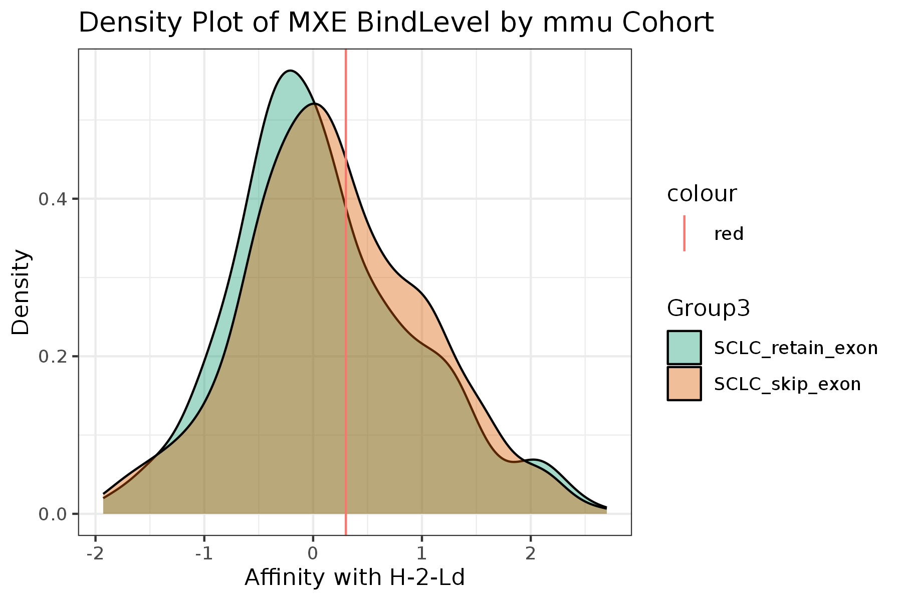
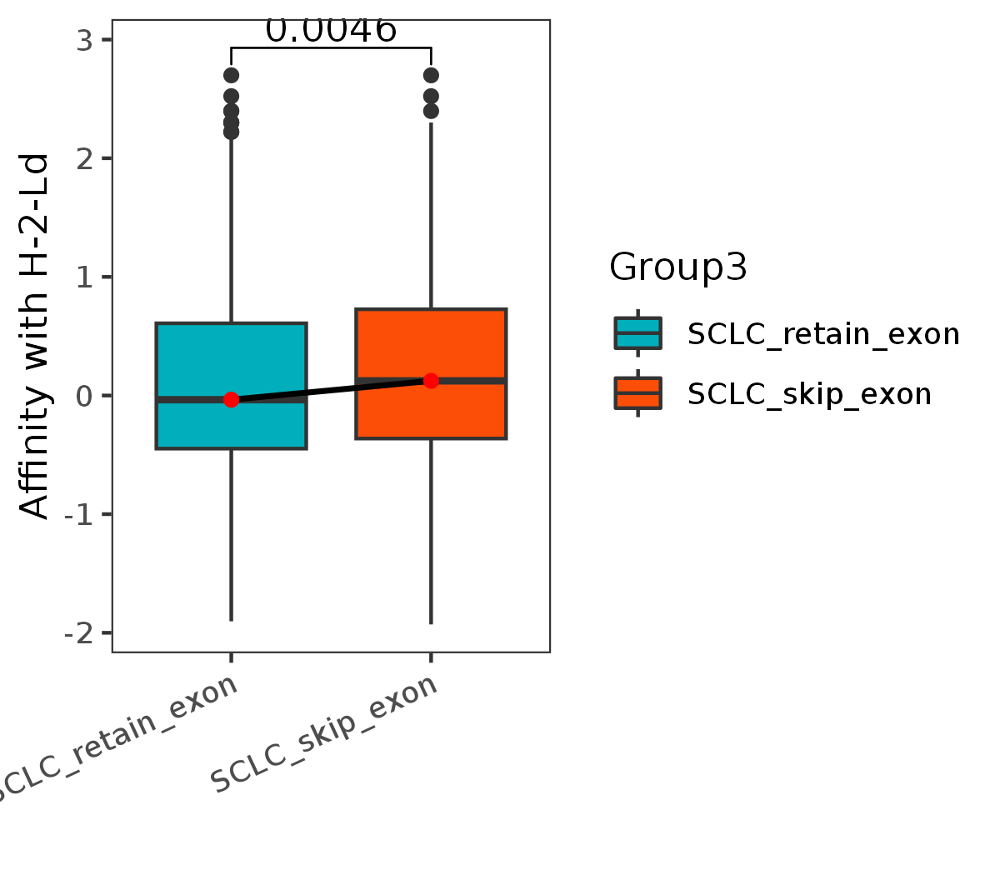
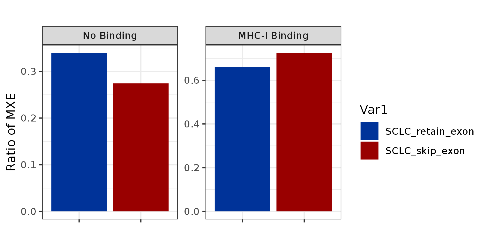

## Figure5H
```r
mxe_DRUG_mmu_merge1 <- mm_MXE_merge_use[mm_MXE_merge_use$Group3%in%c("DRUG_retain_exon","DRUG_skip_exon"),]
library(ggplot2)
library(ggpubr)
p1 <- ggplot(mxe_DRUG_mmu_merge1, aes(x = value1, fill = Group3)) +
  geom_density(alpha=0.4) +
  scale_fill_brewer(palette="Dark2")+
  geom_vline(aes(xintercept=-log10(0.5),col="red"))+
  theme_bw() +
  labs(title = "Density Plot of MXE BindLevel by mmu Cohort",
       x = "Affinity with H-2-Ld", y = "Density")
ggsave(p1,file="Figure5H-1-density-DRUG-SCLC-MXE-FDR005-DRUG.png",height=4,width=6)

####箱型图
library(ggthemes)
library(ggplot2)
library(tibble)
library(ggpubr)
mxe_DRUG_mmu_merge1$Group3 <- factor(mxe_DRUG_mmu_merge1$Group3,levels=c("DRUG_retain_exon","DRUG_skip_exon"))
e <- ggplot(mxe_DRUG_mmu_merge1, aes(x = Group3, y = value1))
p1 <- e + geom_boxplot(aes(fill = Group3)) + 
  xlab("")+ylab("Affinity with H-2-Ld")+
  stat_compare_means(comparisons = list(c("DRUG_retain_exon","DRUG_skip_exon")),method = "wilcox.test",paired = F)+
  theme_bw() + theme(panel.grid=element_blank())+
  scale_fill_manual(values = c("#00AFBB", "#FC4E07"))+
  theme(axis.text.x = element_text(angle = 25, hjust = 1))
p2 <- p1 +  stat_summary(fun=median, geom="line", aes(group=1), 
                 color = "#000000", linewidth = 0.8)+ 
  stat_summary(fun=median, geom="point",color = "red")
p2
ggsave(p2,file="Figure5H-2-boxplot-DRUG_SCLC-MXE-FDR005-DRUG.png",height=3.5,width=4)

data_long2 <- mxe_DRUG_mmu_merge1
data_long2$Group4 <- "No Binding"
data_long2[which(data_long2$value<2),"Group4"] <- "MHC-I Binding"
data_long2$Group4 <- factor(data_long2$Group4,levels=c("No Binding","MHC-I Binding"))

data_long2$Group3 <- factor(data_long2$Group3,levels=c("DRUG_retain_exon","DRUG_skip_exon"))

dat <- data.frame(table(data_long2$Group3,data_long2$Group4))
dat1 <- dat
total_normal <- sum(dat1$Freq[dat1$Var1 == "DRUG_retain_exon"])
total_sclc <- sum(dat1$Freq[dat1$Var1 == "DRUG_skip_exon"])
dat1$Relative_Abundance <- ifelse(dat1$Var1 == "DRUG_retain_exon", dat1$Freq / total_normal, dat1$Freq / total_sclc)
dat1$Total <- ifelse(dat1$Var1 == "DRUG_skip_exon",  total_normal, total_sclc)
dat1$Var2 <- factor(dat1$Var2,levels=c("No Binding","MHC-I Binding"))
dat1$Var1 <- factor(dat1$Var1,levels=c("DRUG_retain_exon","DRUG_skip_exon"))

p2 <- ggplot(dat1, aes(x = Var1, y = Relative_Abundance, fill = Var1)) +
  geom_bar(stat = "identity", position = "dodge") +
  labs(title = "", x = "", y = "Ratio of MXE") +
  scale_fill_manual(values = c("DRUG_skip_exon"="#990000","DRUG_retain_exon"="#003399")) +
  facet_wrap(~Var2, scales = "free_y")+ 
  theme_bw()  +#
  theme(axis.text.x = element_blank())
ggsave(p2,file="Figure5H-3-bar-DRUG_SCLC-MXE-strongbing-FDR005-DRUG.png",height=3,width=5.5)
```
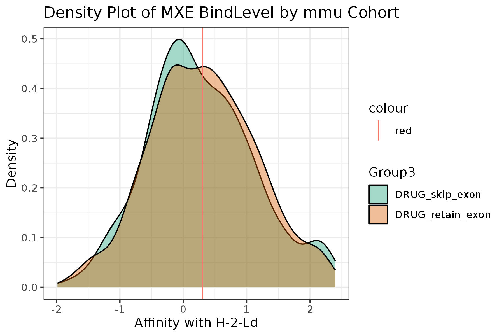
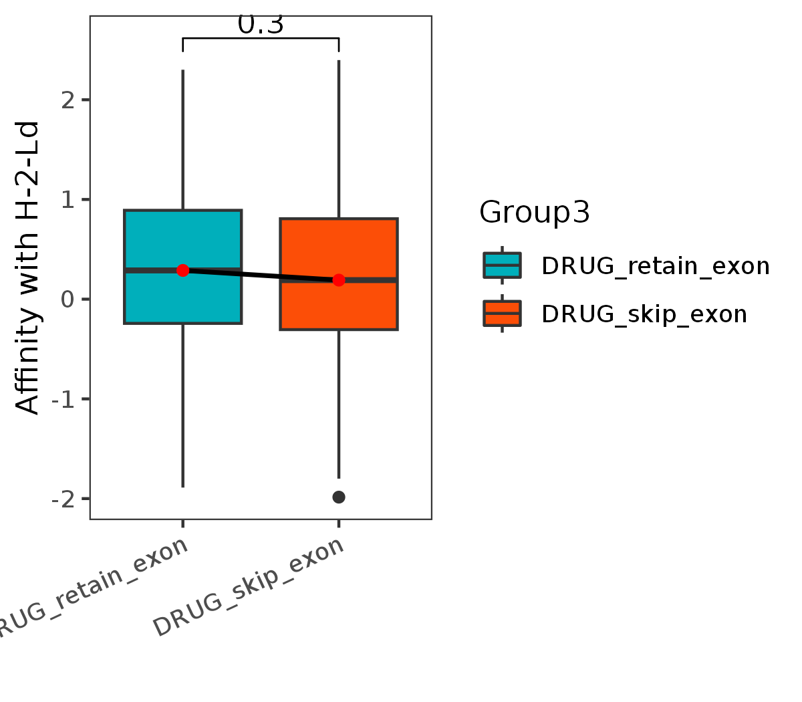
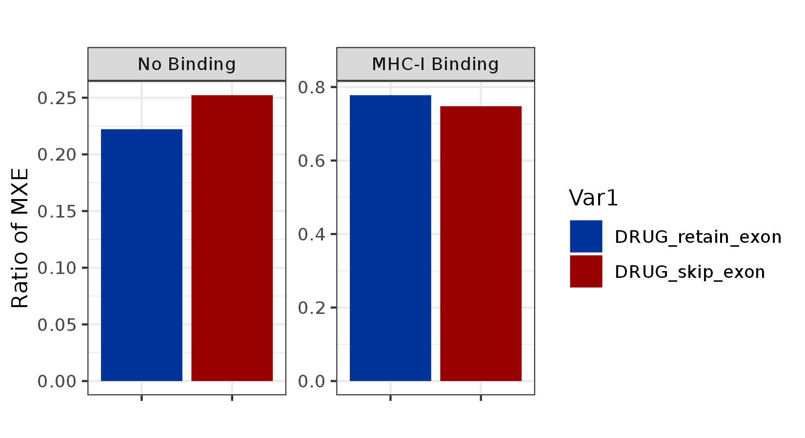

## Supplementary Figure5D
```r
##################SCLC
mxe_SCLC_mmu_merge1 <- mm_MXE_merge_use[mm_MXE_merge_use$Group3%in%c("SCLC_retain_exon","SCLC_skip_exon"),]
library(ggplot2)
library(ggpubr)
p1 <- ggplot(mxe_SCLC_mmu_merge1, aes(x = value1, fill = Group3)) +
  geom_density(alpha=0.4) +
  scale_fill_brewer(palette="Dark2")+
  geom_vline(aes(xintercept=-log10(0.5),col="red"))+
  theme_bw() +
  labs(title = "Density Plot of MXE BindLevel by mmu Cohort",
       x = "Affinity with H-2-Kb", y = "Density")
ggsave(p1,file="Supplementary Figure.5D-1-density-DRUG_SCLC-MXE-FDR005-SCLC.png",height=4,width=6)

library(ggthemes)
library(ggplot2)
library(tibble)
library(ggpubr)
mxe_SCLC_mmu_merge1$Group3 <- factor(mxe_SCLC_mmu_merge1$Group3,levels=c("SCLC_retain_exon","SCLC_skip_exon"))
e <- ggplot(mxe_SCLC_mmu_merge1, aes(x = Group3, y = value1))
p1 <- e + geom_boxplot(aes(fill = Group3)) + 
  xlab("")+ylab("Affinity with H-2-Kb")+
  stat_compare_means(comparisons = list(c("SCLC_retain_exon","SCLC_skip_exon")),method = "wilcox.test",paired = F)+
  theme_bw() + theme(panel.grid=element_blank())+
  scale_fill_manual(values = c("#00AFBB", "#FC4E07"))+
  theme(axis.text.x = element_text(angle = 25, hjust = 1))
p2 <- p1 +  stat_summary(fun=median, geom="line", aes(group=1), 
                 color = "#000000", linewidth = 0.8)+ 
  stat_summary(fun=median, geom="point",color = "red")
p2
ggsave(p2,file="Supplementary Figure.5D-2-boxplot-DRUG_SCLC-MXE-FDR005-SCLC.png",height=3.5,width=4)

#####Strong Binding
data_long2 <- mxe_SCLC_mmu_merge1
data_long2$Group4 <- "No Binding"
data_long2[which(data_long2$value<2),"Group4"] <- "MHC-I Binding"
data_long2$Group4 <- factor(data_long2$Group4,levels=c("No Binding","MHC-I Binding"))
data_long2$Group3 <- factor(data_long2$Group3,levels=c("SCLC_retain_exon","SCLC_skip_exon"))
dat <- data.frame(table(data_long2$Group3,data_long2$Group4))
dat1 <- dat
total_normal <- sum(dat1$Freq[dat1$Var1 == "SCLC_retain_exon"])
total_sclc <- sum(dat1$Freq[dat1$Var1 == "SCLC_skip_exon"])
dat1$Relative_Abundance <- ifelse(dat1$Var1 == "SCLC_retain_exon", dat1$Freq / total_normal, dat1$Freq / total_sclc)
dat1$Total <- ifelse(dat1$Var1 == "SCLC_skip_exon",  total_normal, total_sclc)
dat1$Var2 <- factor(dat1$Var2,levels=c("No Binding","MHC-I Binding"))
dat1$Var1 <- factor(dat1$Var1,levels=c("SCLC_retain_exon","SCLC_skip_exon"))

p2 <- ggplot(dat1, aes(x = Var1, y = Relative_Abundance, fill = Var1)) +
  geom_bar(stat = "identity", position = "dodge") +
  labs(title = "", x = "", y = "Ratio of MXE") +
  scale_fill_manual(values = c("SCLC_skip_exon"="#990000","SCLC_retain_exon"="#003399")) +
  facet_wrap(~Var2, scales = "free_y")+ 
  theme_bw()  +#
  theme(axis.text.x = element_blank())
ggsave(p2,file="Supplementary Figure.5D-3-bar-DRUG_SCLC-MXE-strongbing-FDR005-SCLC.png",height=5,width=6)
```


## Supplementary Figure5E
```r
MXE_mmu_1st1 <- MXE_mmu_1st[MXE_mmu_1st$MHC%in%c("H-2-Kb"),]
MXE_mmu_2nd1 <- MXE_mmu_2nd[MXE_mmu_2nd$MHC%in%c("H-2-Kb"),]
MXE_mmu_1st2 <- aggregate(MXE_mmu_1st1$BindLevel, by = list(type = MXE_mmu_1st1$Score_EL), FUN = min)
MXE_mmu_2nd2 <- aggregate(MXE_mmu_2nd1$BindLevel, by = list(type = MXE_mmu_2nd1$Score_EL), FUN = min)
colnames(MXE_mmu_1st2) <- c("ID","MXE_mmu_1st")
colnames(MXE_mmu_2nd2) <- c("ID","MXE_mmu_2nd")

mm_MXE_all_score <- merge(MXE_mmu_1st2,MXE_mmu_2nd2,by="ID")
library(ggplot2)
library(tidyr)
mm_MXE_all_score_long <- pivot_longer(mm_MXE_all_score, cols = starts_with("MXE_mmu"), 
                          names_to = "Group", 
                          values_to = "value")


mm_MXE_merge <- merge(mm_MXE_all_score_long,mmu_MXE_all_info,by.x="ID",by.y="Nrow_ID",all.x=TRUE)
mm_MXE_merge$Group1 <- "SCLC"
mm_MXE_merge[which(mm_MXE_merge$IncLevelDifference<0),"Group1"] <- "DRUG"
mm_MXE_merge$Group_skip <- "skip_2nd"
mm_MXE_merge[which(mm_MXE_merge$strand=="-"),"Group_skip"] <- "skip_1st"
mm_MXE_merge$Group2 <- ifelse((mm_MXE_merge$Group_skip=="skip_2nd")&(mm_MXE_merge$Group=="MXE_mmu_2nd"), "skip_exon",
ifelse((mm_MXE_merge$Group_skip=="skip_1st")&(mm_MXE_merge$Group=="MXE_mmu_1st"), "skip_exon", "retain_exon"))
mm_MXE_merge1 <- mm_MXE_merge[mm_MXE_merge$FDR<=0.05,]
mm_MXE_merge_use <- subset(mm_MXE_merge1,select=c( ID,Group,Group1,Group2,value,Group_skip))
mm_MXE_merge_use$Group3 <- paste(mm_MXE_merge_use$Group1,mm_MXE_merge_use$Group2,sep="_")
mm_MXE_merge_use <- mm_MXE_merge_use[mm_MXE_merge_use$Group3%in%c("SCLC_retain_exon","SCLC_skip_exon","DRUG_skip_exon","DRUG_retain_exon"),]
mm_MXE_merge_use$Group3 <- factor(mm_MXE_merge_use$Group3,levels=c("SCLC_retain_exon","SCLC_skip_exon","DRUG_skip_exon","DRUG_retain_exon"))
library(ggpubr)
mm_MXE_merge_use$value1 <- -log10(mm_MXE_merge_use$value)

####################DRUG
mxe_DRUG_mmu_merge1 <- mm_MXE_merge_use[mm_MXE_merge_use$Group3%in%c("DRUG_retain_exon","DRUG_skip_exon"),]
library(ggplot2)
library(ggpubr)
p1 <- ggplot(mxe_DRUG_mmu_merge1, aes(x = value1, fill = Group3)) +
  geom_density(alpha=0.4) +
  scale_fill_brewer(palette="Dark2")+
  geom_vline(aes(xintercept=-log10(0.5),col="red"))+
  theme_bw() +
  labs(title = "Density Plot of MXE BindLevel by mmu Cohort",
       x = "Affinity with H-2-Kb", y = "Density")
ggsave(p1,file="Supplementary Figure.5E-1-density-DRUG-SCLC-MXE-FDR005-DRUG.png",height=4,width=6)

####箱型图
library(ggthemes)
library(ggplot2)
library(tibble)
library(ggpubr)
mxe_DRUG_mmu_merge1$Group3 <- factor(mxe_DRUG_mmu_merge1$Group3,levels=c("DRUG_retain_exon","DRUG_skip_exon"))
e <- ggplot(mxe_DRUG_mmu_merge1, aes(x = Group3, y = value1))
p1 <- e + geom_boxplot(aes(fill = Group3)) + 
  xlab("")+ylab("Affinity with H-2-Kb")+
  stat_compare_means(comparisons = list(c("DRUG_retain_exon","DRUG_skip_exon")),method = "wilcox.test",paired = F)+
  theme_bw() + theme(panel.grid=element_blank())+
  scale_fill_manual(values = c("#00AFBB", "#FC4E07"))+
  theme(axis.text.x = element_text(angle = 25, hjust = 1))
p2 <- p1 +  stat_summary(fun=median, geom="line", aes(group=1), 
                 color = "#000000", linewidth = 0.8)+ 
  stat_summary(fun=median, geom="point",color = "red")
p2
ggsave(p2,file="Supplementary Figure.5E-2-boxplot-DRUG_SCLC-MXE-FDR005-DRUG.png",height=3.5,width=4)

#####Strong Binding
data_long2 <- mxe_DRUG_mmu_merge1
data_long2$Group4 <- "No Binding"
data_long2[which(data_long2$value<2),"Group4"] <- "MHC-I Binding"
data_long2$Group4 <- factor(data_long2$Group4,levels=c("No Binding","MHC-I Binding"))
data_long2$Group3 <- factor(data_long2$Group3,levels=c("DRUG_retain_exon","DRUG_skip_exon"))
dat <- data.frame(table(data_long2$Group3,data_long2$Group4))
dat1 <- dat
total_normal <- sum(dat1$Freq[dat1$Var1 == "DRUG_retain_exon"])
total_sclc <- sum(dat1$Freq[dat1$Var1 == "DRUG_skip_exon"])
dat1$Relative_Abundance <- ifelse(dat1$Var1 == "DRUG_retain_exon", dat1$Freq / total_normal, dat1$Freq / total_sclc)
dat1$Total <- ifelse(dat1$Var1 == "DRUG_skip_exon",  total_normal, total_sclc)
dat1$Var2 <- factor(dat1$Var2,levels=c("No Binding","MHC-I Binding"))
dat1$Var1 <- factor(dat1$Var1,levels=c("DRUG_retain_exon","DRUG_skip_exon"))

p2 <- ggplot(dat1, aes(x = Var1, y = Relative_Abundance, fill = Var1)) +
  geom_bar(stat = "identity", position = "dodge") +
  labs(title = "", x = "", y = "Ratio of MXE") +
  scale_fill_manual(values = c("DRUG_skip_exon"="#990000","DRUG_retain_exon"="#003399")) +
  facet_wrap(~Var2, scales = "free_y")+ 
  theme_bw()  +#
  theme(axis.text.x = element_blank())
ggsave(p2,file="Supplementary Figure.5E-3-bar-DRUG_SCLC-MXE-strongbing-FDR005-DRUG.png",height=3,width=5.5)
```


## Figure6F
veh：就是veh+PD1, prmt:就是Prmt 抑制剂+PD1

```r
/usr/local/R4.2/bin/R
library(CellChat)
library(patchwork)
library(Seurat)
library(ggplot2)
library(cowplot)
library(patchwork)
library(dplyr)
library(data.table)
library(future.apply)
library(trqwe)
scRNA_filter_merge2_harmony <- mcreadRDS("./scRNA_filter_merge.withWT.harmony.rds",mc.cores=20)

head(scRNA_filter_merge2_harmony)
library(randomcoloR)
palette <- randomColor(count = 60)  #随机生成60种颜色，其实里面有重复的
palette <- distinctColorPalette(9) #差异明显的60种
color_t <- distinctColorPalette(10) #差异明显的60种
library("scales")
Paired_reorder <- c("#E11E26","#A6CDE2","#74C476","#1E78B4","#34A047","#F59899","#FCBF6E","#B15928","#F47E1F","#6A3E98","#FAF39B","#CAB2D6")
show_col(color_t)
scRNA_filter_merge2_harmony$Cell_annotation <- factor(scRNA_filter_merge2_harmony$Cell_annotation,levels=c("SCLC","Smooth_Muscle","Fibro","Endo","Marco","Neutrophil","DC","T_cell","NK","B_cell"))

allcolour=c("#20B2AA","#FFA500","#9370DB","#98FB98","#1E90FF","#7CFC00","#FFFF00",
            "#808000","#FF00FF","#FA8072","#7B68EE","#9400D3","#800080","#A0522D","#D2B48C","#D2691E","#87CEEB","#40E0D0","#5F9EA0",
            "#FF1493","#0000CD","#008B8B","#FFE4B5","#8A2BE2","#228B22","#E9967A","#4682B4","#32CD32","#F0E68C","#FFFFE0","#EE82EE",
            "#FF6347","#6A5ACD","#9932CC","#8B008B","#8B4513","#DEB887")
p2 <- DimPlot(object = scRNA_filter_merge2_harmony, reduction = "openTSNE",repel=TRUE,label=FALSE,group.by="Cell_annotation",split.by="group",raster = FALSE,ncol=5,cols=c(Paired_reorder))
```
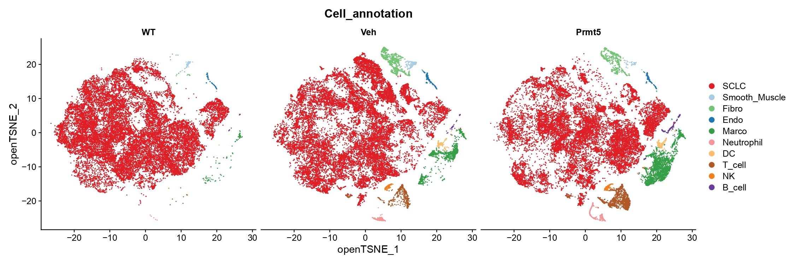
## Figure6G
```r

##每个细胞群的分布
library(paletteer)
library(ggsci)
library(scales)
library(ggalluvial)
library(scales)
scRNA_filter_merge2_harmony$group <- factor(scRNA_filter_merge2_harmony$group,levels=c("WT","Veh","Prmt5"))
sel_type <-c("SCLC","Smooth_Muscle","Fibro","Endo","Marco","Neutrophil","DC","T_cell","NK","B_cell")
col_sel <- hue_pal()(length(as.character(sel_type)))
col <- col_sel[1:length(as.character(sel_type))]
names(col) <- as.character(sel_type)
aa <- as.data.frame(table(scRNA_filter_merge2_harmony$group,scRNA_filter_merge2_harmony$Cell_annotation))
aa$Var2 <- factor(aa$Var2,levels=sel_type)
aa <- aa[order(aa$Var2),]
aa$Var1 <- as.character(aa$Var1)
aa <-aa[order(aa$Freq),]
aa_all <- c()
for (i in unique(aa$Var1)){
  group_sel <- subset(aa,Var1==i)
  group_sel$sum_number <- sum(group_sel$Freq)
  group_sel$normal_ratio <- (group_sel$Freq/group_sel$sum_number)*100
  group_sel$normal_ratio <- round(group_sel$normal_ratio,2)
  aa_all <- rbind(aa_all,group_sel)
}

aa_all <- aa_all[order(aa_all$Var1),]
aa_all$Var1 <- factor(aa_all$Var1,levels=c("WT","Veh","Prmt5"))

p1 <- ggplot(aa_all, aes(x = Var1, y = normal_ratio, fill = Var2, 
    stratum = Var2, alluvium = Var2)) +
geom_stratum(width = 0.75) +  #代替 geom_col() 绘制堆叠柱形图
geom_flow(alpha = 0.5) +  #绘制同类别之间的连接线
theme_classic() +
scale_fill_manual(values = Paired_reorder)+
labs(x = '', y = 'Relative Abundance(%)',title="ALL percentage of subpop")+ theme(axis.text.x  = element_text(angle=45,size=12,hjust=1,vjust=1,color="black"))
```
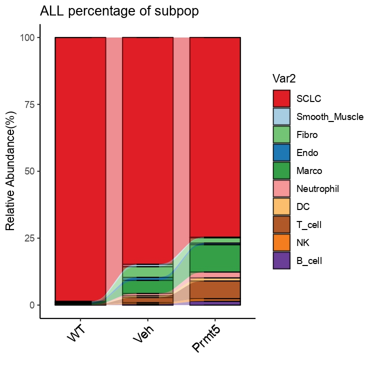

## Figure6H
```r
only_T_harmony1 <- mcreadRDS("/local/workdir/xuelan/1_project/SCLC/only_T.harmony.rds",mc.cores=20)
pal <- jdb_palette("corona")
pal <- pal[c(2,1,3:length(pal))]
plot <- DimPlot(object = only_T_harmony1, reduction = "openTSNE",label=FALSE,repel=FALSE,group.by="v2_Cell_annotation",split.by="group",cols=pal) +labs(title="openTSNE")
ggsave("/local/workdir/xuelan/1_project/SCLC/res/Fig5.7.svg", plot=plot,width = 20, height = 7,dpi=300)
```
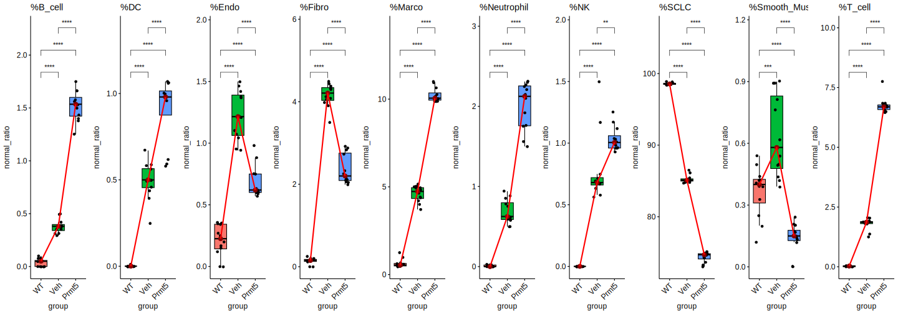

## Figure6I
```r
/usr/local/R4.2/bin/R
library(CellChat)
library(patchwork)
library(Seurat)
library(ggplot2)
library(cowplot)
library(patchwork)
library(dplyr)
library(data.table)
library(future.apply)
library(trqwe)
scRNA_filter_merge2_harmony <- mcreadRDS("./scRNA_filter_merge.withWT.harmony.rds",mc.cores=20)
head(scRNA_filter_merge2_harmony)

source("./MyBestFunction_scRNA.R.v4.R")
options(future.globals.maxSize= 6040032000)

table(scRNA_filter_merge2_harmony$group)
Idents(scRNA_filter_merge2_harmony) <- scRNA_filter_merge2_harmony$Cell_annotation
sce_SCLC <- subset(scRNA_filter_merge2_harmony,idents=c("SCLC"))%>% NormalizeData()

table(sce_SCLC$Cell_annotation,sce_SCLC$group)

Idents(sce_SCLC) <- sce_SCLC$group
sce_SCLC$group <- factor(sce_SCLC$group,levels=c("WT","Veh","Prmt5"))
All_gsva_seura_ <- future_lapply(1:length(levels(sce_SCLC$group)),function(i) {
    sel_tmp <- subset(sce_SCLC,idents=levels(sce_SCLC$group)[i])
    sel_tmp <- pseudo_bulk_seurat_mean_random(seurat_obj=sel_tmp,num_split=50,seed.use=1,slot="data",prefix=levels(sce_SCLC$group)[i],assay="RNA")
    metadata <- data.frame(cell_type=c(rep(levels(sce_SCLC$group)[i],50)),
    row.names=colnames(sel_tmp))
    sel_gsva_seurat <- CreateSeuratObject(counts = sel_tmp,assay = 'RNA',project = 'RNA',min.cells = 0,meta.data = metadata)
    message(levels(sce_SCLC$group)[i], " is done")
    return(sel_gsva_seurat)
})

All_gsva_seura <- merge(x = All_gsva_seura_[[1]], y = All_gsva_seura_[c(2:length(All_gsva_seura_))])
Idents(All_gsva_seura) <- All_gsva_seura$cell_type
All_gsva_seura$cell_type <- factor(All_gsva_seura$cell_type,levels=levels(sce_SCLC$group))

library(clusterProfiler)
ALL_GSEA_GMT <- read.gmt("./msigdb.v2022.1.Mm.symbols.gmt")
colnames(ALL_GSEA_GMT)[1] <- "ont"
ALL_GSEA_GMT$ont <- as.character(ALL_GSEA_GMT$ont)

only_DS.100.RNA <- All_gsva_seura
all_data_obj <- GetAssayData(object = only_DS.100.RNA, slot = "data")
path <- unique(ALL_GSEA_GMT$ont)
path_score_All_ <- future_lapply(1:length(path),function(x) {
  sel_path <- subset(ALL_GSEA_GMT,ont==path[x])
  Lineage_marker <- sel_path$gene
  Lineage_marker <- intersect(rownames(all_data_obj),Lineage_marker)
  if (length(Lineage_marker)==0) {
    path_score_t <- data.frame(sel_path=rep("Nothing",ncol(only_DS.100.RNA)))
    colnames(path_score_t) <- path[x]
    path_score_t <- as.data.frame(t(path_score_t))
  } else {
    speci_raw <- FetchData(object =  only_DS.100.RNA, vars = Lineage_marker,slot="data")
    path_score_t <- data.frame(sel_path=(rowSums(speci_raw)/length(Lineage_marker)))
    colnames(path_score_t) <- path[x]
    path_score_t <- as.data.frame(t(path_score_t))
  }
  return(path_score_t)
  })
path_score_All <- as.data.frame(rbindlist(path_score_All_))
rownames(path_score_All) <- path

path_score_All1 <- path_score_All[path_score_All$'Prmt5_48'!="Nothing",]
intersect(colnames(path_score_All1),rownames(only_DS.100.RNA@meta.data))
colnames(path_score_All1) <- rownames(only_DS.100.RNA@meta.data)
new_seurat <- CreateSeuratObject(counts = path_score_All1,assay = 'RNA',project = 'RNA',min.cells = 0,meta.data =  only_DS.100.RNA@meta.data[colnames(path_score_All1),])
Idents(new_seurat) <- new_seurat$cell_type
mcsaveRDS(new_seurat,"only_SCLC.10.RNA_GSVA_new_seurat.rds")
new_seurat_markers <- FindAllMarkers(object = new_seurat, only.pos = T, min.pct = 0,logfc.threshold = 0)
mcsaveRDS(new_seurat_markers,"only_SCLC.10.RNA_GSVA_DEG.rds")

new_seurat_markers <-mcreadRDS("only_SCLC.10.RNA_GSVA_DEG.rds")
CLC.only.GSVA <- new_seurat
new_seurat_markers <-new_seurat_markers
HALLMARK <- new_seurat_markers[rownames(new_seurat_markers)%in%c("ULE-SPLICING-VIA-NOVA2","WP-SPLICING-FACTOR-NOVA-REGULATED-SYNAPTIC-PROTEINS","GOBP-NEGATIVE-REGULATION-OF-RNA-SPLICING","GOBP-NEGATIVE-REGULATION-OF-MRNA-SPLICING-VIA-SPLICEOSOME","GOBP-REGULATION-OF-ALTERNATIVE-MRNA-SPLICING-VIA-SPLICEOSOME"),]
table(new_seurat_markers$cluster)
library(BuenColors)
HALLMARK.sig <- subset(HALLMARK,avg_log2FC > 0.01)
table(HALLMARK.sig$cluster)
HALLMARK.sig.All_ <- lapply(1:length(unique(HALLMARK.sig$gene)),function(x) {
    tmp <- subset(HALLMARK.sig,gene==unique(HALLMARK.sig$gene)[x])
    tmp <- subset(tmp,avg_log2FC==max(tmp$avg_log2FC))
    return(tmp)
    })
HALLMARK.sig.All <- do.call(rbind,HALLMARK.sig.All_)
HALLMARK.sig.All <- HALLMARK.sig.All[order(HALLMARK.sig.All$cluster,-(HALLMARK.sig.All$avg_log2FC)),]
top50 <- HALLMARK.sig.All %>% group_by(cluster) %>% top_n(n = 10, wt = avg_log2FC)
top50 <- as.data.frame(top50)
path_score_All <- as.data.frame(GetAssayData(object = SCLC.only.GSVA, slot = "data"))
HALLMARK_data <- path_score_All[top50$gene,]
HALLMARK_data <- as.matrix(HALLMARK_data)
HALLMARK.zscore <- sweep(HALLMARK_data - rowMeans(HALLMARK_data), 1, matrixStats::rowSds(HALLMARK_data),`/`)
HALLMARK.zscore[HALLMARK.zscore > 1] <- 1
HALLMARK.zscore[HALLMARK.zscore < -1] <- -1
library(ComplexHeatmap)
library(circlize)
bb <- jdb_palette("brewer_spectra")
col_fun2 = colorRamp2(c(-1, 0, 1), c(bb[1],bb[5],bb[9]))
ANNO_COL = HeatmapAnnotation(Cell_anno=SCLC.only.GSVA$cell_type,annotation_legend_param = list(Cell_anno = list(nrow = 2)))

HALLMARK_PATH <- Heatmap(HALLMARK.zscore, cluster_rows = FALSE, cluster_columns = FALSE, top_annotation = ANNO_COL, 
    column_split = SCLC.only.GSVA$cell_type, cluster_column_slices = FALSE, row_split = top50$cluster, cluster_row_slices = FALSE,
    col = col_fun2, show_column_names = FALSE, show_row_names = TRUE,column_title = "HALLMARK",row_names_gp = gpar(fontsize = 9),
    heatmap_legend_param = list(direction = "horizontal"),row_title_rot=0,
    row_names_max_width = max_text_width(rownames(HALLMARK.zscore), gp = gpar(fontsize = 12)))
```
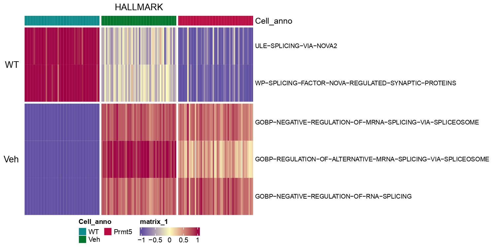

## Figure6J
```r

#绘制热图
library(ComplexHeatmap)
library(circlize)
cellchat_WT <- mcreadRDS("./CELL_Interaction/0_cellchat_WT_cell.rds")
cellchat_Veh <- mcreadRDS("./CELL_Interaction/0_cellchat_Veh_cell.rds")

cellchat_WT <- netAnalysis_computeCentrality(cellchat_WT)
cellchat_Veh <- netAnalysis_computeCentrality(cellchat_Veh)

object.list <- list(WT=cellchat_WT,Veh=cellchat_Veh)
cellchat <- mergeCellChat(object.list, add.names = names(object.list))
cellchat
library(ComplexHeatmap)
library(circlize)
```
```r
par(mfrow = c(1,2))
netVisual_diffInteraction(cellchat, weight.scale = T)
```
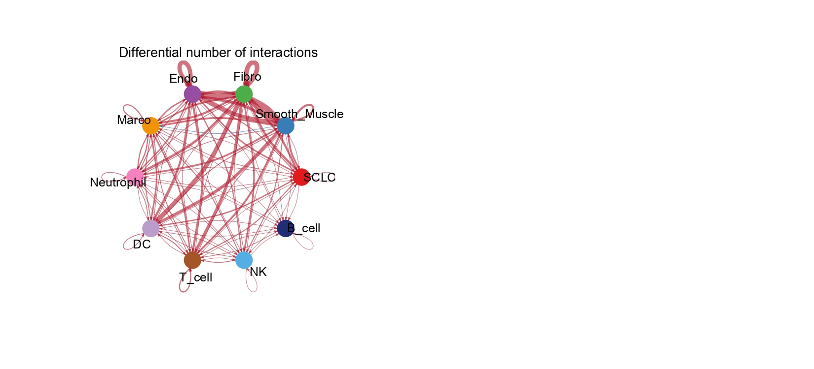

```r
cellchat_Prmt5 <- mcreadRDS("./CELL_Interaction/0_cellchat_Prmt5_cell.rds")
cellchat_Veh <- mcreadRDS("./CELL_Interaction/0_cellchat_Veh_cell.rds")
cellchat_Prmt5 <- netAnalysis_computeCentrality(cellchat_Prmt5)
cellchat_Veh <- netAnalysis_computeCentrality(cellchat_Veh)
object.list <- list(Veh=cellchat_Veh,Prmt5=cellchat_Prmt5)
cellchat <- mergeCellChat(object.list, add.names = names(object.list))
cellchat
par(mfrow = c(1,2))
netVisual_diffInteraction(cellchat, weight.scale = T)
```
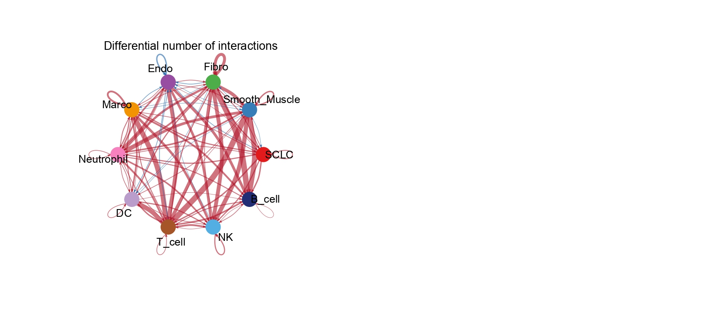

## Figure6K
```r
scRNA_filter_merge2_harmony$Cell_annotation <- factor(scRNA_filter_merge2_harmony$Cell_annotation,levels=c("SCLC","Smooth_Muscle","Fibro","Endo","Marco","Neutrophil","DC","T_cell","NK","B_cell"))
Idents(scRNA_filter_merge2_harmony) <- scRNA_filter_merge2_harmony$Cell_annotation
T_CELL_sce <- subset(scRNA_filter_merge2_harmony,idents=c("T_cell")) 
Idents(T_CELL_sce) <- T_CELL_sce$group
T_CELL_sce <- subset(T_CELL_sce,idents=c("Veh","Prmt5")) %>% NormalizeData()
Idents(T_CELL_sce) <- T_CELL_sce$group
T_CEll_deg.markers <- FindAllMarkers(T_CELL_sce, only.pos = TRUE, min.pct = 0, logfc.threshold = 0)
write.csv(T_CEll_deg.markers,"T_CEll_DEGs-for_mmu_T_CELL.csv")
T_CEll_deg.markers <- read.csv("T_CEll_DEGs-for_mmu_T_CELL.csv")
head(T_CEll_deg.markers)

T_CEll_deg.markers[which(T_CEll_deg.markers$cluster == "Veh"),]$avg_log2FC <- -T_CEll_deg.markers[which(T_CEll_deg.markers$cluster == "Veh"),]$avg_log2FC
head(T_CEll_deg.markers)
T_CEll_deg.markers <- T_CEll_deg.markers[,c("avg_log2FC","gene")]
T_CEll_deg.markers <- T_CEll_deg.markers[order(T_CEll_deg.markers$avg_log2FC,decreasing=TRUE),]
T_CEll_deg.markers <- na.omit(T_CEll_deg.markers)
aa <- T_CEll_deg.markers$avg_log2FC
names(aa) <- T_CEll_deg.markers$gene
geneList = sort(aa,decreasing = T)
library(clusterProfiler)
custom_GSEA_GMT <- read.gmt("./msigdb_v2022.1.Mm_GMTs/msigdb.v2022.1.Mm.symbols.gmt")

gsea_P <- GSEA(geneList,  #待富集的基因列表
    TERM2GENE = custom_GSEA_GMT,  #基因集
    pvalueCutoff = 1,  #指定 p.adjust 值阈值（可指定 1 以输出全部）
    pAdjustMethod = 'BH',
    nPerm = 100000)  #指定 p 值校正方法
library(enrichplot)
inter_pw <- c("GOBP_T_CELL_ACTIVATION","GOBP_REGULATION_OF_T_CELL_ACTIVATION","GOBP_T_CELL_RECEPTOR_SIGNALING_PATHWAY")
p <- gseaplot2(gsea_P,geneSetID=inter_pw,color = c('#1f77b4','#ff7f0e','#2ca02c','#d62728','#9467bd','#8c564b'))
```
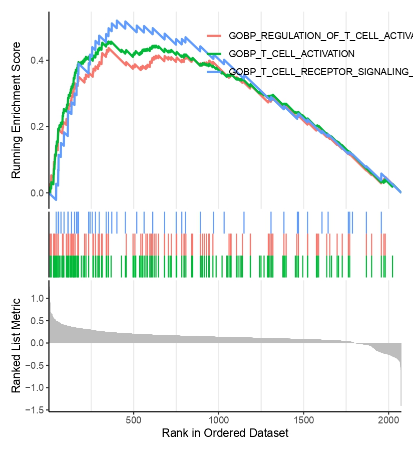

```r
scRNA_filter_merge2_harmony$Cell_annotation <- factor(scRNA_filter_merge2_harmony$Cell_annotation,levels=c("SCLC","Smooth_Muscle","Fibro","Endo","Marco","Neutrophil","DC","T_cell","NK","B_cell"))
Idents(scRNA_filter_merge2_harmony) <- scRNA_filter_merge2_harmony$Cell_annotation
DC_CELL_sce <- subset(scRNA_filter_merge2_harmony,idents=c("DC")) 
Idents(DC_CELL_sce) <- DC_CELL_sce$group
DC_CELL_sce <- subset(DC_CELL_sce,idents=c("Veh","Prmt5")) %>% NormalizeData()
Idents(DC_CELL_sce) <- DC_CELL_sce$group
DC_CELL_deg.markers <- FindAllMarkers(DC_CELL_sce, only.pos = TRUE, min.pct = 0, logfc.threshold = 0)
write.csv(DC_CELL_deg.markers,"DC_CELL_DEGs-for_mmu_DC_CELL.csv")
DC_CELL_deg.markers <- read.csv("DC_CELL_DEGs-for_mmu_DC_CELL.csv")
DC_CELL_deg.markers[which(DC_CELL_deg.markers$cluster == "Veh"),]$avg_log2FC <- -DC_CELL_deg.markers[which(DC_CELL_deg.markers$cluster == "Veh"),]$avg_log2FC
head(DC_CELL_deg.markers)
DC_CELL_deg.markers <- DC_CELL_deg.markers[,c("avg_log2FC","gene")]
DC_CELL_deg.markers <- DC_CELL_deg.markers[order(DC_CELL_deg.markers$avg_log2FC,decreasing=TRUE),]
DC_CELL_deg.markers <- na.omit(DC_CELL_deg.markers)
aa <- DC_CELL_deg.markers$avg_log2FC
names(aa) <- DC_CELL_deg.markers$gene
geneList = sort(aa,decreasing = T)
library(clusterProfiler)
gsea_P <- GSEA(geneList,  #待富集的基因列表
    TERM2GENE = custom_GSEA_GMT,  #基因集
    pvalueCutoff = 1,  #指定 p.adjust 值阈值（可指定 1 以输出全部）
    pAdjustMethod = 'BH',
    nPerm = 100000)  #指定 p 值校正方法
library(enrichplot)
inter_pw <- c("GOMF_MHC_CLASS_I_PROTEIN_BINDING","GOBP_CELL_ACTIVATION","HALLMARK_INTERFERON_GAMMA_RESPONSE")
p <- gseaplot2(gsea_P,geneSetID=inter_pw,color = c('#1f77b4','#ff7f0e','#2ca02c','#d62728','#9467bd','#8c564b'))
```
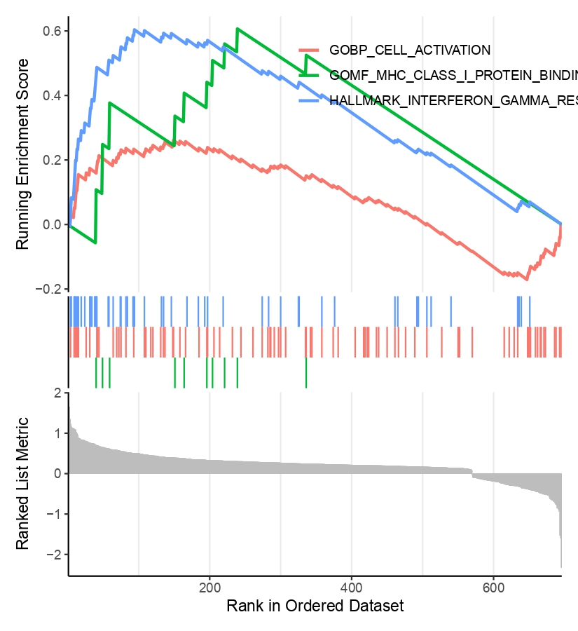

```r
scRNA_filter_merge2_harmony$Cell_annotation <- factor(scRNA_filter_merge2_harmony$Cell_annotation,levels=c("SCLC","Smooth_Muscle","Fibro","Endo","Marco","Neutrophil","DC","T_cell","NK","B_cell"))
Idents(scRNA_filter_merge2_harmony) <- scRNA_filter_merge2_harmony$Cell_annotation
Marco_sce <- subset(scRNA_filter_merge2_harmony,idents=c("Marco")) 
Idents(Marco_sce) <- Marco_sce$group
Marco_sce <- subset(Marco_sce,idents=c("Veh","Prmt5")) %>% NormalizeData()
Idents(Marco_sce) <- Marco_sce$group
Marco_deg.markers <- FindAllMarkers(Marco_sce, only.pos = TRUE, min.pct = 0, logfc.threshold = 0)
write.csv(Marco_deg.markers,"Marco_DEGs-for_mmu_Marco.csv")
Marco_deg.markers[which(Marco_deg.markers$cluster == "Veh"),]$avg_log2FC <- -Marco_deg.markers[which(Marco_deg.markers$cluster == "Veh"),]$avg_log2FC
head(Marco_deg.markers)

Marco_deg.markers <- Marco_deg.markers[,c("avg_log2FC","gene")]
Marco_deg.markers <- Marco_deg.markers[order(Marco_deg.markers$avg_log2FC,decreasing=TRUE),]
Marco_deg.markers <- na.omit(Marco_deg.markers)
aa <- Marco_deg.markers$avg_log2FC
names(aa) <- Marco_deg.markers$gene
geneList = sort(aa,decreasing = T)
library(clusterProfiler)
gsea_P <- GSEA(geneList,  #待富集的基因列表
    TERM2GENE = custom_GSEA_GMT,  #基因集
    pvalueCutoff = 1,  #指定 p.adjust 值阈值（可指定 1 以输出全部）
    pAdjustMethod = 'BH',
    nPerm = 100000)  #指定 p 值校正方法
library(enrichplot)
inter_pw <- c("GOBP_CELL_ACTIVATION","GOMF_MHC_CLASS_I_PROTEIN_BINDING","GOMF_MHC_PROTEIN_COMPLEX_BINDING")
p <- gseaplot2(gsea_P,geneSetID=inter_pw,color = c('#1f77b4','#ff7f0e','#2ca02c','#d62728','#9467bd','#8c564b'))
```
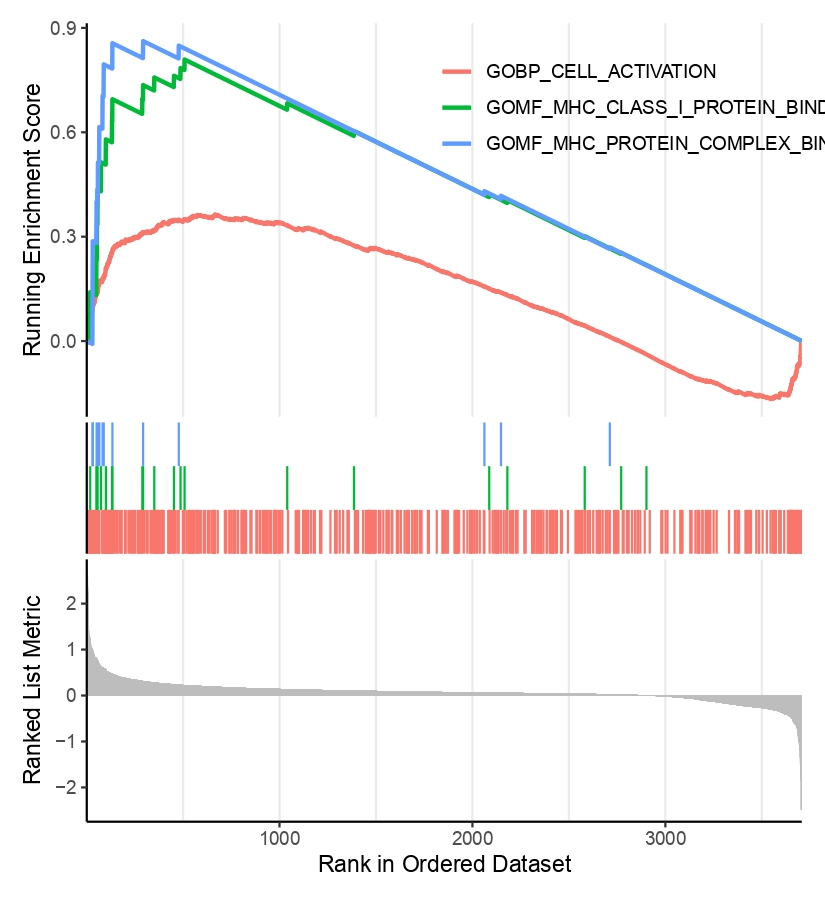


## Supplementary Figure6A
```r
only_T_harmony1 <- mcreadRDS("/local/workdir/xuelan/1_project/SCLC/only_T.harmony.rds",mc.cores=20)
pal <- jdb_palette("corona")
pal <- pal[c(2,1,3:length(pal))]
plot <- DimPlot(object = only_T_harmony1, reduction = "openTSNE",label=FALSE,repel=FALSE,group.by="v2_Cell_annotation",split.by="group",cols=pal) +labs(title="openTSNE")
```


## Supplementary Figure6B
```r
library(ggalluvial)
aa_all <- as.data.frame(table(only_T_harmony1$group,only_T_harmony1$v2_Cell_annotation))
aa_all <- aa_all[order(aa_all$Var2),]
aa_all$Var1 <- as.character(aa_all$Var1)
aa_all$Var1 <- factor(aa_all$Var1,levels=c("WT","Veh","Prmt5"))
aa_all <- aa_all[order(aa_all$Var1),]
p4 <- ggplot(aa_all, aes(x = Var1, y = Freq, fill = Var2, stratum = Var2, alluvium = Var2)) + geom_stratum(width = 0.75) + geom_flow(alpha = 0.5) + 
theme_classic() + theme(axis.text.x  = element_text(angle=45, vjust=1,hjust = 1)) +labs(x = '', y = 'Relative Abundance(%)',title="Freq")+scale_fill_manual(values = pal)+scale_color_manual(values = pal)
plot_grid(p4,ncol=1)
```


## Supplementary Figure6C
```r
EffectorMemory <- c("Gzma","Gzmk","Nkg7","Cd8a","Cd8b1","Ctsw","Gzmb","Ccl5","Cst7","Prf1","Abi3","Fasl","Itm2c","1500009L16Rik","Eomes","Chst12","Ccr5","Hcst","Aoah","Hopx","Slamf7","Cxcr3","Oasl1","F2r","Cxcr6")
EffectorMemory <- intersect(EffectorMemory,rownames(scRNA_filter_merge2_harmony))
speci_raw <- FetchData(object = scRNA_filter_merge2_harmony, vars = EffectorMemory,slot="data")
scRNA_filter_merge2_harmony[["EffectorMemory"]] <- (rowSums(speci_raw))/length(EffectorMemory)
EarlyActiv <- c("Gzmk","Fos","Cd69","Zfp36","Fosb","Ccl5","Gzmm","Dusp2","Lyar","Samd3","Cxcr4","Ctsw","Cd8a","Anxa1","Klrg1","Cd8b1","Aoah","Tagap","Klrd1","Ier2","Gzma","Cst7","Itm2c","Parp8","Btg2")
EarlyActiv <- intersect(EarlyActiv,rownames(scRNA_filter_merge2_harmony))
speci_raw <- FetchData(object = scRNA_filter_merge2_harmony, vars = EarlyActiv,slot="data")
scRNA_filter_merge2_harmony[["EarlyActiv"]] <- (rowSums(speci_raw))/length(EarlyActiv)
Naive <- c("Ccr7","Il7r","Sell","Tcf7","Txk","S1pr1","Lef1","Satb1")
Naive <- intersect(Naive,rownames(scRNA_filter_merge2_harmony))
speci_raw <- FetchData(object = scRNA_filter_merge2_harmony, vars = Naive,slot="data")
scRNA_filter_merge2_harmony[["Naive"]] <- (rowSums(speci_raw))/length(Naive)
Exhuasted <- c("Lag3","Prf1","Cd8a","Havcr2","Gzmb","Nkg7","Cd8b1","Ctsd","Klrd1","Id2","Cst7","Pdcd1","Tnfrsf9","Tigit","Ctsw","Ccl4","Cd63","Ccl3","Ifng","Cxcr6","Fasl","Rbpj","Chst12","Fam3c","Csf1")
Exhuasted <- intersect(Exhuasted,rownames(scRNA_filter_merge2_harmony))
speci_raw <- FetchData(object = scRNA_filter_merge2_harmony, vars = Exhuasted,slot="data")
scRNA_filter_merge2_harmony[["Exhuasted"]] <- (rowSums(speci_raw))/length(Exhuasted)
Sel_sig <- c("EarlyActiv","EffectorMemory")
data.sel <- as.data.frame(FetchData(object = scRNA_filter_merge2_harmony, vars = c(Sel_sig,"group","Cell_annotation"),slot="data"))
data.sel <- data.sel[data.sel$Cell_annotation=="T_cell",]
data.sel$group <- factor(data.sel$group,levels=c("WT","Veh","Prmt5"))
All_plot_merge1 <- lapply(1:length(Sel_sig),function(x) {
  plot <- ggboxplot(data.sel, x = "group", y = Sel_sig[x], fill="group",title=paste0(Sel_sig[x],".in.T_cell"), legend = "none",outlier.shape = NA,notch = FALSE) +rotate_x_text(angle = 45)+
  stat_summary(fun.y = median, geom="point",colour="darkred", size=3) + stat_summary(fun = median, geom = "line",aes(group = 1),col = "red",size=1)+
  stat_compare_means(comparisons =list(c("WT","Veh"),c("WT","Prmt5"),c("Veh","Prmt5")),label = "p.signif", method = "t.test")  
  return(plot)
})
plot <- CombinePlots(c(All_plot_merge1),nrow=1)
```


## Supplementary Figure6D
```r
Sel_sig <- c("MHC_I_mole","MHC_II_mole","Inflammatory_and_cytokine","M1_Macro_sig")
All_sum <- as.data.frame(FetchData(object = scRNA_filter_merge2_harmony, vars = c(Sel_sig,"group","Cell_annotation"),slot="data"))
All_sum <- All_sum[All_sum$Cell_annotation=="Marco",]
All_sum$Inflammatory_and_cytokine <- (All_sum$Inflammatory_and_cytokine-mean(All_sum$Inflammatory_and_cytokine))/(max(All_sum$Inflammatory_and_cytokine)-min(All_sum$Inflammatory_and_cytokine))
All_sum$M1_Macro_sig <- (All_sum$M1_Macro_sig-mean(All_sum$M1_Macro_sig))/(max(All_sum$M1_Macro_sig)-min(All_sum$M1_Macro_sig))
All_sum$MHC_I_mole <- (All_sum$MHC_I_mole-mean(All_sum$MHC_I_mole))/(max(All_sum$MHC_I_mole)-min(All_sum$MHC_I_mole))
All_sum$MHC_II_mole <- (All_sum$MHC_II_mole-mean(All_sum$MHC_II_mole))/(max(All_sum$MHC_II_mole)-min(All_sum$MHC_II_mole))
All_sum$M1_Macro_sig[All_sum$M1_Macro_sig > 0.5] <- 0.5
All_sum$M1_Macro_sig[All_sum$M1_Macro_sig< -0.5]<- -0.5
All_sum$Inflammatory_and_cytokine[All_sum$Inflammatory_and_cytokine > 0.5] <- 0.5
All_sum$Inflammatory_and_cytokine[All_sum$Inflammatory_and_cytokine< -0.5]<- -0.5
All_sum$MHC_II_mole[All_sum$MHC_II_mole > 0.5] <- 0.5
All_sum$MHC_II_mole[All_sum$MHC_II_mole< -0.5]<- -0.5
All_sum <- All_sum[order(All_sum$MHC_II_mole,decreasing=FALSE),]
aa <- jdb_palette("brewer_spectra",type = "continuous")
sel_group <- c("WT","Veh","Prmt5")
library(ggpubr)
plot <- ggscatter(All_sum, x = "MHC_I_mole", y = "Inflammatory_and_cytokine",color="M1_Macro_sig",
    alpha=0.5,fullrange = TRUE,rug = TRUE,size=0.5,legend="none",facet.by="group",ncol=3)+
    labs(title=paste0("Marco "))+
    geom_vline(xintercept = 0, color = 'grey50', size = 1) +
    geom_hline(yintercept = 0, color = 'grey50', size = 1) + theme_classic()+
    geom_density_2d(aes(alpha = ..nlevel..),colour="#BB2933", size = 1,bin=8) +scale_alpha_continuous(range = c(0, 1.5))+
    scale_colour_gradientn(colours = colorRampPalette(aa)(100))+  xlim(-0.5,0.5)+ylim(-0.5,0.5)
```


## Supplementary Figure6E
```r
Sel_sig <- c("MHC_I_mole","Inflammatory_and_cytokine","M1_Macro_sig","M2_Macro_sig")
data.sel <- as.data.frame(FetchData(object = scRNA_filter_merge2_harmony, vars = c(Sel_sig,"group","Cell_annotation"),slot="data"))
data.sel <- data.sel[data.sel$Cell_annotation=="Marco",]
data.sel$group <- factor(data.sel$group,levels=c("WT","Veh","Prmt5"))
All_plot_merge1 <- lapply(1:length(Sel_sig),function(x) {
  plot <- ggboxplot(data.sel, x = "group", y = Sel_sig[x], fill="group",title=paste0(Sel_sig[x],".in.Marco"), legend = "none",outlier.shape = NA,notch = FALSE) +rotate_x_text(angle = 45)+
  stat_summary(fun.y = median, geom="point",colour="darkred", size=3) + stat_summary(fun = median, geom = "line",aes(group = 1),col = "red",size=1)+
  stat_compare_means(comparisons =list(c("WT","Veh"),c("WT","Prmt5"),c("Veh","Prmt5")),label = "p.signif", method = "t.test")  
  return(plot)
})
plot <- CombinePlots(c(All_plot_merge1),nrow=1)
```

