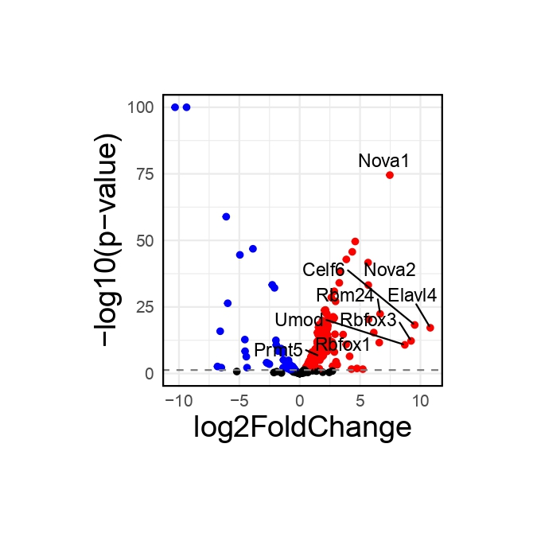

```r
/usr/local/R4.2/bin/R
 .libPaths("./program/R/R_source/R-4.2.2/library")
library(Rsamtools)
library(GenomicFeatures)
library(GenomicAlignments)
library(BiocParallel)
library(pheatmap)
library(RColorBrewer)
library(PoiClaClu)
library(org.Mm.eg.db)
library(AnnotationDbi)
library(DOSE)
library(clusterProfiler)
library(topGO)
library(pathview)
library(org.Hs.eg.db)
library(AnnotationDbi)
library(DOSE)
library(clusterProfiler)
library(topGO)
library(ggplot2)
library(data.table)
library(future.apply)
library(trqwe)
library(future)
library(future.apply)
library(nichenetr)
library(tidyr)
library(GenomicRanges)
library(viridis)
library(chromVAR)
library(ggpubr)
library(corrplot)
library(SingleCellExperiment)
library(scater)
library(flexmix)
library(splines)
library(biomaRt)
library(miQC)
library(scales)
library(BuenColors)
library(PCAtools)
library(trqwe)
library(future)
library(future.apply)
library(ggplot2)
library(Seurat)
library(cowplot)
library(patchwork)
library(dplyr)
library(data.table)
library(future.apply)
library(trqwe)
# library(Signac)
library(Seurat)
library(GenomeInfoDb)
# library(EnsDb.Hsapiens.v75)
library(ggplot2)
library(patchwork)
library(hdf5r)
library(Seurat)
library(GenomicRanges)
plan("multicore", workers = 20)
options(future.globals.maxSize = 500 * 1024^3)
```

Fig.3B
```r
scp ./Project/SCLC_Splicing/Figure/Fig_250418/mSCLC_vs_mNormal_3vs3_GRcm39/SCLC_vs_Normal_3vs3_DEGS_Normalize_Count.csv xiangmeng@172.16.1.21:./project/tmp/OTS/2_SCLC_splicing/v2_figure/Fig3/
mmu_SCLC_result <- read.csv(row.names=1,"./project/tmp/OTS/2_SCLC_splicing/v2_figure/Fig3/SCLC_vs_Normal_3vs3_DEGS_Normalize_Count.csv")
anno_data=org.Mm.eg.db
organism="mouse"
mmu_SCLC_result$entrez <- mapIds(x = anno_data,
                        keys = (mmu_SCLC_result$symbol),
                        keytype ="SYMBOL",
                        column ="ENTREZID",
                        multiVals="first")
mmu_SCLC_result$GENENAME <- mapIds(x = anno_data,
                        keys = (mmu_SCLC_result$symbol),
                        keytype ="SYMBOL",
                        column ="GENENAME",
                        multiVals="first")

mmu_SCLC_result <- mmu_SCLC_result[!is.na(mmu_SCLC_result$symbol),]
upmmu_SCLC_result <- subset(mmu_SCLC_result,pvalue < 0.05 & log2FoldChange >1)
downmmu_SCLC_result  <- subset(mmu_SCLC_result,pvalue < 0.05 & log2FoldChange < -1)
ee  <- as.matrix(upmmu_SCLC_result$entrez)
dd <- as.vector(ee)
KEGGupmmu_SCLC_result <- enrichKEGG(gene =dd, 
                    organism = organism, 
                    keyType = "ncbi-geneid",
                     pvalueCutoff = 0.05,
                       pAdjustMethod = "BH", 
                       minGSSize = 10, 
                       maxGSSize = 500,
                       qvalueCutoff = 0.2, 
                       use_internal_data = TRUE)
KEGGupmmu_SCLC_result <- setReadable(KEGGupmmu_SCLC_result, anno_data, keyType="ENTREZID")
ee  <-as.matrix(downmmu_SCLC_result$entrez)
    dd <- as.vector(ee)
KEGGdownmmu_SCLC_result <- enrichKEGG(gene =dd, 
                    organism = organism, 
                    keyType = "ncbi-geneid",
                     pvalueCutoff = 0.05,
                       pAdjustMethod = "BH", 
                       minGSSize = 10, 
                       maxGSSize = 500,
                       qvalueCutoff = 0.2, 
                       use_internal_data = TRUE)
KEGGdownmmu_SCLC_result <- setReadable(KEGGdownmmu_SCLC_result, anno_data, keyType="ENTREZID")
mcsaveRDS(KEGGdownmmu_SCLC_result,"./project/tmp/OTS/2_SCLC_splicing/v2_figure/Fig3/KEGGdownmmu_SCLC_result_p0.05_log1.rds")
mcsaveRDS(KEGGupmmu_SCLC_result,"./project/tmp/OTS/2_SCLC_splicing/v2_figure/Fig3/KEGGupmmu_SCLC_result_p0.05_log1.rds")
# KEGGdownmmu_SCLC_result <- read.csv(row.names=1,"./project/1naifeifei/SCLC_plot_20180502/3V3_normal_SCLC/KEGG/KEGGdownres_0.05_1_file.csv")
# KEGGupmmu_SCLC_result <- read.csv(row.names=1,"./project/1naifeifei/SCLC_plot_20180502/3V3_normal_SCLC/KEGG/KEGGupres_0.05_1_file.csv")

KEGGupmmu_SCLC_resultuporder <- KEGGupmmu_SCLC_result[order((KEGGupmmu_SCLC_result$Count),decreasing = TRUE),]
KEGGdownmmu_SCLC_resultdownorder <- KEGGdownmmu_SCLC_result[order((KEGGdownmmu_SCLC_result$Count),decreasing = TRUE),]
down_kegg<-KEGGdownmmu_SCLC_resultdownorder[KEGGdownmmu_SCLC_resultdownorder$p.adjust<0.05,];
down_kegg$group=-1
up_kegg<-KEGGupmmu_SCLC_resultuporder[KEGGupmmu_SCLC_resultuporder$p.adjust<0.05,];
up_kegg$group=1
down_kegg1 <- down_kegg[-(21:nrow(down_kegg)),]
up_kegg1 <- up_kegg[-(21:nrow(up_kegg)),]
  dat=rbind(up_kegg1,down_kegg1)
  colnames(dat)
    dat$p.adjust = -log10(dat$p.adjust)
  dat$p.adjust=dat$p.adjust*dat$group 
  dat=dat[order(dat$p.adjust,decreasing = F),]
  library("ggplot2")
  g_kegg<- ggplot(dat, aes(x=reorder(Description,order(p.adjust, decreasing = F)), y=p.adjust, fill=group)) + 
    geom_bar(stat="identity") + 
    scale_fill_gradient(low="blue",high="red",guide = FALSE) + 
    scale_x_discrete(name ="Pathway names") +
    scale_y_continuous(name ="-log10p_adjust") +
    coord_flip() 
  print(g_kegg)
pdf("./project/tmp/OTS/2_SCLC_splicing/v2_figure/Fig3/yc_version_mmu_SCLC_vs_Normal_KEGG.pdf")
g_kegg
dev.off()
```
<div style="display: flex; justify-content: space-between;">
  
</div>

Fig.3C
```r
library(ggrepel)
mouse_res <- read.csv(row.names=1,"./project/tmp/OTS/2_SCLC_splicing/v2_figure/Fig3/SCLC_vs_Normal_3vs3_DEGS_Normalize_Count.csv")
mouse_res <- mouse_res[!duplicated(mouse_res$symbol),]
mouse_res <- mouse_res[!is.na(mouse_res$symbol),]
rownames(mouse_res) <- mouse_res$symbol

SP_genes <- read.csv("./project/tmp/OTS/2_SCLC_splicing/GO_term_summary_20250205_003645.csv")
SP_genes_1 <- SP_genes %>% mutate(human_gene = convert_mouse_to_human_symbols(as.character(SP_genes$Symbol))) %>% drop_na()

mouse_res_SFs <- mouse_res[which(rownames(mouse_res) %in% SP_genes_1$Symbol),]
mouse_res_SFs <- mouse_res_SFs[order(mouse_res_SFs$log2FoldChange,decreasing=TRUE),]
mouse_res_SFs1 <- mouse_res_SFs[order(mouse_res_SFs$log2FoldChange,decreasing=FALSE),]

SFs_gene_tmp <-  c("Prmt5","Flnb",rownames(mouse_res_SFs)[1:10])

mouse_res$gene_name <- rownames(mouse_res)

mouse_res_SFs$gene_name <- rownames(mouse_res_SFs)
mouse_res_SFs$LOGP <- -log10(mouse_res_SFs$pvalue)
mouse_res_SFs$LOGP <- ifelse(mouse_res_SFs$LOGP>100,100,mouse_res_SFs$LOGP)

p1 <- ggplot(data = mouse_res_SFs, aes(x = log2FoldChange, y = LOGP)) +
  geom_point(aes(color = ifelse(pvalue < 0.05 & log2FoldChange>0, "red", 
  ifelse(pvalue < 0.05 & log2FoldChange< 0 , "blue","black"))), size = 1.5) +  # 根据基因是否在 SP_genes_1$Symbol 中选择颜色
  geom_hline(yintercept = -log10(0.05), linetype = "dashed", color = "gray50") +
  labs(x = "log2FoldChange", y = "-log10(p-value)") +
  scale_color_identity() +  # 使用自定义的颜色
  geom_text_repel(
    data = subset(mouse_res_SFs, gene_name %in% SFs_gene_tmp),
    aes(label = gene_name),
    hjust = 0, vjust = 1.5, color = "black")+
   theme_minimal() +
  theme(plot.margin = unit(rep(2, 4), 'cm')) +
  theme(panel.border = element_rect(color = "black", fill = NA, size = 1)) +
  theme(axis.text = element_text(size = 10), axis.title = element_text(size = 18))

pdf(file="./project/tmp/OTS/2_SCLC_splicing/v2_figure/Fig3/yc_version_mouse_SCLC_vs_normal_SFs_gene_volplot.pdf",height=4.5,width=4.5)
p1
dev.off()
```

<div style="display: flex; justify-content: space-between;">
  
</div>

Fig.3D
```r
ALL_merge1_lung_epi2 <- mcreadRDS("./project/tmp/OTS/2_SCLC_splicing/public_omics/Gaodong/gaodong_merge_ncTRM_pri_only_Ascl1.rds",mc.cores=20)

library(slingshot, quietly = TRUE)
library(splatter, quietly = TRUE)
sim <- as.SingleCellExperiment(ALL_merge1_lung_epi2)
colData(sim)$order <- colData(sim)$group_xm
table(colData(sim)$group_xm)
library(RColorBrewer)
colors <- unique(union(brewer.pal(8,'Set3'),brewer.pal(8,'Accent')))
colors <- unique(union(colors,brewer.pal(8,'Set1')))
sce <- slingshot(sim, clusterLabels = 'group_xm', reducedDim = 'PCA', start.clus = "3",approx_points=300)
# par(mar = rep(2, 4))
# plot(reducedDims(sce)$PCA[,c(1,2)], col = colors[colData(sim)$order])
# lines(SlingshotDataSet(sce), lwd=2, col='black',show.constraints = TRUE)

# plot(reducedDims(sce)$PCA[,c(1,2)], col = colors[colData(sim)$order], pch=16, asp = 1)
# lines(SlingshotDataSet(sce), lwd=2, type = 'lineages', col = 'black')

all_meta <- ALL_merge1_lung_epi2[[]]
pseudo <- colData(sce)
pseudo <- pseudo[rownames(all_meta),]
all_meta <- cbind(all_meta,pseudo[,c("slingPseudotime_1")])
ALL_merge1_lung_epi2@meta.data <- as.data.frame(all_meta)
colnames(ALL_merge1_lung_epi2@meta.data)[ncol(ALL_merge1_lung_epi2@meta.data)] <- c("Tumor_Progression")
p1 <- XY_FeaturePlot(object = ALL_merge1_lung_epi2, features = c("Tumor_Progression"),ncol=1,pt.size=.5,reduction="pca",label=T,cols = CustomPalette(low ="#007BBF", mid = "#FFF485",high = "#FF0000")) +NoAxes()
pdf(file="./project/tmp/OTS/2_SCLC_splicing/output/Fig3/Only_Ascl1_gaodong_merge_ncTRM_Pseudotime_tracjetory.pdf",height=3,width=3.3)
p1
dev.off()
```
<div style="display: flex; justify-content: space-between;">
  
</div>

Fig.3E-F
```r
library(monocle)
seuratX <- ALL_merge1_lung_epi2
data <- as(as.matrix(seuratX@assays$RNA@data), 'sparseMatrix')
pd <- new('AnnotatedDataFrame', data = seuratX@meta.data)
fData <- data.frame(gene_short_name = row.names(data), row.names = row.names(data))
fd <- new('AnnotatedDataFrame', data = fData)
monocle_obj2 <- newCellDataSet(data,
                              phenoData = pd,
                              featureData = fd,
                              expressionFamily = uninormal())# since I have already normalized, thresholded and scalled in Suerat v3.0.0.9150
pData(monocle_obj2)$Pseudotime <- pData(monocle_obj2)$Tumor_Progression

cds_subset <- monocle_obj2
scale_max = 3
scale_min = -3
trend_formula = "~sm.ns(Pseudotime, df=3)"
newdata <- data.frame(Pseudotime = seq(min(pData(cds_subset)$Pseudotime),max(pData(cds_subset)$Pseudotime), length.out = 100))
m <- genSmoothCurves(cds_subset, cores = 30, trend_formula = trend_formula,relative_expr = T, new_data = newdata)
mcsaveRDS(m,file="./project/tmp/OTS/2_SCLC_splicing/output/Fig3/gaodong_merge_ncTRM/Pseudotime/only_Ascl1_Normal_to_tumor_Pseudotime_heatmap_All_genes_m.rds",mc.cores=20)
m <- mcreadRDS(file="./project/tmp/OTS/2_SCLC_splicing/output/Fig3/gaodong_merge_ncTRM/Pseudotime/only_Ascl1_Normal_to_tumor_Pseudotime_heatmap_All_genes_m.rds",mc.cores=20)
m1 = m[!apply(m, 1, sum) == 0, ]
m1 = log10(m1 + 1)
m1 = m1[!apply(m1, 1, sd) == 0, ]
m1 = Matrix::t(scale(Matrix::t(m1), center = TRUE))
m1 = m1[is.na(row.names(m1)) == FALSE, ]
m1[is.nan(m1)] = 0
m1[m1 > scale_max] = scale_max
m1[m1 < scale_min] = scale_min
mcsaveRDS(m1,file="./project/tmp/OTS/2_SCLC_splicing/output/Fig3/gaodong_merge_ncTRM/Pseudotime/only_Ascl1_Normal_to_tumor_Pseudotime_heatmap_All_genes_m_normalised.rds",mc.cores=20)

diff_test_res <- monocle::differentialGeneTest(monocle_obj2,
              fullModelFormulaStr = "~sm.ns(Pseudotime)",
              cores=20)
mcsaveRDS(diff_test_res,file="./project/tmp/OTS/2_SCLC_splicing/output/Fig3/gaodong_merge_ncTRM/Pseudotime/only_Ascl1_Normal_to_tumor_Pseudotime_genes.rds",mc.cores=20)

Binner <- function(cds_object,cells_subset,anno_group){
  df <- data.frame(pData(cds_object[,cells_subset]))
  df <- df[,c("Pseudotime", anno_group)]
  colnames(df) <- c("Pseudotime", "State")
  df <- df[order(df$Pseudotime, decreasing = F),]
  len <- length(df$Pseudotime)
  bin <- round(len/100)
  State <- c()
  value <- c()
  for(i in 0:99){
    if(i < 99){
      start <- 1+(bin*i)
      stop <- bin+(bin*i)
      value <- df$State[c(start:stop)][length(df$State[c(start:stop)])/2]
      State <- c(State, value)
    }
    else{
      State <- c(State, value)
    }
  }
  return(as.data.frame(State))
}
bin1 <- Binner(monocle_obj2,colnames(monocle_obj2),"group")
bin2 <- Binner(monocle_obj2,colnames(monocle_obj2),"group_xm")
bin <- do.call(cbind,list(bin1,bin2))
colnames(bin) <- c("group","group_xm")
bin$group <- as.character(bin$group)
bin$group_xm <- as.character(bin$group_xm)
mcsaveRDS(bin,file="./project/tmp/OTS/2_SCLC_splicing/output/Fig3/gaodong_merge_ncTRM/Pseudotime/ASCL1_Lineage1_sigma_20_col_bin.rds",mc.cores=20)

diff_test_res <- mcreadRDS(file="./project/tmp/OTS/2_SCLC_splicing/output/Fig3/gaodong_merge_ncTRM/Pseudotime/only_Ascl1_Normal_to_tumor_Pseudotime_genes.rds",mc.cores=20)
sig_gene_names <- row.names(subset(diff_test_res, qval < 1e-50))
length(sig_gene_names)
gene_basemean <- as.data.frame(rowMeans(data))
colnames(gene_basemean) <- "Means"
mean(as.numeric(as.character(gene_basemean$Means)))
remind_genes <- rownames(gene_basemean)[which(as.numeric(as.character(gene_basemean$Means))>mean(as.numeric(as.character(gene_basemean$Means))))]
sig_gene_names <- intersect(sig_gene_names,remind_genes)
length(sig_gene_names)
bin$data <- "mouse_data" 
bin <- bin[,c(2:3)]
t <- plot_pseudotime_heatmap(monocle_obj2[sig_gene_names,],
                num_clusters = 2,
                cores = 30,
                add_annotation_col = bin,
                show_rownames = F, return_heatmap=TRUE)
mcsaveRDS(t,file="./project/tmp/OTS/2_SCLC_splicing/output/Fig3/gaodong_merge_ncTRM/Pseudotime/only_Ascl1_Normal_to_tumor_Pseudotime_anno.rds",mc.cores=20)
pdf("./project/tmp/OTS/2_SCLC_splicing/output/Fig3/mouse_only_Ascl1_normal_to_tumor_diffgene_heatmap_cluster.pdf",height=2.5,width=3)
t
dev.off()

# ph <- mcreadRDS(file="./project/tmp/OTS/2_SCLC_splicing/output/Fig3/gaodong_merge_ncTRM/Pseudotime/only_Ascl1_Normal_to_tumor_Pseudotime_anno.rds",mc.cores=20)
bks <- seq(-3.1, 3.1, by = 0.1)
hmcols <- monocle:::blue2green2red(length(bks) - 1)
annotation_row <- DataFrame(Cluster = factor(cutree(t$tree_row,2)))
annotation_row$gene <- rownames(annotation_row)
annotation_row1 <- do.call(rbind,list(subset(annotation_row,Cluster==1),
  subset(annotation_row,Cluster==2)))
# annotation_row1$Cluster2 <- as.numeric(as.character(annotation_row1$Cluster))
# annotation_row1$Cluster2[which(annotation_row1$Cluster==2)] <- 1
# annotation_row1$Cluster2[which(annotation_row1$Cluster==3)] <- 1
# annotation_row1$Cluster2[which(annotation_row1$Cluster==1)] <- 2
# annotation_row1$Cluster <- as.numeric(as.character(annotation_row1$Cluster2))
annotation_row1 <- data.frame(Cluster=as.character(annotation_row1$Cluster),row.names=rownames(annotation_row1))
order <- as.data.frame(table(annotation_row1$Cluster))
mcsaveRDS(annotation_row1,file="./project/tmp/OTS/2_SCLC_splicing/output/Fig3/gaodong_merge_ncTRM/Pseudotime/only_Ascl1_Normal_to_tumor_peudotime_annotation_row1_all_v2.rds",mc.cores=20)

heatmap_matrix <- mcreadRDS(file="./project/tmp/OTS/2_SCLC_splicing/output/Fig3/gaodong_merge_ncTRM/Pseudotime/only_Ascl1_Normal_to_tumor_Pseudotime_heatmap_All_genes_m_normalised.rds",mc.cores=20)
heatmap_matrix <- heatmap_matrix[!duplicated(rownames(heatmap_matrix)),]
# setdiff(rownames(annotation_row1),rownames(heatmap_matrix))
heatmap_matrix1 <- heatmap_matrix[intersect(rownames(annotation_row1),rownames(heatmap_matrix)),]
row_dist <- as.dist((1 - cor(Matrix::t(heatmap_matrix1)))/2)
row_dist[is.na(row_dist)] <- 1
cds_subset <- monocle_obj2[sig_gene_names,]
feature_label <- as.character(fData(cds_subset)[row.names(heatmap_matrix1),"gene_short_name"])
feature_label[is.na(feature_label)] <- row.names(heatmap_matrix1)
row_ann_labels <- as.character(fData(cds_subset)[row.names(annotation_row1),"gene_short_name"])
row_ann_labels[is.na(row_ann_labels)] <- row.names(annotation_row1)
row.names(heatmap_matrix1) <- feature_label
# row.names(annotation_row1) <- row_ann_labels
colnames(heatmap_matrix1) <- c(1:ncol(heatmap_matrix1))
library(pheatmap)
ph_res <- pheatmap(heatmap_matrix1[,], useRaster = T, cluster_cols = FALSE,
    cluster_rows = F, show_rownames = FALSE,
    show_colnames = F, clustering_distance_rows = row_dist,
    clustering_method = NULL, cutree_rows = 0,gaps_row =c(order$Freq[1]),
    annotation_row = annotation_row1, annotation_col = bin,
    treeheight_row = 20, breaks = bks, fontsize = 6, color = hmcols,
    border_color = NA, silent = TRUE, filename = NA)
pdf("./project/tmp/OTS/2_SCLC_splicing/output/Fig3/mouse_only_Ascl1_normal_to_tumor_diffgene_heatmap_cluster.pdf",height=2.5,width=3)
ph_res
dev.off()

mcsaveRDS(heatmap_matrix1,file="./project/tmp/OTS/2_SCLC_splicing/output/Fig3/gaodong_merge_ncTRM/Pseudotime/only_Ascl1_Normal_to_tumor_matrix1.rds",mc.cores=20)
png(file="./project/tmp/OTS/2_SCLC_splicing/output/Fig3/gaodong_merge_ncTRM/Pseudotime/only_Ascl1_Normal_to_tumor_peudotime_with_anno.png",res=720,units ="in", width=8, height=8)
ph_res
dev.off()

annotation_row1 <- mcreadRDS(file="./project/tmp/OTS/2_SCLC_splicing/output/Fig3/gaodong_merge_ncTRM/Pseudotime/only_Ascl1_Normal_to_tumor_peudotime_annotation_row1_all_v2.rds",mc.cores=20)
heatmap_matrix1 <- mcreadRDS(file="./project/tmp/OTS/2_SCLC_splicing/output/Fig3/gaodong_merge_ncTRM/Pseudotime/only_Ascl1_Normal_to_tumor_matrix1.rds",mc.cores=20)
colnames(heatmap_matrix1) <- paste0("order_",colnames(heatmap_matrix))
heatmap_matrix1 <- reshape2::melt(heatmap_matrix1)
heatmap_matrix1$Var1 <- as.character(heatmap_matrix1$Var1)
annotation_row1$Var2 <- paste0("Module_",annotation_row1$Cluster)
heatmap_matrix1$Module <- annotation_row1[heatmap_matrix1$Var1,]$Var2
heatmap_matrix1$Order <- gsub("order_","",heatmap_matrix1$Var2)
heatmap_matrix1$Order <- as.numeric(heatmap_matrix1$Order)
heatmap_matrix1$Module <- factor(heatmap_matrix1$Module,levels=c("Module_1","Module_2"))
my_pal1 <- jdb_palette("corona")[c(1:2,4)]
names(my_pal1) <- c("Module_1","Module_2")
p1 <- ggplot(heatmap_matrix1, aes(Order, value,color=Module)) +
  geom_point(alpha=0.05,size=0.01)+
  xlab("Pseudotime")+
  theme_classic() + geom_smooth(se=TRUE,size=2) + labs(title="All Modules") +scale_color_manual(values = my_pal1, guide = "none")
pdf("./project/tmp/OTS/2_SCLC_splicing/output/Fig3/mouse_only_Ascl1_normal_to_tumor_3cluster_psudo.pdf",height=3,width=3)
p1
dev.off()


annotation_row1 <- mcreadRDS(file="./project/tmp/OTS/2_SCLC_splicing/output/Fig3/gaodong_merge_ncTRM/Pseudotime/only_Ascl1_Normal_to_tumor_peudotime_annotation_row1_all_v2.rds",mc.cores=20)
col_genes <- annotation_row1
col_genes$gene <- rownames(col_genes)
info <- col_genes[,c("Cluster","gene")]
top_marker <- c()
number.group <- length(unique(info$Cluster))
for (i in c(1:number.group)){
  y <- info$Cluster
  marker <- info[with(info,y==i),]
  top_marker[[i]] <- marker
  names(top_marker)[i] <- paste("clu",i,sep="_")
}
gcSampl <- c()
for (i in c(1:length(top_marker))){
t <- top_marker[[i]]
symbol <- as.character(t$gene)
DD <- symbol
t$entrez <- mapIds(x = org.Mm.eg.db,
                        keys = DD,
            keytype ="SYMBOL",
            column ="ENTREZID",
            multiVals="first")
names <- na.omit(t)
entrez <- as.character(names$entrez)
gcSampl[[i]] <- entrez
names(gcSampl)[i] <- names(top_marker)[i]
print(paste(names(top_marker)[i],"is done",sep = " "))
}
# HLH_T1_OFF_HIGH_KEGG <- compareCluster(geneCluster = gcSampl, fun = "enrichKEGG",organism="mouse",
#   use_internal_data=TRUE, minGSSize = 5)

HLH_T1_OFF_HIGH_KEGG <- compareCluster(
  geneCluster = gcSampl,
  fun = "enrichKEGG",
  organism = "mmu",  # "mmu" is the correct KEGG code for mouse
  minGSSize = 5
)
mcsaveRDS(HLH_T1_OFF_HIGH_KEGG,file="./project/tmp/OTS/2_SCLC_splicing/output/Fig3/gaodong_merge_ncTRM/Pseudotime/only_Ascl1_cluster_KEGG.rds",mc.cores=20)

HLH_T1_OFF_HIGH_GO <- compareCluster(geneCluster = gcSampl, fun = "enrichGO",OrgDb="org.Mm.eg.db",keyType = "ENTREZID", ont = "BP",readable = TRUE,
  minGSSize = 5)
# mcsaveRDS(HLH_T1_OFF_HIGH_GO,file="./project/tmp/OTS/2_SCLC_splicing/output/Fig3/gaodong_merge_ncTRM/Pseudotime/only_Ascl1_Normal_to_tumor_peudotime_annotation_row1_GO_v2.rds",mc.cores=20) 
# clusterProfiler::dotplot(HLH_T1_OFF_HIGH_KEGG,showCategory=10,includeAll=TRUE) + 
#   theme(axis.text.x  = element_text(angle=45, vjust=1,size=8,hjust = 1)) + labs(title = "KEGG")
# clusterProfiler::dotplot(HLH_T1_OFF_HIGH_GO,showCategory=10,includeAll=FALSE) + 
#   theme(axis.text.x  = element_text(angle=45, vjust=1,size=8,hjust = 1)) + labs(title = "GO BP")

p1 <- clusterProfiler::dotplot(HLH_T1_OFF_HIGH_KEGG,showCategory=20,includeAll=FALSE) + 
theme(axis.text.x  = element_text(angle=0, vjust=1,size=8)) + labs(title = "KEGG")
pdf("./project/tmp/OTS/2_SCLC_splicing/output/Fig3/mouse_only_Ascl1_normal_to_tumor_module_KEGG.pdf",width=8,height=6)
p1
dev.off()
```
<div style="display: flex; justify-content: space-between;">
  
  
  
</div>
